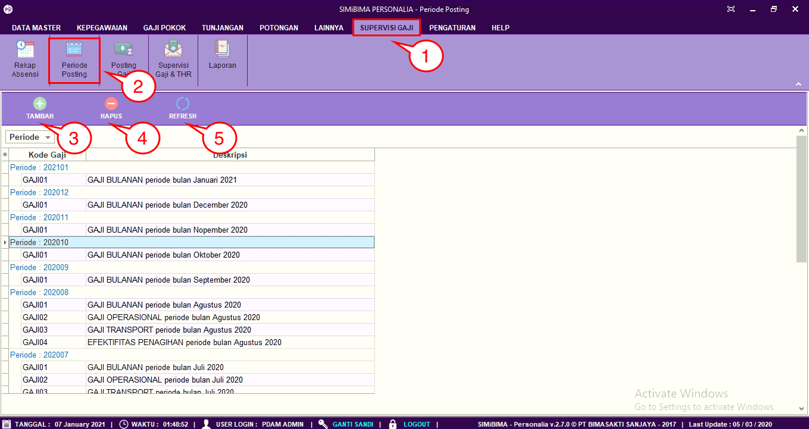
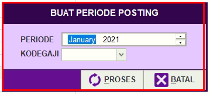
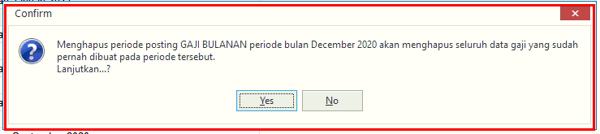

= Membuat dan Menghapus Periode Posting Gaji

Fitur ini berfungsi untuk membuat dan menghapus periode posting gaji. Berikut langkah-langkah dan penjelasan menu pada *Periode Posting Gaji*:

1. Pilih menu *Supervise Gaji*
2. Cari ikon *Periode Posting*
3. Untuk menambahkan periode posting gaji, klik pada tombol *Tambah* seperti poin 3 pada gambar di atas. Selanjutnya isi form buat periode posting. Jika sudah User dapat mengklik tombol *Proses*
+

4. Untuk menghapus periode posting gaji, Pilih data periode posting yang ingin dihapus terlebih dahulu. Selanjutnya klik pada ikon *Hapus*, seperti poin 4 pada gambar utama di atas. Setelah itu terdapat form konfirmasi, jika User yakin untuk menghapus data periode posting gaji, User dapat mengklik tombol *Yes*
+

5. Ikon *Refresh* digunakan  untuk melakukan pembaruan atau refresh ketika ada data yang belum muncul pada waktu ditambah.