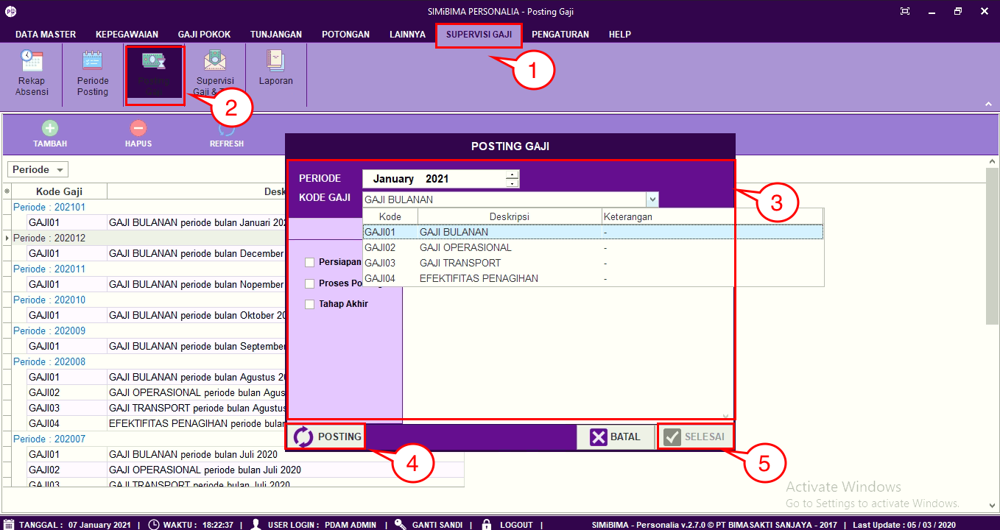

= Memposting Data Gaji Bulanan 

Untuk dapat melakukan posting data gaji bulanan, User terlebih dahulu harus membuat periode posting, langkah-langkahnya dapat dilihat pada Fitur Periode Posting.  Jika sudah, berikut langkah-langkahnya

1. Pilih menu *Supervisi Gaji*
2. Cari ikon *Posting Gaji*
3. Pilih periode posting dan kode gaji
4. Jika sudah, klik pada tombol *Posting* dan tunggu hingga proses selesai
5. klik pada *Tombol Sukses* jika proses posting gaji bulanan sudah selesai.
