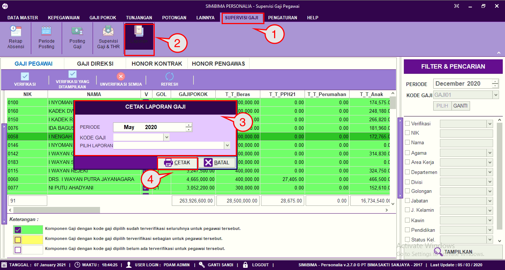
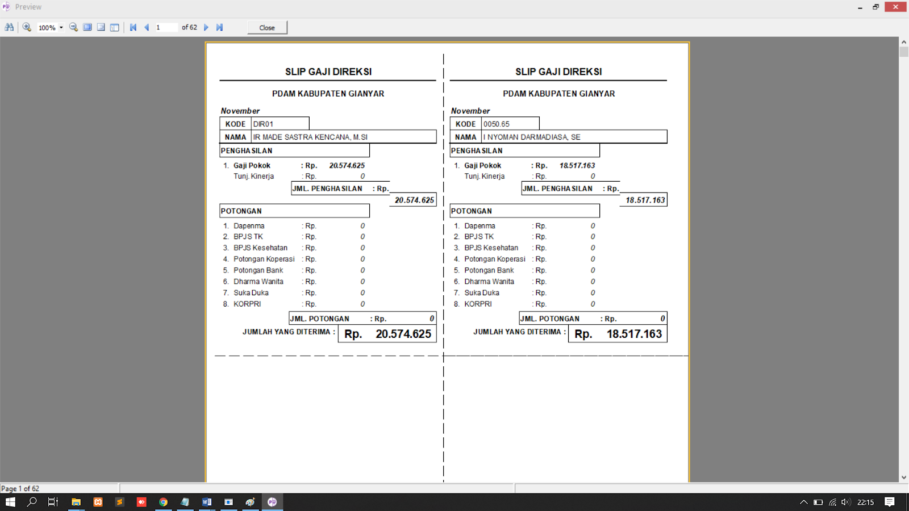

= Mencetak Laporan Gaji Bulanan

Fitur ini berfungsi untuk mencetak laporan gaji, berikut langkah-langkahnya.

1. Pilih menu *Supervisi Gaji*
2. Cari ikon *Laporan*
3. Lengkapi data pada _form_, sepeti periode, kode gaji dan laporan yang ingin dicetak
4. Untuk mencetak laporan, User dapat mengklik tombol *Cetak*. Berikut contoh hasil cetak laporan.
+

