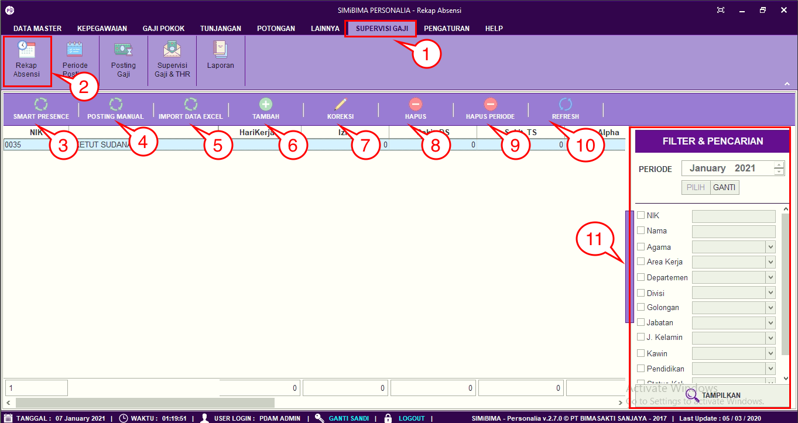
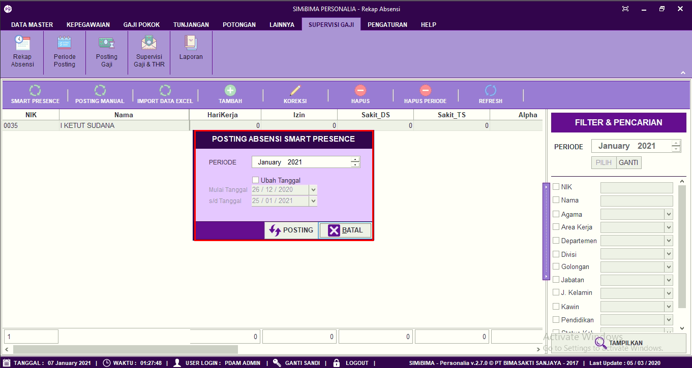
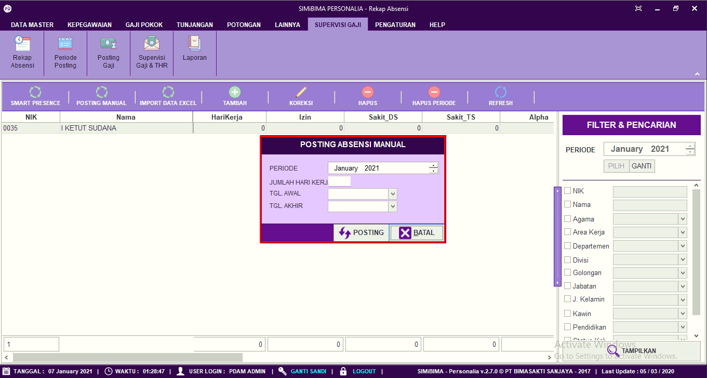
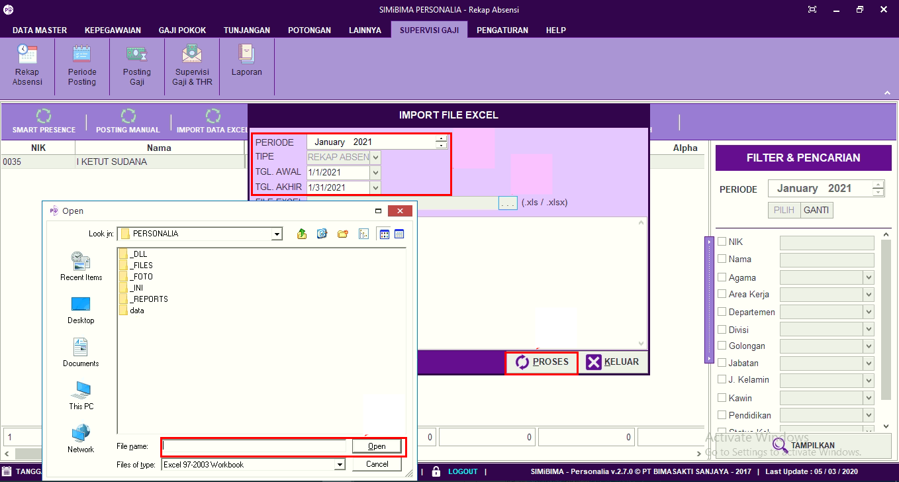
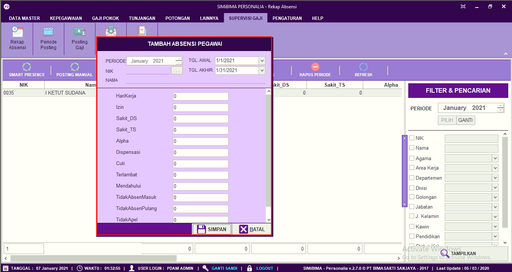
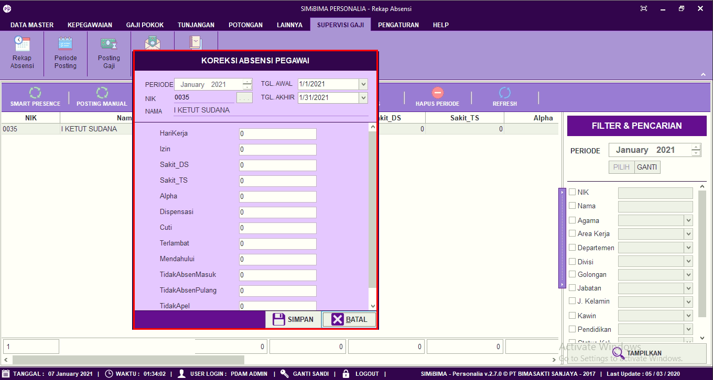
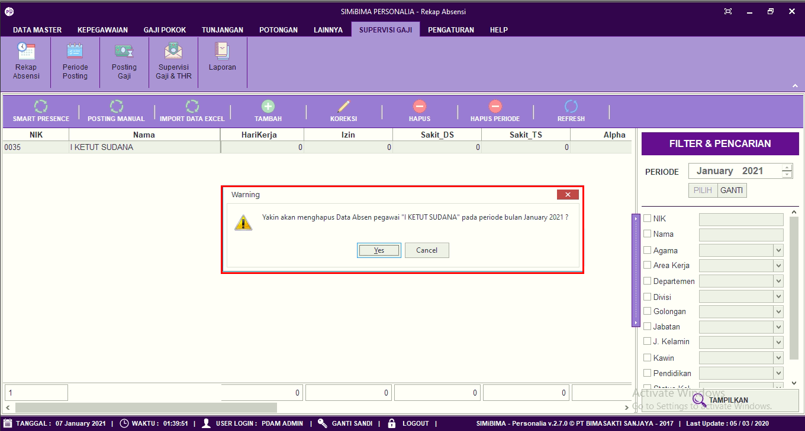
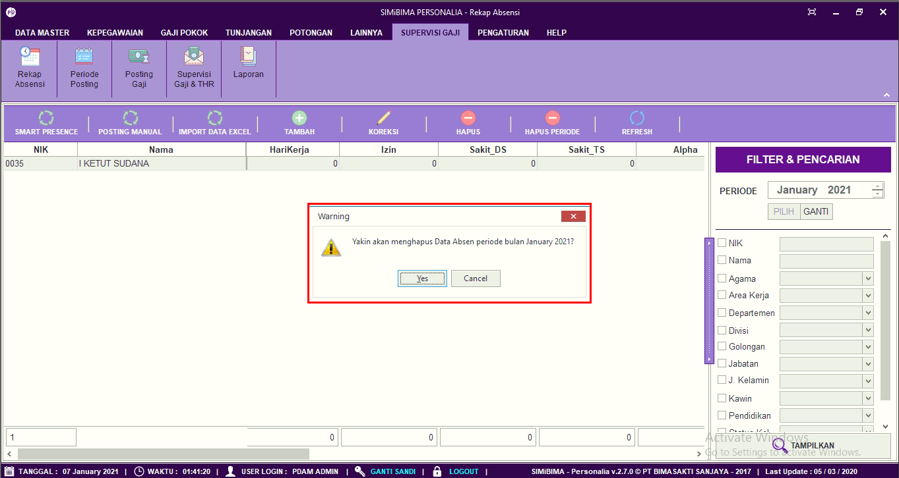

= Posting dan Memasukkan Rekap Absensi

Fitur ini berfungsi untuk mengatur absensi pegawai, baik itu melakukan posting absen, melakukan import data absen, menambah data absen pegawai, memperbarui data, menghapus data absen perorangan, dan menghapus data absen per periode. Berikut langkah-langkahnya:

1. Pilih menu *Supervisi Gaji*
2. Cari ikon *Rekap Absen*
3. Untuk melakukan posting rekap absen secara otomatis, pilih periode absensi yang User inginkan. Jika sudah, klik pada tombol *Posting Smart Presence* seperti poin 3 pada gambar di atas. Selanjutnya lengkapi data pada form posting absensi secara otomatis, jika sudah klik pada tombol *Posting* untuk memproses data
+

4. Untuk melakukan posting rekap absen secara manual, pilih periode absensi yang User inginkan. Jika sudah, klik pada tombol *Posting Manual* seperti poin 4 pada gambar di atas. Selanjutnya lengkapi data pada form posting absensi manual, jika sudah klik pada tombol *Posting* untuk memproses data
+

5. Untuk memasukkan data dalam format Excel ke dalam sistem, User dapat mengklik tombol *Import Data Excel*, seperti poin 5 pada gambar utama di atas. Selanjutnya tentukan periode laporan yang akan User masukkan, pilih rekap absen yang ingin dimasukkan pada sistem. Jika sudah User dapat mengklik tombol Proses seperti gambar berikut
+

6. Untuk menambahkan data absensi pegawai klik pada tombol *Tambah* seperti poin 6 pada gambar utama di atas. Selanjutnya isi form tambah absensi pegawai. Jika sudah User dapat mengklik tombol *Simpan*
+

7. Untuk memperbarui data absensi pegawai, pilih data yang ingin User perbarui terlebih dahulu. Selanjutnya klik pada ikon *Koreksi*, seperti poin 7 pada gambar utama di atas. Selanjutnya perbarui bagian yang ingin diubah, jika sudah User dapat mengklik tombol *Simpan*
+

8. Untuk menghapus data absensi pegawai, pilih data yang ingin dihapus terlebih dahulu. Selanjutnya klik pada ikon *Hapus*, seperti poin 8 pada gambar utama di atas. Selanjutnya terdapat form konfirmasi, jika User yakin untuk menghapus data absensi pegawai, User dapat mengklik tombol *Yes*. Seperti pada gambar di bawah ini
+

9. Untuk menghapus data absensi per periode, Pilih periode absensi yang ingin dihapus. Selanjutnya klik pada tombol *Hapus Periode*, seperti poin 9 pada gambar utama di atas. Setelah itu akan muncul form konfirmasi, jika User yakin untuk menghapus periode absensi, User dapat mengklik tombol *Yes*
+

10. Ikon *Refresh* digunakan  untuk melakukan pembaruan atau refresh ketika ada data yang belum muncul pada waktu ditambah
11. *Filter Pencarian* digunakan untuk menampilkan data Rekap Absensi sesuai dengan field sesuai dengan yang ditentukan. Setelah melengkapi field klik tombol *Tampilkan* untuk menampilkan data yang ditentukan.