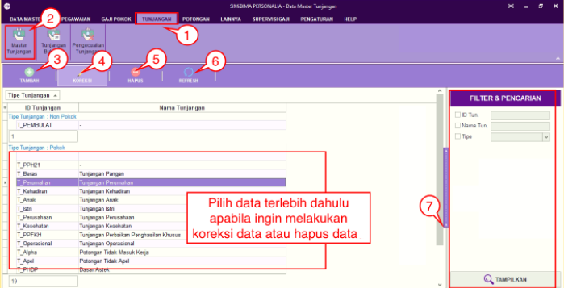
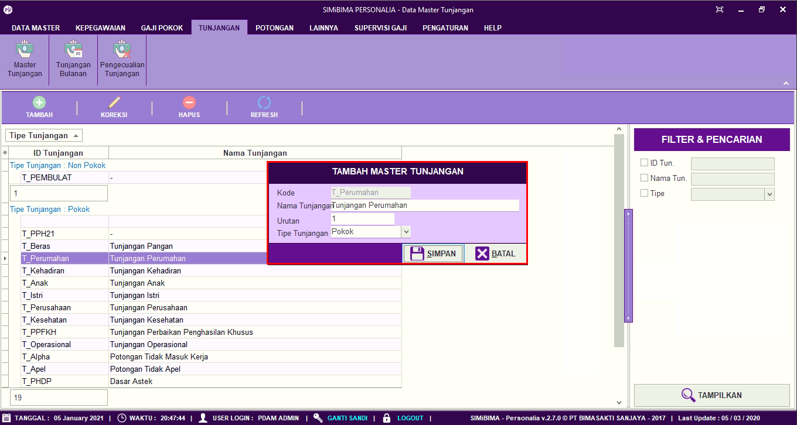
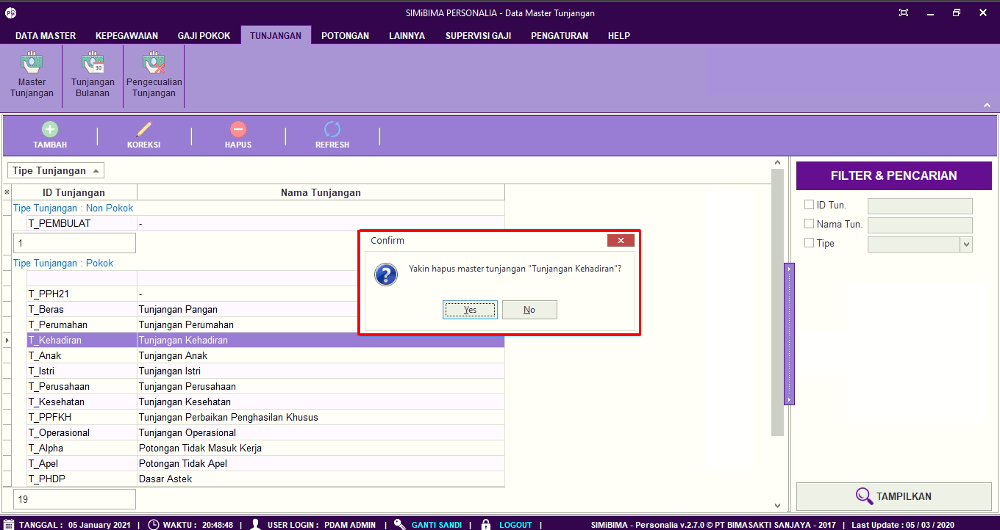

= Menambah Memperbarui dan Menghapus Data Jenis Tunjangan

Fitur ini berfungsi untuk mengatur jenis tunjangan, baik itu menambahkan, memperbarui, dan menghapus jenis tunjangan. Berikut langkah-langkahnya:

1. Pilih menu *Tunjangan*
2. Cari ikon *Master Tunjangan*
3. Untuk menambahkan jenis tunjangan, klik pada tombol *Tambah* seperti poin 3 pada gambar di atas. Selanjutnya lengkapi data jenis tunjangan, seperti kode, nama tunjangan, urutan, dan tipe tunjangan. Jika sudah klik tombol *Simpan* seperti pada gambar di bawah ini
+

4. Untuk memperbarui data, pilih data yang ingin diperbarui terlebih dahulu. Selanjutnya klik pada ikon *Koreksi*, perbarui bagian yang ingin diubah. Jika sudah klik tombol *Simpan*
5. Untuk menghapus data, pilih data yang ingin dihapus terlebih dahulu. Selanjutnya klik pada ikon *Hapus* sampai muncul pop up konfirmasi. Jika yakin untuk menghapus hak akses aplikasi, klik tombol *Yes* seperti gambar berikut
+

6. Ikon *Refresh* digunakan untuk melakukan penyegaran halaman ketika ada data yang belum muncul saat ditambahkan
7. Ikon *Pencarian* digunakan untuk mencari data pada master tunjangan berdasarkan field yang sudah ditentukan yaitu ID tunjangan, Nama Tunjangan dan Tipe. Klik tombol Tampilkan untuk menampilkan tunjangan yang akan dicari sesuai dengan field yang sudah diisi.