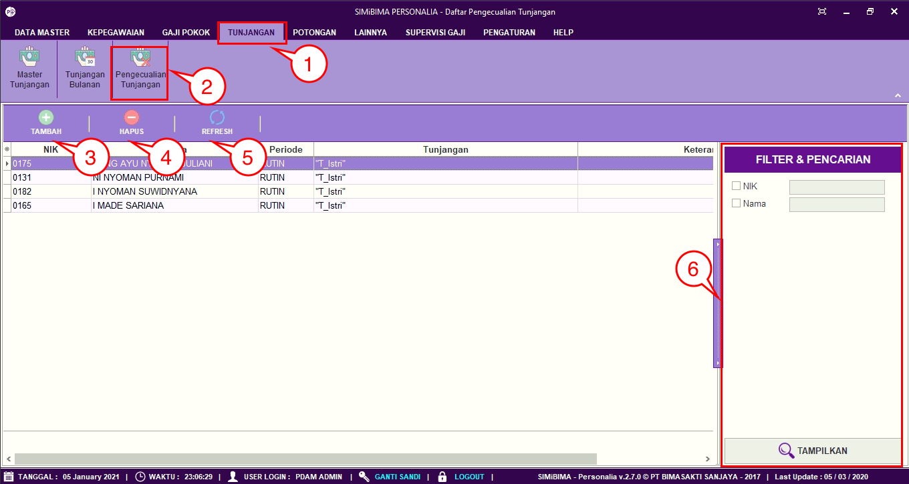
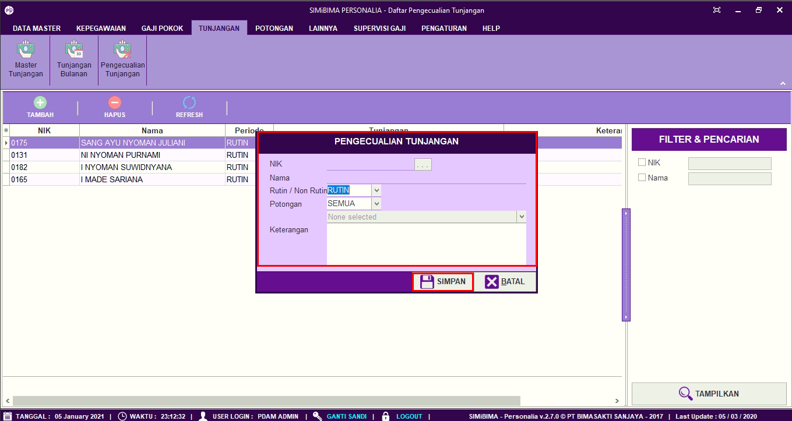
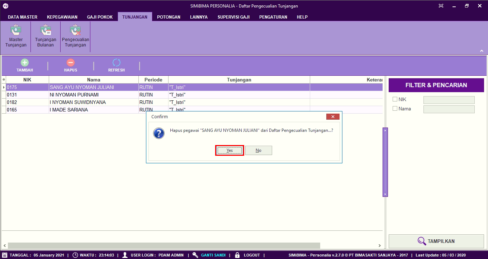

= Menambah dan Menghapus Data Pengecualian Hak Tunjangan

Fitur ini berfungsi untuk mengatur pengecualian hak tunjangan, seperti menambahkan maupun menghapus data tunjangan, berikut langkah-langkahnya.

1. Pilih menu *Tunjangan*
2. Cari ikon *Pengecualian Tunjangan*
+

3. Untuk menambah daftar pengecualian tunjangan, klik tombol *Tambah* seperti poin 3 pada gambar di atas. Selanjutnya lengkapi data pada form, seperti NIK pegawai, periode pemotongan rutin/tidak, kategori pemotongan, dan alasan pemotongan. Jika sudah klik tombol *Simpan*
4. Untuk menghapus data pengecualian hak tunjangan, Pilih data pegawai yang ingin dihapus. Jika sudah, klik tombol *Hapus* seperti poin 4 pada gambar utama di atas. Selanjutnya akan muncul form konfirmasi, jika  yakin untuk menghapus data, klik pada tombol *Yes* seperti pada gambar
+

5. Ikon *Refresh* digunakan untuk menyegarkan halaman ketika ada data yang belum muncul setelah ditambahkan data baru.
6. Ikon *Pencarian* digunakan untuk mencari data pada *Pengecualian Tunjangan* berdasarkan field yang sudah ditentukan yaitu ID tunjangan, NIK dan Nama. Klik tombol *Tampilkan* untuk menampilkan tunjangan yang akan dicari sesuai dengan field yang sudah diisi.
