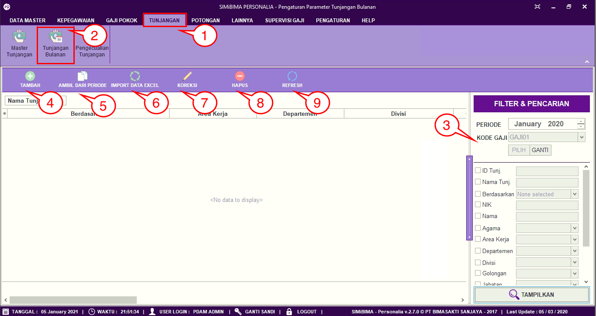
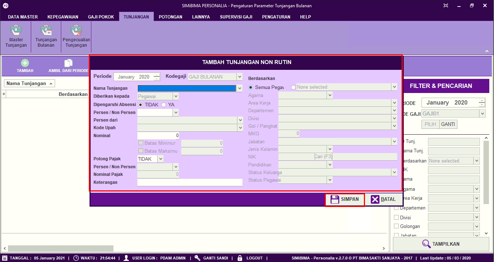
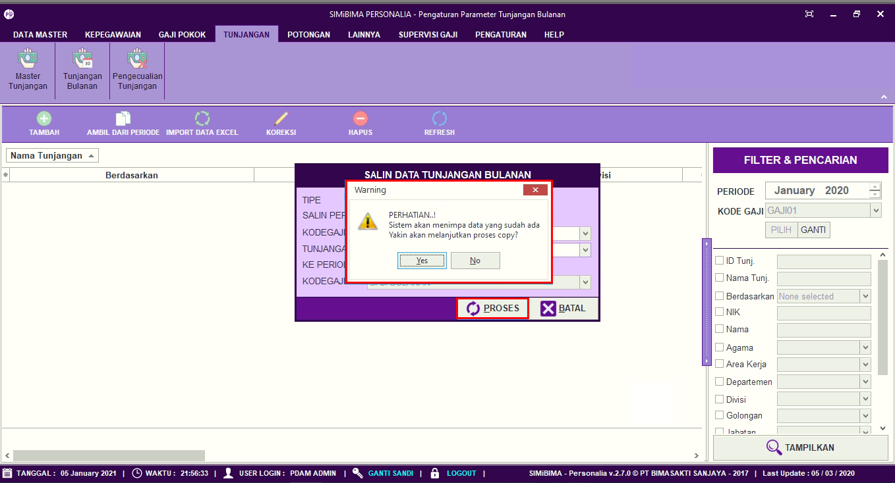
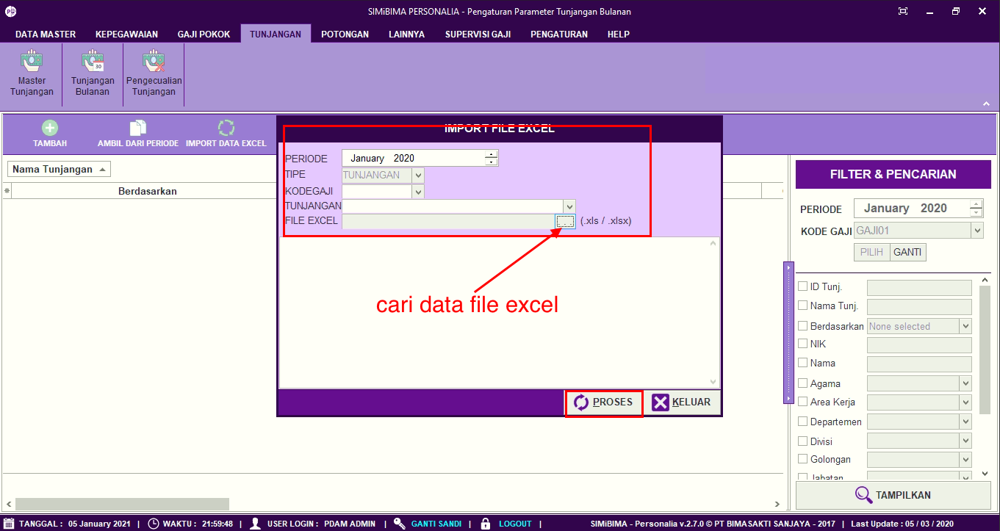
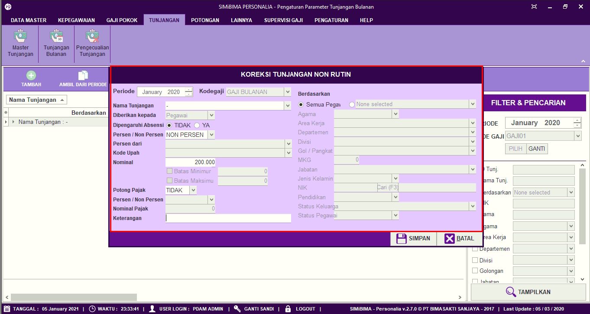
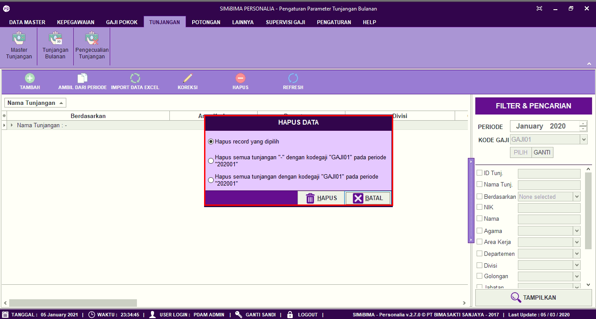

= Mengatur Hak Tunjangan Bulanan

Fitur ini berfungsi untuk mengatur hak tunjangan bulanan, baik itu menambahkan, mengambil data dari periode sebelumnya, memperbarui, dan menghapus hak tunjangan, berikut langkah-langkahnya.

1. Pilih menu *Tunjangan*
2. Cari ikon *Tunjangan Bulanan*
3. Pilih periode tunjangan , pada menu tersebut juga dapat mencari data tunjangan bulanan. Isi field pada menu pencarian kemudian klik tombol tampilkan untuk menampilkan data
+

4. Untuk menambahkan data penerima tunjangan, klik pada tombol *Tambah* seperti poin 4 pada gambar di atas. Selanjutnya lengkapi data pada form. Jika sudah klik tombol *Simpan* seperti pada gambar
+

5. Selain menambahkan baru, User juga dapat menggunakan data tunjangan pada periode sebelumnya, dengan cara mengklik tombol *Ambil Dari Periode*, seperti poin 5 pada gambar utama di atas. 
+
Selanjutnya lengkapi data pada form, seperti salinan periode, kode gaji dan jenis tunjangan. Jika sudah klik tombol Proses, selanjutnya akan terdapat form konfirmasi, klik pada tombol Yes untuk menyalin tunjangan dari periode sebelumnya seperti pada gambar
+

6. Selain mengambil data tunjangan dari periode sebelumnya, User juga dapat memasukan data tunjangan dengan format Excel ke dalam sistem. Pertama-tama klik pada tombol *Import Data Excel* seperti poin 6 pada gambar utama di atas.
+
Selanjutnya lengkapi data pada form, seperti periode, kode gaji, jenis tunjangan dan pilih data tunjangan yang ingin dimasukkan ke dalam sistem. Jika sudah klik tombol *Proses* seperti pada gambar.
+

7. Untuk memperbarui data, pilih data yang ingin diperbarui terlebih dahulu. Selanjutnya klik pada ikon *Koreksi* seperti poin 7 pada gambar utama di atas, perbarui bagian yang ingin diubah. Jika sudah klik tombol *Simpan*	
8. Untuk menghapus data, pilih data yang ingin dihapus terlebih dahulu. Selanjutnya klik pada tombol *Hapus*. Centang data yang ingin dihapus, jika yakin untuk menghapus data tunjangan, klik tombol Hapus seperti gambar berikut
+

+
Setelah muncul pop up hapus data, tersedia 3 pilihan yaitu : 
+
- Hapus record yang dipilih artinya data tunjangan akan dihapus sesuai dengan data yang dipilih pada list tunjangan
- Hapus semua tunjangan sesuai dengan data yang dipilih dan sesuai dengan kode gaji sesuai dengan periode 
- Hapus semua tunjangan dengan sesuai dengan kode gaji sesuai dengan periode
9. Ikon *Refresh* digunakan untuk menyegarkan halaman apabila ada data yang belum muncul setelah ditambahkan data baru.
