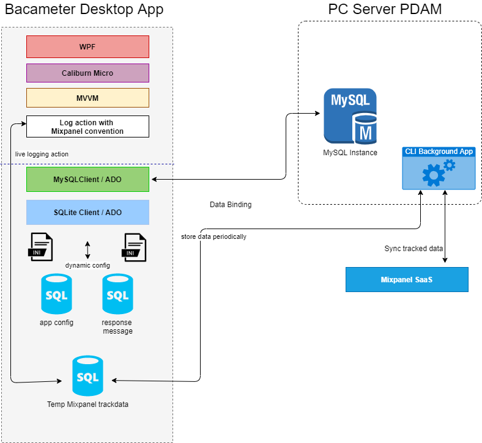
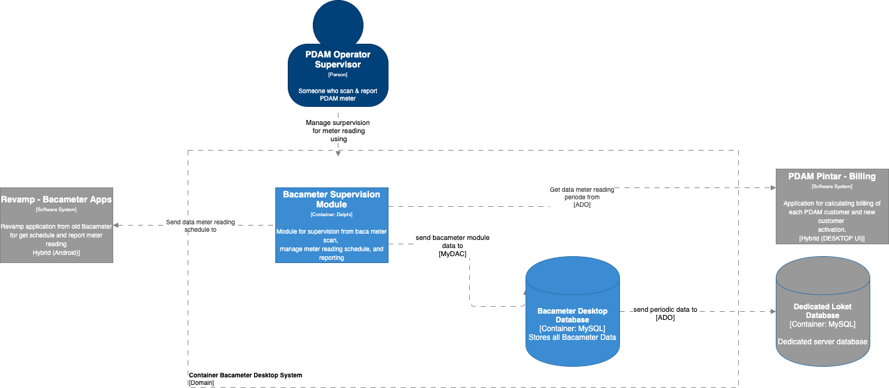

= Architecture Bacameter.NET

== High Level Architecture

Berikut ini merupakan _high level architecture_ dari Bacameter.NET

Untuk lebih detailnya, dapat dilihat pada diagram C2 berikut:

Sistem ini merupakan bagian dari Bimasakti Alterra. Untuk lebih detail terkait hubungan PDAM Info dengan sistem Bimasakti Alterra lainnya, silakan mengakses <<../../../../../Divisions/Meet-Our-Divisions/Technology/Engineering/Alterra-Systems-C1-Diagram/BSA-C1-Diagram.adoc#,BSA C1 Diagram>> berikut.

== Related System

Bacameter terdiri dari beberapa sistem yang saling terintegrasi. Berikut daftar sistem yang terhubung dengan Bacameter.

[cols="5%,30%,65%",frame=all, grid=all]
|===
^.^h|*No* 
^.^h|*System Name* 
^.^h|*Description*

| 1 | Bacamater Grabber | CLI background app untuk mengambil data dari mobile app & lakukan sinkronisasi dengan database Bacameter
| 2 | Datatools | Web Based Dashboard untuk melihat report terkait berbagai aplikasi PDAM Pintar
| 3 | Bacameter Mobile | Android app untuk menyimpan data hasil baca oleh petugas baca PDAM di lapangan
|===

