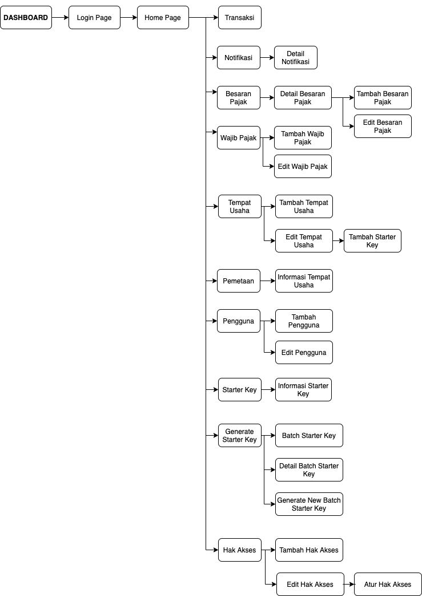

= Architecture Bima PHR

== Sitemap

Berikut adalah sitemap dari Dashboard Bima PHR:

== Related Systems

Berikut adalah daftar sistem yang terkoneksi dengan Dashboard Bima PHR:

|===
| *No* | *Nama Sistem* | *Deskripsi*

| 1
| Bapenda API Rev 2.1{caret}
| Bapenda API ini berfungsi sebagai _backend_ untuk aplikasi _Dashboard_.
Bapenda API ini memproses permintaan dari sistem dashboard terkait _summary_ transaksi wajib pajak, _starter key_, informasi wajib pajak, dan lain-lain.
Bapenda API ini juga dapat memberikan notifikasi menggunakan _Server Sent Event_, sehingga Dashboard dapat menerima informasi bahwa ada tempat usaha yang koneksinya bermasalah dengan _server_ Bapenda.

| 2
| Flagr
| Flagr adalah sistem yang digunakan untuk _continuous deployment_, karena Bima PHR ini menggunakan TBD, sehingga semua code yang dibuat oleh engineer akan di-_deploy_ ke semua _environment_.
Flagr ini digunakan untuk mencegah sebuah fitur digunakan oleh user ketika fitur tersebut masih dikembangkan.

| 3
| Google Maps
| Google Maps adalah _third party_ yang digunakan untuk menampilkan peta lokasi tempat usaha pada sistem _Dashboard_ Bima PHR.
|===