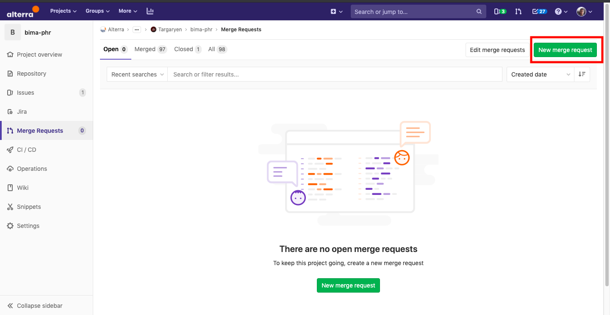
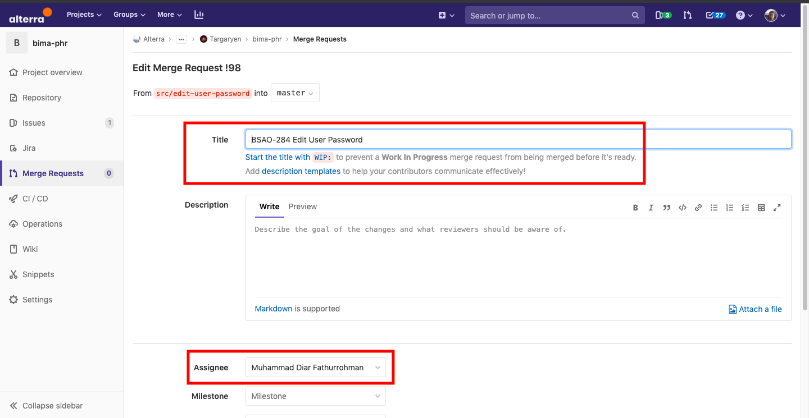
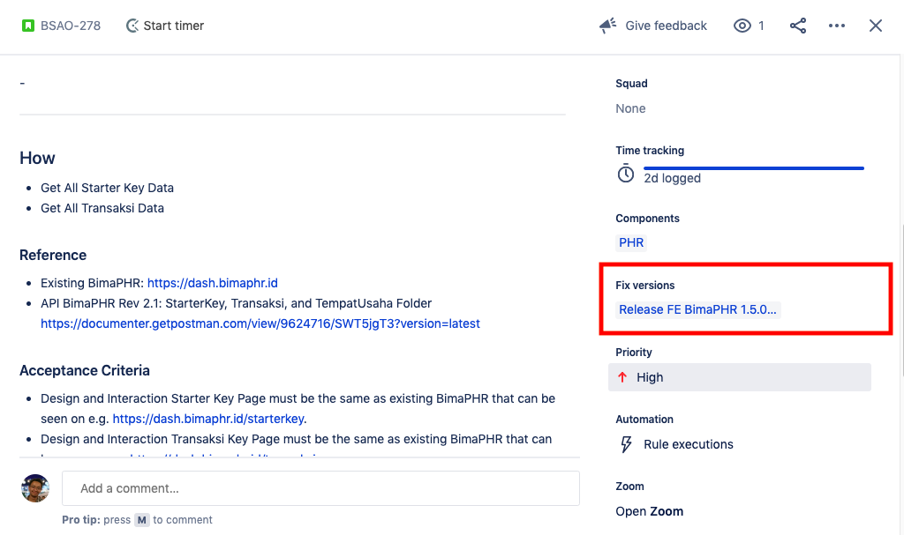
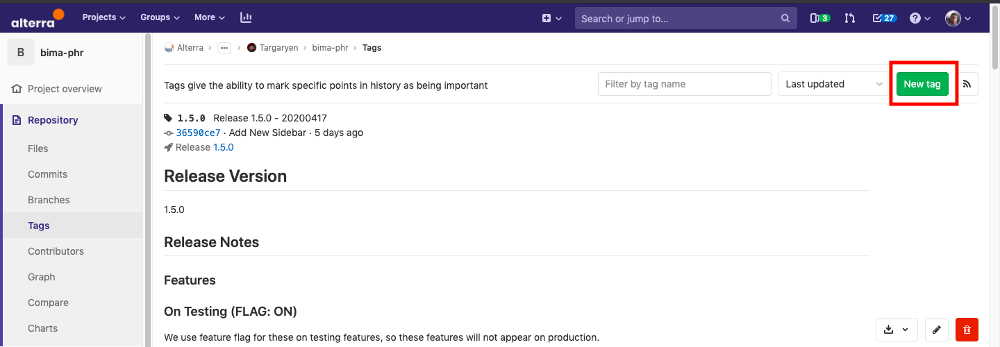
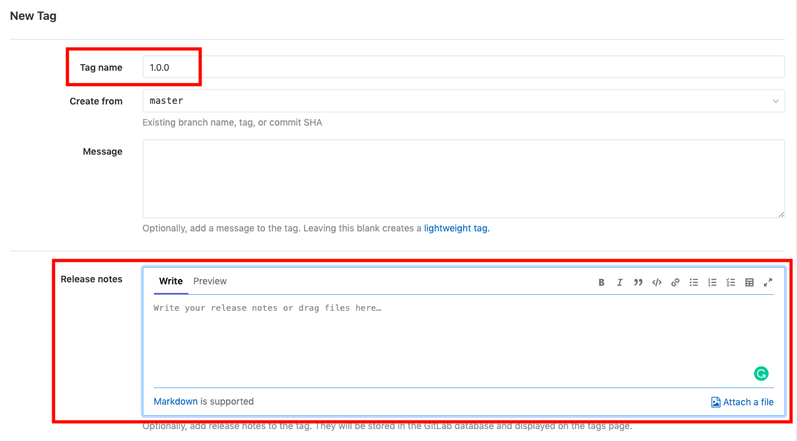
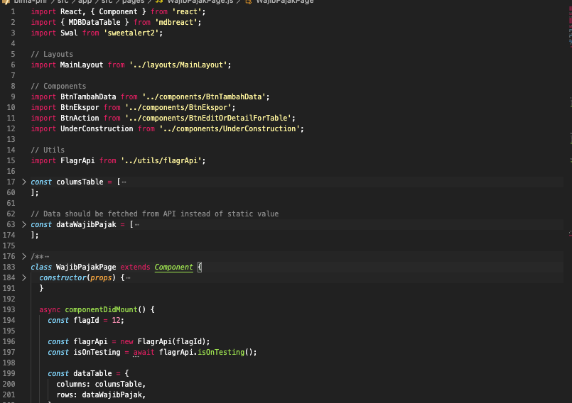

= Development Process Bima PHR

Berikut adalah langkah-langkah untuk melakukan _development_:

. *Pre Development*
+
_Prerequisite_:

 ** Node (v.13 _recommended_) & npm (v.6 _recommended_)
 ** Git

+
Jalankan perintah ini di _command line_:

 ** `git clone git@gitlab.alterra.id:alterra/merlin/targaryen/bima-phr.git` (Clone with ssh)  or
 ** `+git clone http://gitlab.alterra.id/alterra/merlin/targaryen/bima-phr.git+` (Clone with https)
 ** `cd bima-phr/src/app`
 ** `npm install` (Install all dependencies)

. *Development Process*
 ** Untuk pengerjaan tiap _task/feature_ dapat dimulai dengan membuat _branch_ baru yg bersifat _Short Life Branch_
  *** Pindah _directory_ ke _directory_ BimaPHR di lokal kamu
  *** `git checkout master`
  *** `git pull`

+
Contoh: _task_ dengan id Jira BSAO-007 untuk pengerjaan fitur _login proses_
 ** Menambahkan _branch_ baru
  *** Untuk _branch_ featur menggunakan awalan "`src/`" diikuti dengan nama fitur
  *** `git checkout -b src/page-login-page` (membuat branch baru dengan nama "`src/page-login-page`")
 ** Menjalankan eslint sebelum _commit_
  *** `eslint <path/to/file> --fix` (Untuk melakukan _automation fix_)
  *** Usahakan _error_ yang muncul tidak ada, namun jika memang ada diusahakan seminimal mungkin.
 ** Proses melakukan _Commit_
  *** `git add <file yang ingin di-commit>`
  *** `git commit -m “BSAO-007 Add login page”` (jika _issue_ id adalah BSAO-007)
  *** `git push origin src/page-login-page` (jika nama _branch feature_ adalah src/page-login-page)

+
*Jika ingin memulai _development_ _feature/bug_ baru, silahkan ulangi _step-by-step_ diatas.*
. *Merge Request*
+
Setelah _development_ selesai untuk sebuah fitur yang telah dikembangkan, maka kamu bisa membuat Merge Request di -_epository_ BimaPHR

 ** Buat Merge Request
+

 ** Pilih Source Branch > Create Merge Request
+
image::./images-bima-phr/Bima-PHR-Merge-Request2.png[]

 ** Title MR: +++<Issue ID="" on="" Jira="">++++++<Feature>+++, ex: BSAO-007 *Add Login Page*+++</Feature>++++++</Issue>+++
 ** Menambahkan Reviewer di bagian Assignee
+

 ** Simpan Merge Request

+
*Untuk Reviewer yg sudah di-assign diharuskan memberikan comment di Merge Request tersebut*

. *Rebase (TBD)*
+
Dalam proses _development_ BimaPHR, kami menggunakan proses TBD, sehingga untuk proses _merge_ menggunakan perintah "`git rebase`".
Gitlab sudah menyediakan fitur untuk _re-basing_ ini, tapi terkadang dibutuhkan proses _rebase_ lokal _developernya_, langkah-langkah untuk _rebase_ tersebut adalah:

 ** `git checkout master`
 ** `git pull origin master`
 ** `git checkout <feature-branch>`
 ** `git rebase master`
+
*Kalau terjadi conflict*

  *** Resolve the conflict
  *** `git add <file>`
  *** `git rebase —continue`
  *** `git push origin <feature-branch>`

 ** `git push -f`

. *Proses Release*
 ** Minta untuk diberikan _Release Fix Version_ ke Development Lead (Mas Fiqri)
 ** Buat _Task Release_ (contohnya https://alterra.atlassian.net/browse/BSAO-310[di sini])
 ** Tambahkan _Fix Version_ di setiap _issue_ yang akan di-_release_
+

 ** Buat https://gitlab.alterra.id/alterra/merlin/targaryen/bima-phr/-/tags[tag release] di Gitlab
+

 ** Tambahkan _Release Notes_ nya (contoh)
+

 ** Bila sudah selesai proses _release_ ke _staging_, buat _request release to production_ ke infra melalui https://ata.to/infra-helpdesk
 ** Proses _release_ selesai
 ** Update _issue_ (_transition_) _to done_, atau _bulk update to done_
 ** _Execute Releases_ JIRA (Ask to Mas Fiqri)
 ** _Finished then all issue_ (_on release plan notes_) otomatis ke _hide_
. *Feature Flagr*
 ** Feature flag url https://flagr.sumpahpalapa.com/phr/#/
 ** Flagr digunakan untuk mencegah sebuah fitur yang belum selesai prosesnya (_development_ dan/atau _testing_) tampil di-_production_
 ** _Import_ Flagr Utils dari folder utils
+

 ** Buat _instance_ dari FlagrApi dengan memasukan FlagId sebagai _argument_
 ** Panggil _method isOnTesting()_ menggunakan _await_
+

. *Testing*
+
Untuk _Peer Testing_ ditentukan ketika sub task/story tersebut akan mulai di-_develop_

. *Unit Test*
+
_Tools_ yang digunakan adalah Jest dan Enzyme.

 ** Buat _file test_ untuk _file_ yang ingin di-_test_, dan letakkan di-_directory_ +++<root_repo>+++/src/app/test dengan menyamakan struktur *directory* dari file fitur.+++</root_repo>+++
  *** Contoh:
  *** Nama _file_ fitur: LoginPage.js
  *** Lokasi _file_ fitur: +++<root_repo>+++/src/app/src/pages/LoginPage.js+++</root_repo>+++
  *** Nama _file test_: LoginPage.test.js
  *** Lokasi _file test_: +++<root_repo>+++/src/app/test/pages/LoginPage.test.js+++</root_repo>+++
 ** Jika sudah membuat _code_ untuk unit test, maka dapat menjalankan _command_: `npm test <path/to/test_file>`
 ** Atau jika ingin melakukan _watch file test_, maka jalankan _command_: `npm run testwatch`
 ** Atau jika ingin melakukan _watch_ sambil mengumpulkan _test coverage_, maka jalankan _command_: `npm run coveragewatch`
 ** Jika _unit test_ sudah *PASS* maka dapat di-_generate_ hasil _coverage_-nya, dengan cara menjalankan _command_: `npm run coverage`
 ** Setelah itu _file_ html hasil dari _test coverage_ akan ter-_generate_ di _directory_ +++<root_repo>+++/src/app/coverage/lcov-report/index.html.+++</root_repo>+++
