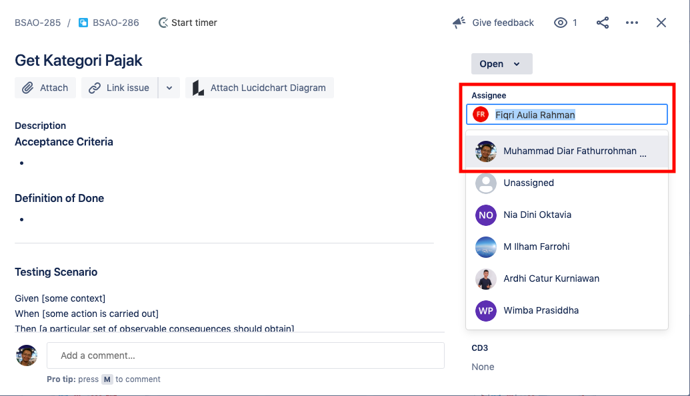

= Project Management Bima PHR

== Membuat Jira Ticket

. Jira ticket untuk _story_ dan _sub-task_ di buat oleh Mas Fiqri
. Jira ticket untuk _release_ dibuat oleh SE

Setelah Jira _ticket_ dibuat, SE dapat mengubah _assignee ticket_ tersebut ketika ingin mengerjakan _story/subtask_ yang bersangkutan.

Next: Kemungkinan kedepannya Development Lead hanya akan menambahkan _story_, untuk _subtask_ akan dilakukan _slicing_ oleh SE.

== Clarity Issue

Setiap _story_ dan _subtask_ diharuskan memiliki deskripsinya masing-masing agar tiap _story_ dan _sub-task_ memiliki _issue_ yang jelas.
_Clarity issue_ ini ditambahkan oleh tiap-tiap SE yang akan mengerjakan _story/subtask_ tersebut.

* https://alterra.atlassian.net/browse/BSAO-281[Contoh deskripsi story]
* https://alterra.atlassian.net/browse/BSAO-283[Contoh deskripsi subtask]
* https://alterra.atlassian.net/browse/BSAO-310[Contoh deskripsi release ticket]

Untuk bagian _testing_, biasanya diawal dikomunikasikan dengan QE terlebih dulu sebelum mulai pengerjaan, namun karena tidak adanya QE bisa didiskusikan diawal sprint dengan teman-teman SE lainnya.
Testing akan dilakukan oleh _peers_, dan _peers_ yg ditunjuk diharuskan membuat _manual testing scenario_ menggunakan _gherkin_ dan ditambahkan pada bagian dekripsi di setiap _story/subtask ticket_.
