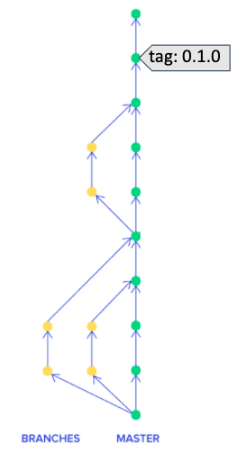
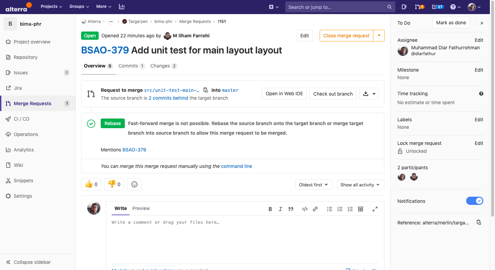
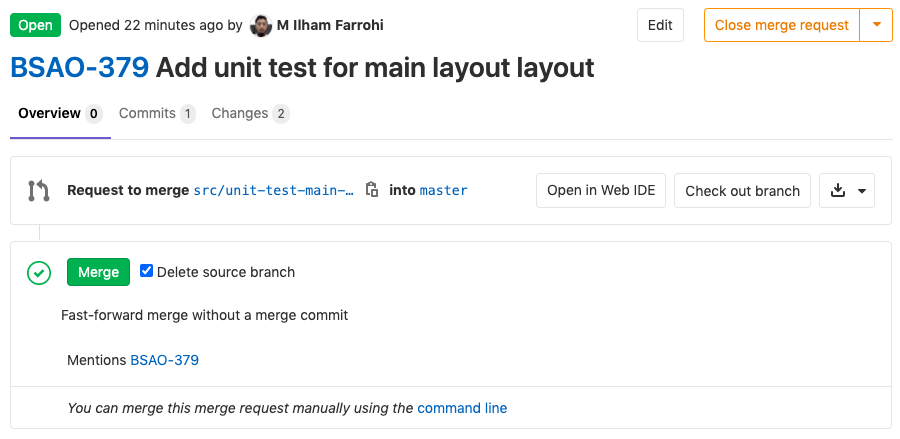
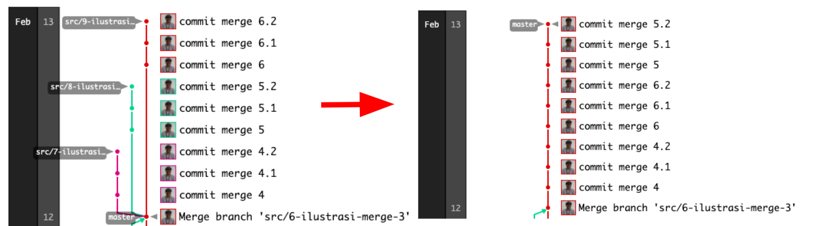

= Development Bima PHR

== Trunk Based Development

Pada proses _development dashboard_ BimaPHR digunakan metode _Trunk Based Development_ yang diilustrasikan pada gambar berikut:

Penjelasan mengenai _Trunk Based Development_ dapat dipelajari di jurnal _Trunk Based Development_ di laman https://drive.google.com/file/d/16d1NU2x-kCCv8KVyOjq2UeYjXCYQBVZy/view?usp=sharing[Alterra Knowledge Base]

== Development Step

_Dashboard_ BimaPHR ini memiliki 3 _environment_ yang berbeda, yaitu:

* _Development & Testing_
* _Staging_
* _Production_

Pada penggunaan TBD, ketiga _branch_ tersebut mengandung informasi dan data-data dari _branch_ yang sama, yaitu _Master_.
Sehingga, _branch Master_ dapat selalu siap untuk dirilis ke pengguna.

_Software Engineer_ dan _Quality Engineer_ dapat mengakses _environment development_ & _testing_ pada http://103.117.207.199:8808/ (_vpn alterra required_) untuk keperluan pengembangan _code_ dan pengujian.
Sementara, _environment_ yang siap digunakan oleh pengguna dapat diakses pada http://bimaphr.alterra.id/.

_Software Engineer_ yang akan melakukan proses _development_ diharuskan membuat _branch_ baru pada _repository gitlab_ BimaPHR.
Apabila pengembangan yang dilakukan oleh _software engineer_ telah selesai dan ingin dilakukan _testing_, maka _engineer_ tersebut perlu membuat _Merge Request_ pada _repository gitlab_ BimaPHR.
_Merge Request_ adalah permintaan penggabungan antara _base_ (_Master_) dengan _development branch_, untuk ilustrasi dari _Merge Request_ ditampilkan pada gambar berikut.

Dengan penggunaan TBD, proses penggabungan tersebut menggunakan metode _rebase_.
Sehingga, grafik _repository_-nya menjadi seperti berikut:

