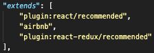
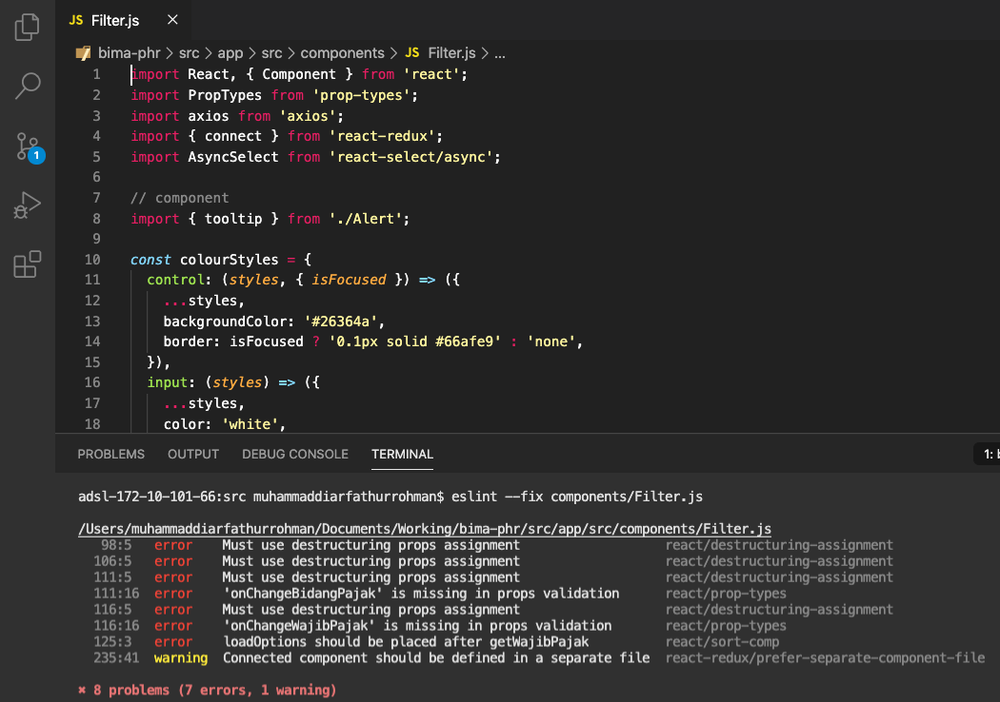

= Naming Convention Bima PHR

_Naming Convention_ pada proses _development Dashboard_ ini menggunakan Javascript _Style Guide_ dari https://airbnb.io/javascript/[Airbnb].

Pengaturan _style guide_ ini sudah diatur dalam _file_ .eslintrc.json, dengan pengaturan sebagai berikut:

Ketika _engineer_ telah selesai melakukan _development code_, diharuskan untuk menjalankan perintah ESlint pada CLI VSCode sebagai pengecekan, apakah _code_ yang sudah dikembangkan sesuai dengan kaidah _style guide_.

Berikut ini adalah ilustrasi penggunaan eslint dan pesan _error_ yang muncul karena tidak sesuai dengan kaidah _style guide-nya_.

