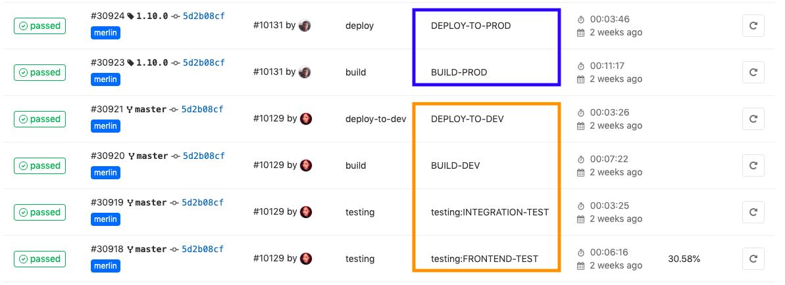

= Release and Deployment Bima PHR

Proses _deployment_ ke _environment development_ dilakukan secara otomatis oleh Gitlab CI/CD ketika adanya _commit_ atau _merge_ ke branch Master.
Sedangkan, _deployment_ ke _environment staging_ dilakukan oleh Gitlab CI/CD ketika menambahkan _Release Tag_ di _repository_ BimaPHR.

Engineer dari Team Project BimaPHR hanya melakukan _deployment_ ke _environment Development_ dan _Staging_ saja, sementara untuk proses _deployment_ ke _environment_ _Production_ dilakukan oleh Infrastructure Team karena akan dilakukan pengecekan terkait _credentials_ yang digunakan.
_Deployment_ dilakukan berdasarkan permintaan dari _engineer_ yang bertugas untuk melakukan rilis.
Langkah ini dituliskan pada bagian <<./schedule-bima-phr.adoc,Schedule & Step Deployment>>.
