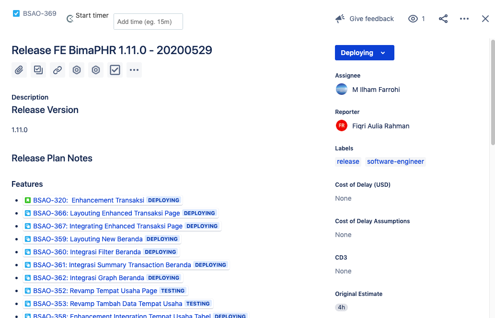
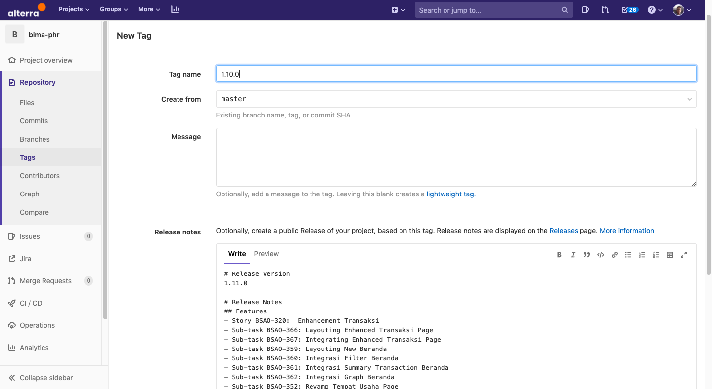
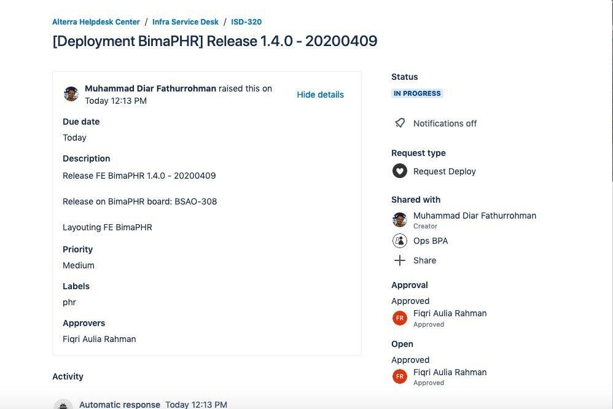

= Schedule and Step Bima PHR

== *Schedule*

Jadwal _deployment_ atau _release_ untuk _dashboard_ BimaPHR adalah setiap hari selasa dan jum'at.
Namun, ini _tentative_ mengikuti proses _development_.

== *Step*

Berikut ini adalah langkah-langkah yang dilakukan ketika proses _deployment_:

. Engineer yang akan melakukan proses _release_ meminta kepada Lead untuk dibuatkan _fix version_ dan _Release Ticket_ di _Board_ Jira BimaPHR.
. Engineer menuliskan _Release Notes_ yang berisikan fitur yang akan dirilis pada _Release Ticket_ tersebut.
+

. Engineer membuat release tag pada _repository BimaPHR_ https://gitlab.alterra.id/alterra/merlin/targaryen/bima-phr/-/tags[Gitlab], dengan deskripsi berisikan _Release Notes_ yang sama dengan _Release Ticket_ pada Jira _Board_.
_Release Tag_ yang disimpan akan melakukan CI/CD ke _environment Staging_ (lihat bagian ini).
+

. Engineer kemudian menginformasikan kepada Team Infrastructure untuk melakukan _deployment_ ke _environment Production_ dengan membuat Jira Ticket di Infra Helpdesk.
Isi dari Jira Ticket Tersebut ada sebagai berikut;
+

