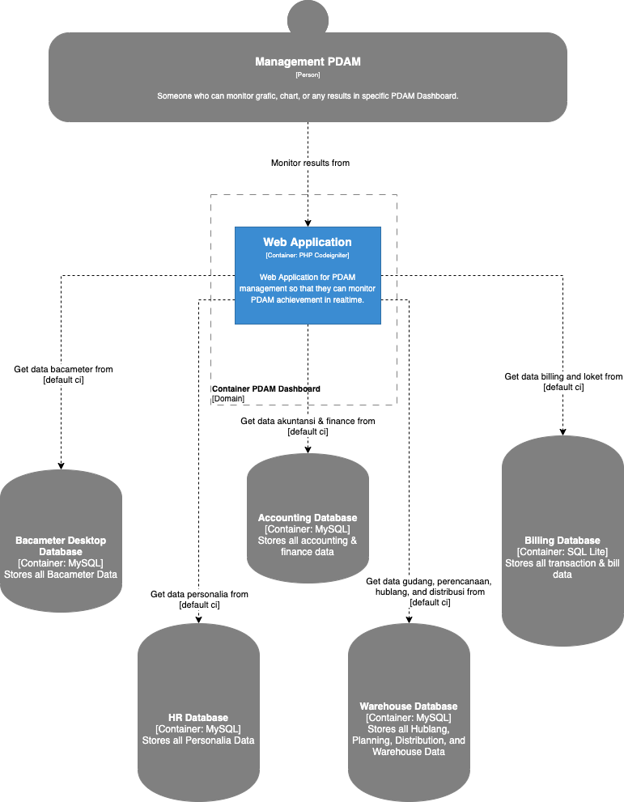

= Architecture Dashboard Web PDAM

== High Level Architecture

Berikut adalah gambar diagram C2 sistem Dashboard Web PDAM:

Sistem ini merupakan bagian dari Bimasakti Alterra. Untuk lebih detail terkait hubungan Dashboard Web PDAM dengan sistem Bimasakti Alterra lainnya, silakan mengakses <<../../../../../Divisions/Meet-Our-Divisions/Technology/Engineering/Alterra-Systems-C1-Diagram/BSA-C1-Diagram.adoc#,BSA C1 Diagram>> berikut.

== Related Systems

[cols="10%,30%,30%,30%",frame=all, grid=all]
|===
^.^h| *System Name* 
^.^h| *Description* 
^.^h| *Depends on* 
^.^h| *Be a Dependencies to*

|PDAMPintar-Dashboard
|Aplikasi untuk manajemen PDAM agar bisa memantau pencapaian PDAM secara realtime.
| -
| -
|===
