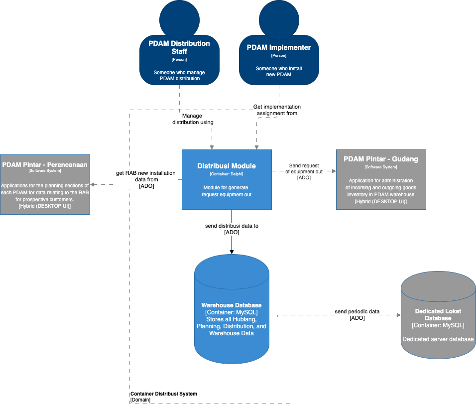

= Architecture Distribusi Web PDAM Gianyar

== High Level Architecture

Berikut adalah gambar diagram C2 sistem Distribusi Web PDAM:

Sistem ini merupakan bagian dari Bimasakti Alterra. Untuk lebih detail terkait hubungan Distribusi Web PDAM dengan sistem Bimasakti Alterra lainnya, silakan mengakses <<../../../../../Divisions/Meet-Our-Divisions/Technology/Engineering/Alterra-Systems-C1-Diagram/BSA-C1-Diagram.adoc#,BSA C1 Diagram>> berikut.

== Related Systems

[cols="10%,20%,35%,35%",frame=all, grid=all]
|===
^.^h| *System Name* 
^.^h| *Description* 
^.^h| *Depends on* 
^.^h| *Be a Dependencies to*

|PDAMPintar-Distribusi
a|Aplikasi untuk bagian Distribusi PDAM masing-masing.
| -
| -
|===
