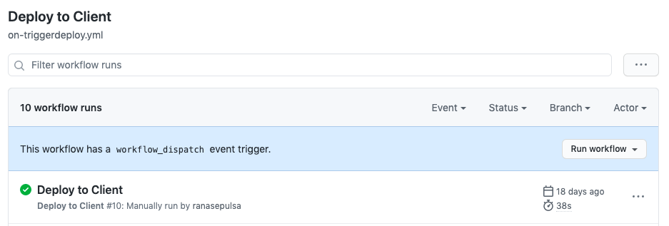
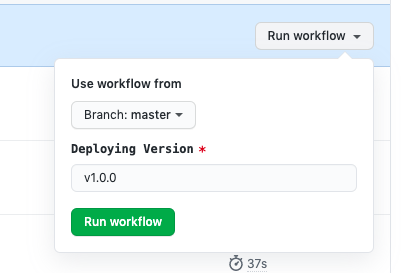

= Release and Deployment Honey

== Staging

=== Schedule and Step Deployment

Deployment Honey staging dilakukan ketika on-push branch development (masing-masing daerah memiliki branch development tersendiri) melalui CI/CD yang disediakan oleh github actions. Ketika akan dilakukan proses merge branch feature ke development, harus dipastikan terlebih dahulu semua step di github actions sudah lolos (ditandai dengan centang warna hijau) dan sudah melalui proses _peer to peer review_.

*Deployment Step*

1. push branch development after merge

== Production

=== Schedule and Step Deployment

Deployment Honey Production dilakukan ketika ada permintaan rilis dari _Product Owner_.

*Deployment Step*

1. Lakukan _pull request_ dari branch master (seperti branch development, branch master memiliki nama custom sesuai nama daerah)

2. Merge branch master, after succeed, run _dispatch workflow_
 

