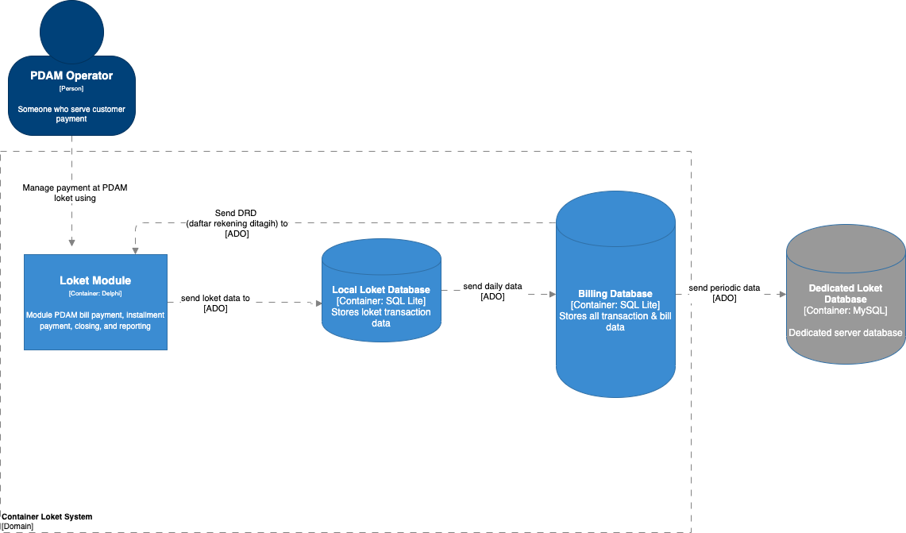

= Architecture Loket.NET

== High Level Architecture

Berikut adalah gambar diagram C2 sistem Loket-NET:

Sistem ini merupakan bagian dari Bimasakti Alterra. Untuk lebih detail terkait hubungan Loket-NET dengan sistem Bimasakti Alterra lainnya, silakan mengakses <<../../../../../Divisions/Meet-Our-Divisions/Technology/Engineering/Alterra-Systems-C1-Diagram/BSA-C1-Diagram.adoc#,BSA C1 Diagram>> berikut.

== Related System

Loket-NET terdiri dari beberapa sistem yang saling terintegrasi. Berikut daftar sistem yang terhubung dengan Loket-NET.

[cols="10%,20%,35%,35%",frame=all, grid=all]
|===
^.^h| *System Name* 
^.^h| *Description* 
^.^h| *Depends on* 
^.^h| *Be a Dependencies to*

| *PDAMPintar-Loket*
| Aplikasi untuk Loket PDAM masing-masing untuk menerima pembayaran, baik secara online maupun offline.
| -
| -
|===
