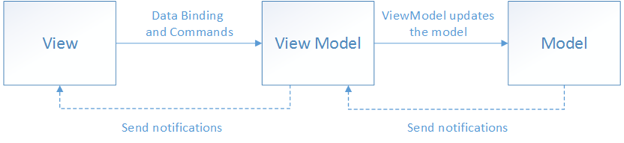

= Architecture Mobile Loket

== High Level Architecture

Berikut adalah gambar diagram HLA sistem Mobile Loket:

Sistem ini merupakan bagian dari BSA. Untuk lebih detail terkait hubungan Mobile Loket dengan sistem BSA lainnya, silakan mengakses diagram C1 berikut.

Note:: Mobile Loket menggunakan MVVM Pattern. Untuk lebih detail silakan mengakses https://docs.microsoft.com/en-us/xamarin/xamarin-forms/enterprise-application-patterns/mvvm[link berikut]

== Related System

Mobile Loket terdiri dari beberapa sistem yang saling terintegrasi. Berikut
daftar sistem yang terhubung dengan Mobile Loket.

[cols="10%,30%,30%,30%",frame=all, grid=all]
|===
^.^h| *System Name* 
^.^h| *Description* 
^.^h| *Depends on* 
^.^h| *Be a Dependencies to*

| *Mobile Loket*
| 
a| 1. https://mloket.sumpahpalapa.com/v1/api[Staging Server]
2. https://mloket.bsa.id/v1/api[Production Server]
| -
|===

