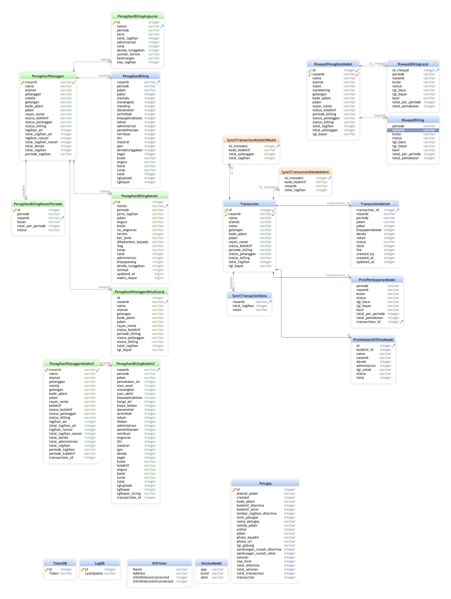

= Database Documentation Mobile Loket

Berisi dokumentasi database yang digunakan di dalam sistem, seperti
daftar tabel dan gambar ERD beserta penjelasannya.

== ERD

[cols="40%,60%",frame=all, grid=all]
|===
^.^h| *Table Name* 
^.^h| *Description* 

|PenagihanPelanggan| Penagihan baik itu Sambungan Rumah maupun Kolektif (Beranda)
|PenagihanBilling| Penagihan detail untuk Billing Tab Air
|PenagihanBillingNonAir| Penagihan SR detail untuk Billing Tab Non Air
|PenagihanBillingAngsuran| Penagihan SR detail untuk Billing Tab Air - List Angsuran
|PenagihanBillingNonairPeriode| Penagihan SR detail untuk Billing Tab Non Air - List Periode
|Petugas| Profile Petugas
|TokenDB| Credential Token
|LogDB| Untuk menyimpan date terakhir disynch
|RiwayatBilling| Penagihan detail untuk Billing Tab Riwayat
|Transaction| History Transaksi 
|TransactionsDetail| History Transaksi Detail
|BtPrinter| Untuk menyimpan deskripsi printer bluetooth
|PenagihanBillingKolektif| Penagihan Kolektif detail untuk Billing Tab Air
|PenagihanPelangganKolektif| Penagihan Kolektif, khusus online (perlu croscek ulang)
|PrintPembayaranModel| Print Sambungan Rumah
|PrintKolektifOfflineModel| Print Kolektif offline
|VersionModel| Untuk version dari BE, namun sebenarnya tidak digunakan
|SynchTransactionData| Untuk menyimpan Transaction SR yg belum sync
|SynchTransactionKolektifModel| Untuk menyimpan Transaction Kolektif yg belum sync
|SynchTransactionDataKolektif| Untuk menyimpan Transaction Kolektif yg belum sync (perlu croscek ulang)
|RiwayatPenagihanModel| Untuk List Riwayat
|PenagihanPelangganDetailLocal| Untuk Detail dan print
|RiwayatBillingLocal| Untuk Detail dan print
|===