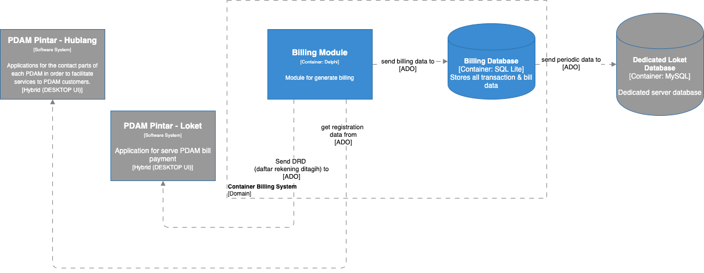

= Architecture SiPintar BSBS ver 4

== High Level Architecture

Berikut adalah gambar diagram C2 sistem SiPintar BSBS V4:

Sistem ini merupakan bagian dari Bimasakti Alterra. Untuk lebih detail terkait hubungan SiPintar BSBS V4 dengan sistem Bimasakti Alterra lainnya, silakan mengakses diagram C1 berikut.

== Related System

SiPintar BSBS V4 terdiri dari beberapa sistem yang saling terintegrasi. Berikut daftar sistem yang terhubung dengan SiPintar BSBS V4.

[cols="10%,30%,30%,30%",frame=all, grid=all]
|===
^.^h| *System Name* 
^.^h| *Description* 
^.^h| *Depends on* 
^.^h| *Be a Dependencies to*

| *SiPintar BSBS ver 4*
|Aplikasi untuk menghitung billling pelanggan PDAM masing-masing
a| 
a|
|===
