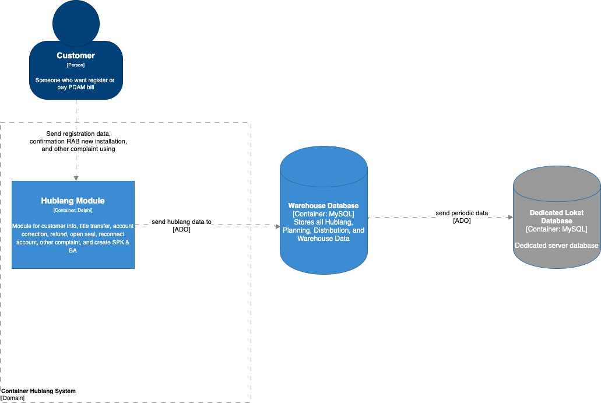
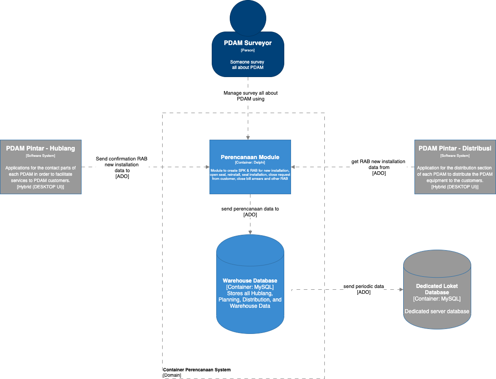
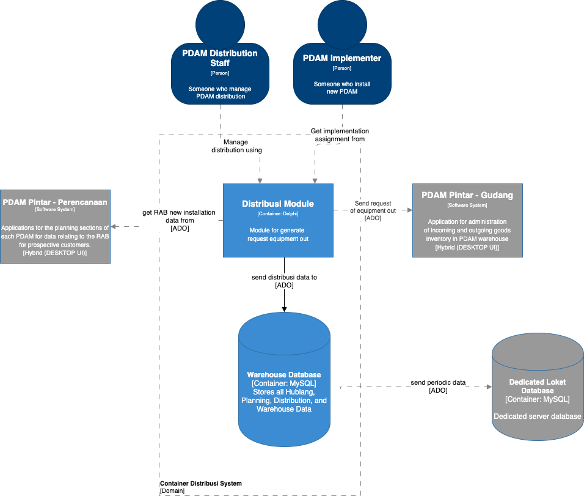

= Architecture SiPintar BSHPD ver 4

== High Level Architecture

Berikut adalah gambar diagram C2 sistem BSHPD ver 4:

1. Hublang
+

2. Perencanaan
+

3. Distribusi
+

Sistem BSHPD merupakan bagian dari Bimasakti Alterra. Untuk lebih detail terkait hubungan BSHPD ver 4 dengan sistem Bimasakti Alterra lainnya, silakan mengakses diagram C1 berikut.

== Related System

BSHPD ver 4 terdiri dari beberapa sistem yang saling terintegrasi. Berikut daftar sistem yang terhubung dengan BSHPD ver 4.

[cols="10%,30%,30%,30%",frame=all, grid=all]
|===
^.^h| *System Name* 
^.^h| *Description* 
^.^h| *Depends on* 
^.^h| *Be a Dependencies to*

| *PDAMPintar-Hubungan Pelanggan*
|Aplikasi untuk bagian hublang PDAM masing-masing agar memudahkan pelayanan ke pelanggan PDAM.
a| 
a|

| *PDAMPintar-Perencanaan*
|Aplikasi untuk bagian perencanaan PDAM masing-masing untuk data-data yang berkaitan dengan RAB
a| 
a|

| *PDAMPintar-Distribusi*
| Aplikasi untuk bagian distribusi PDAM masing-masing.
a| 
a|
|===