= Flow Atribut Ongkos - Development

Dokumen ini berisi tentang _flow_ Development pada menu *Atribut Ongkos* dari sistem Sipintar.NET.

Berikut adalah _flow_ dari Atribut Ongkos:

== 1. Tampilan Utama

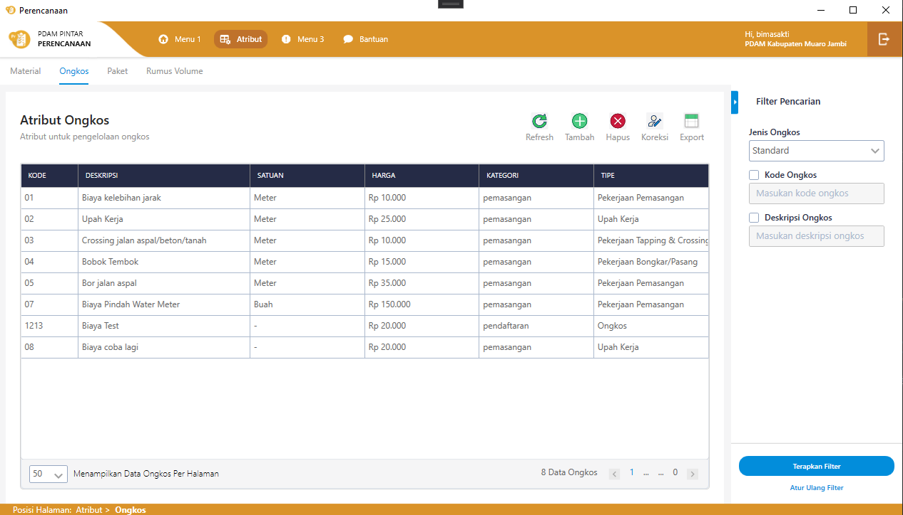
{sp} +

Pada fitur atribut ongkos di halaman utama, terdapat fungsi _read_ pada saat menampilkan data di _grid_ dan _value_ _combobox_. Untuk membuat halaman utama atribut ongkos, klik kanan pada _directory_ pilih *add -> user control (WPF) save dengan nama OngkosView*. +

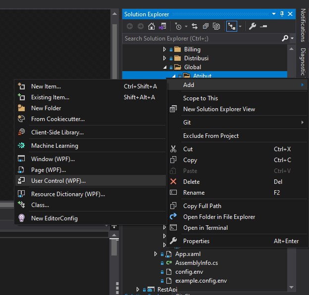
{sp} +

Setelah berhasil disimpan, maka akan ada OngkosView.xaml. Jika OngkosView.xaml diklik, maka akan ada OngkosView.xaml.cs.
 
 . OngkosView.xaml = untuk mendesain tampilan.
 . OngkosView.xaml.cs = memberikan fungsi pada tampilan.

Karena pada sistem Sipintar.NET menggunakan Arsitektur MVVM(Model, View, ViewModel), maka dibutuhkan ViewModel untuk menunjang _View_(OngkosView) yang sudah di uat. Klik kanan pada _directory_ pilih *add -> Class save dengan nama OngkosViewModel*.

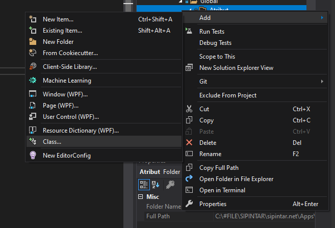
{sp} +

Untuk menyambungkan antara _View_ dengan ViewModel yang sudah di buat tambahkan pada _view_ induk atau biasa disebut parent _view_. Fitur atribut ongkos parent viewnya itu adalah AtributView, jadi tambahkan _syntax_ ini pada AtributView.

    <DataTemplate DataType="{x:Type viewmodel:OngkosViewModel}">
        <view:OngkosView />
    </DataTemplate>

Setelah _View_ dengan ViewModel disambungkan, tambahkan variable dan property pada class AtributViewModel seperti gambar di bawah ini:

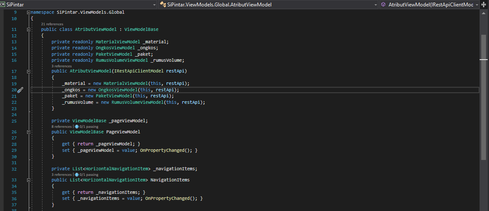
{sp} 

. Private readonly OngkosViewModel _ongkos; => untuk menginisiasi ViewModelnya, dan kenapa dipilih private readonly karena kebutuhannya data tidak boleh diubah dan hanya bisa di akses pada class ini saja.

. _ongkos = new OngkosViewModel(this, restApi); => untuk mengisi default value pada variable yang di buat

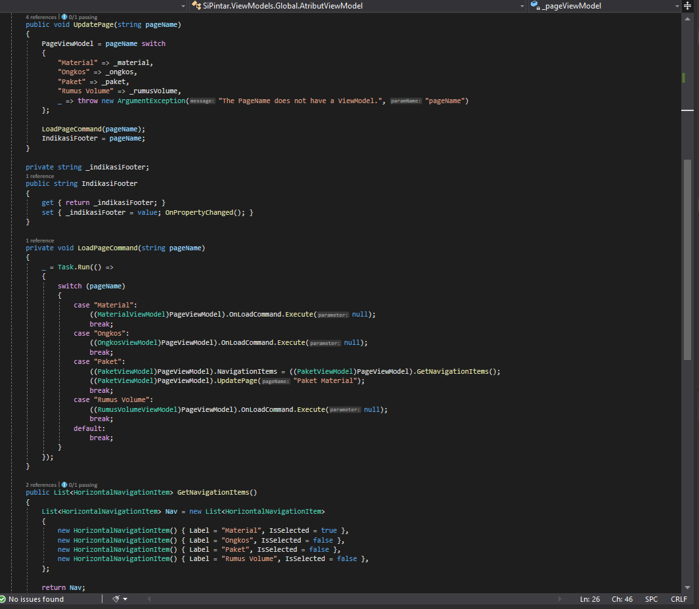
{sp} 

. "Ongkos" => _ongkos, => untuk mengidentifikasi posisi page ongkos
. ((OngkosViewModel)PageViewModel).OnLoadCommand.Execute(null); => fungsi yang di jalankan pertama, jika berada pada page ongkos.
. New HorizontalNavigationItem() { Label = "Ongkos", IsSelected = false }, => untuk menambahkan item ongkos pada navigasi sub header.

Tampilan static seperti di bawah ini.

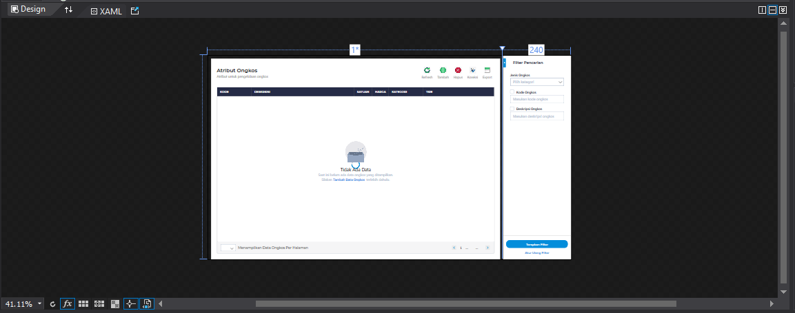
{sp} +

Ada 3 komponen utama pada tampilan utama Atribut Ongkos:

. Tabel => Untuk menampilkan data pada tabel yang telah di siapkan pada tampilan statik adalah pertama tambahkan property pada OngkosViewModel data ongkos yang ingin di tampilkan seperti di bawah ini,

        private ObservableCollection<MasterOngkosDto> _masterOngkosList = new ObservableCollection<MasterOngkosDto>();
        public ObservableCollection<MasterOngkosDto> MasterOngkosList
        {
            get { return _masterOngkosList; }
            set
            {
                _masterOngkosList = value;
                OnPropertyChanged();
            }
        }
+ 
function pemanggilan ke api / Get pada OnLoadCommand 
+
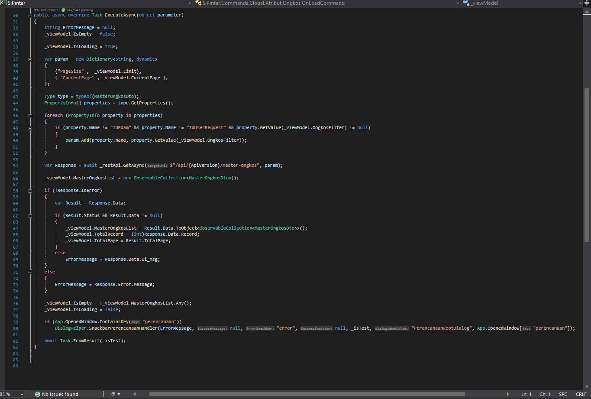
{sp} +
mengisi value untuk MasterOngkosList, selanjutnya menyambungkannya ke UI, buka file OngkosView.xaml. Yang di perlukan menampilkan data di tandai kotak berwarna merah
+
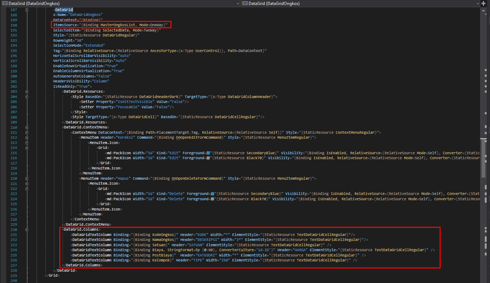
{sp} +
pada "ItemsSource" valuenya isi dengan property MasterOngkosList, dan binding setiap kolomnya.

. Filter => Untuk memfilter data yang ingin di tampilkan pada tabel
tambahkan command "OnFilterCommand" pada OngkosViewModel, dan unction pemanggilan ke api / Get dengan parameter sesui  filter yang di pilih.

. Action Button => ada 4 action button utama yaitu "Refresh, Tambah, Hapus, Koreksi"
.. Refresh => refresh pengulangan dari OnfilterCommand.
.. Tambah => pada button tambah, ada pemanggilan ke class OnOpenAddFormCommand yang ad di directory command, dan untuk view tambah datanya ada pada directory Ongkos dan filenya DialogFormView.xaml
+
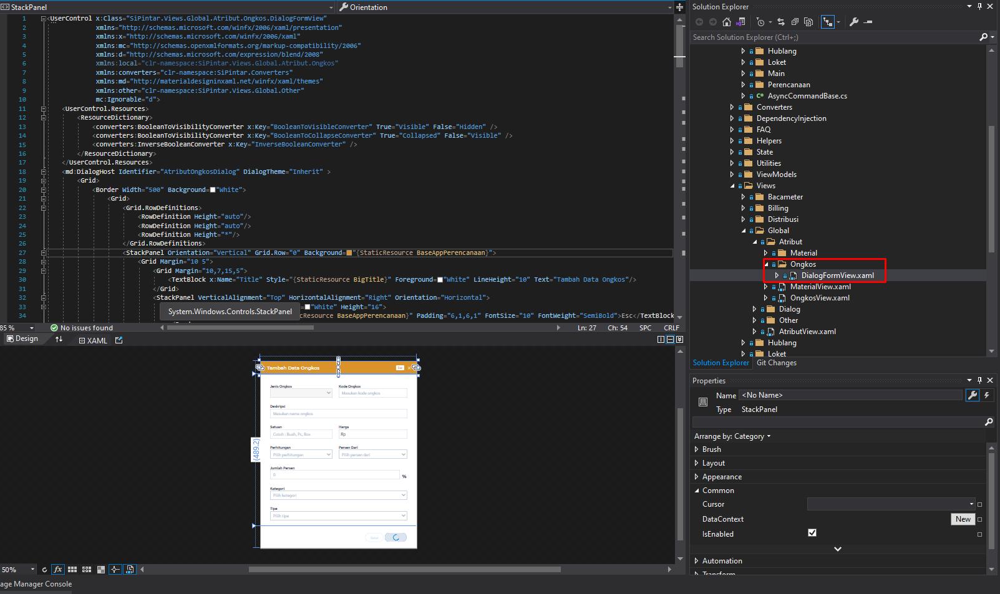
{sp} +
pada OnOpenAddFormCommand ada hit api untuk menampilkan master paket material. Saat klik button tambah akan menjalankan function class OpenSubmitAddForm.
+
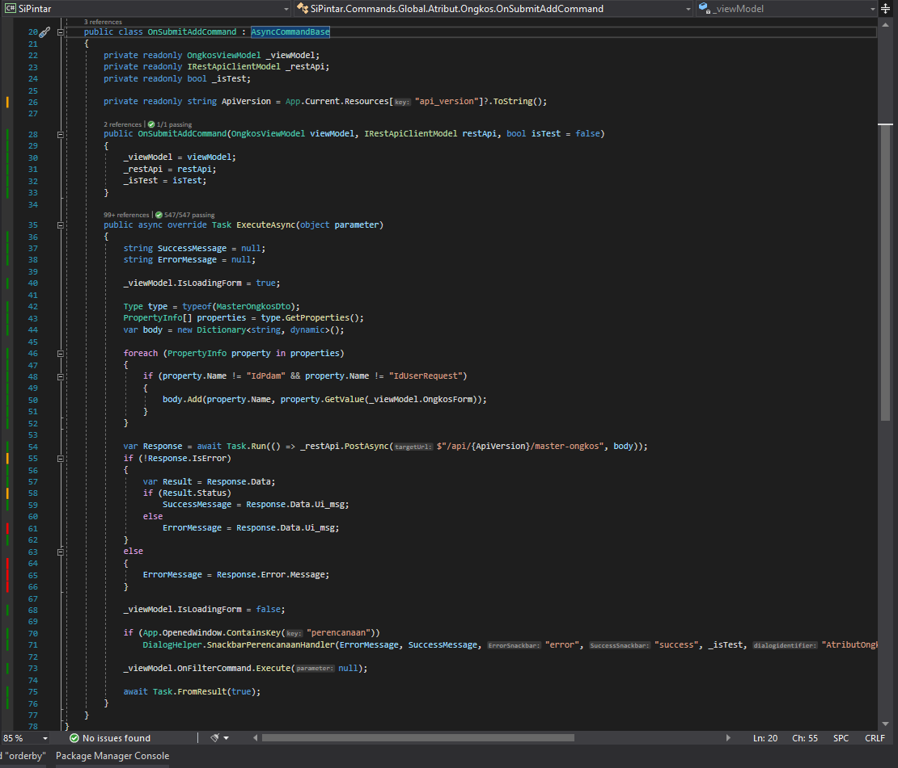
{sp} +
.. Koreksi => pada button koreksi ada pemanggilan ke class OnOpenEditFormCommand yang ad di _directory_ command, dan untuk view tambah datanya ada pada directory Ongkos dan filenya DialogFormView.xaml.
+
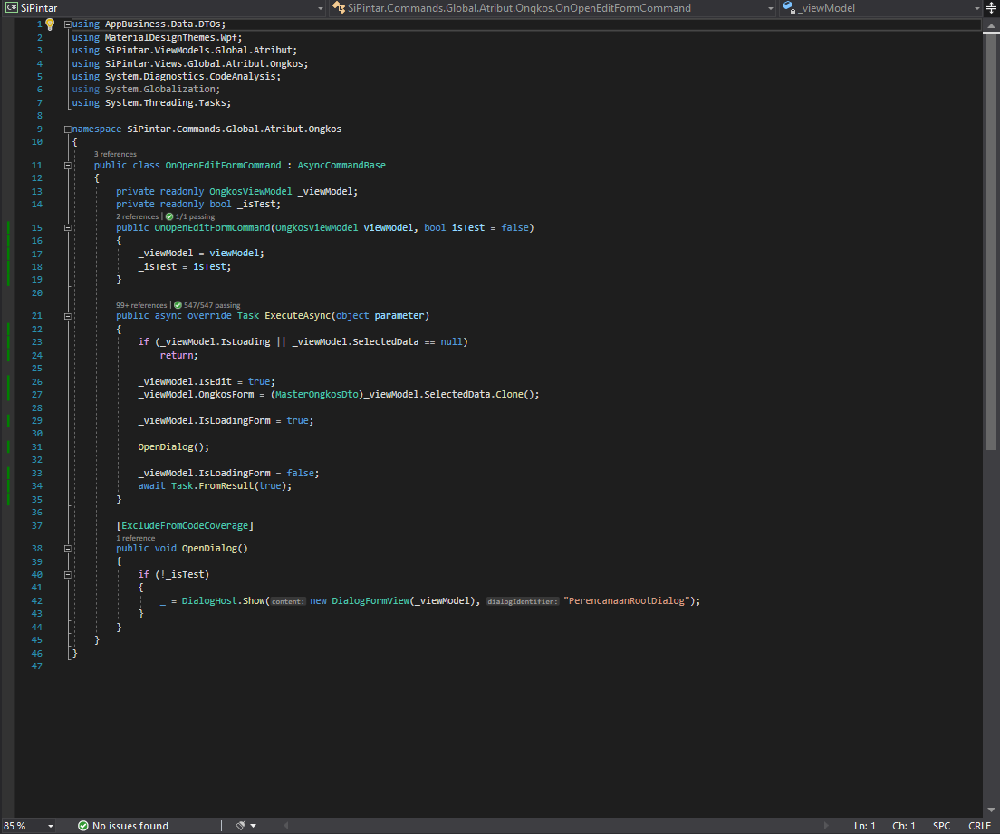
{sp} +
Hampir sama dengan OnOpenAddFormCommand hanya saja pada OnOpenEditFormCommand ada _value_ pada setiap kolomnya.

  _viewModel.OngkosForm = (MasterOngkosDto)_viewModel.SelectedData.Clone(); 

Saat klik _button_ Simpan akan menjalankan function class OpenSubmitEditForm.
+
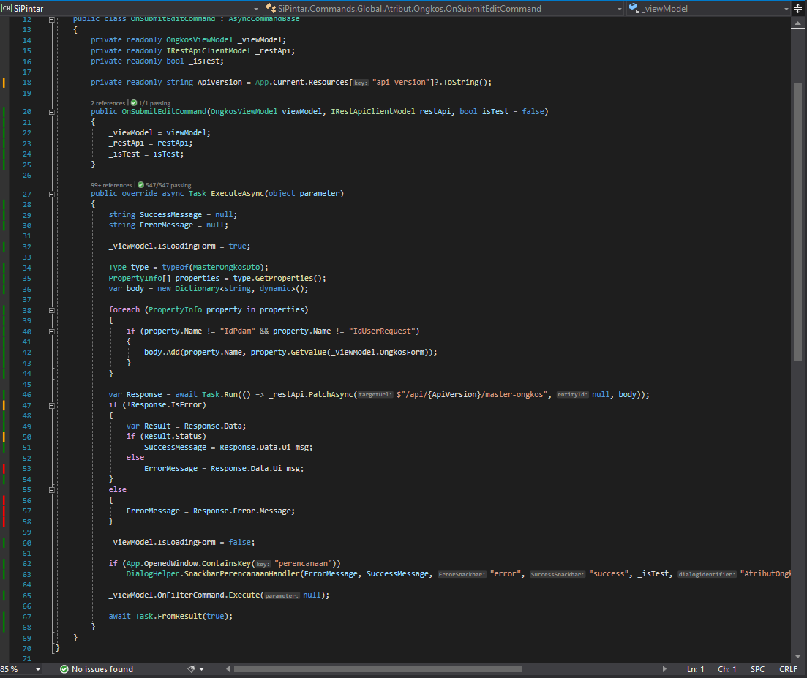
{sp} +

.. Hapus => pada _button_ Hapus, terdapat pemanggilan ke class command OnOpenDeleteFormCommand yang ada pada directory command.
+
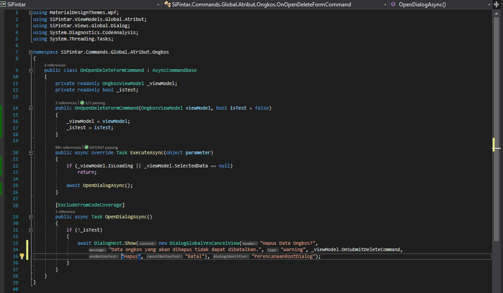
{sp} +

Ada pemanggilan view "DialogGlobalYesCancelView" bisa di cari di directory Views/Global/Dialog untuk menampilkan dialog konfirmasi hapus. Jika diklik OK, maka akan menjalankan function class OpenSubmitDeleteForm dan meng hit api.

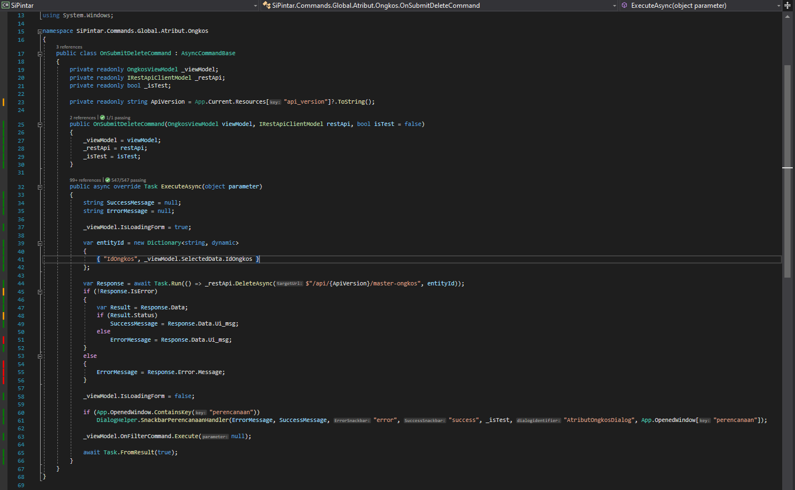
{sp} +

Sedangkan jika klik Batal, maka hanya akan menghilangkan _form_ dialog konfirmasi hapus saja.