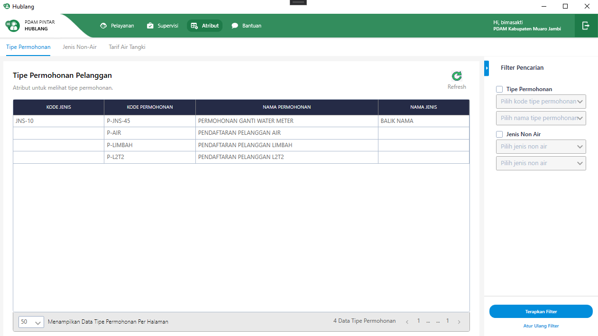

= Flow Atribut Tipe Permohonan - Development

Dokumen ini berisi tentang _flow_ Development pada menu *Atribut Tipe Permohonan* dari sistem Sipintar.NET.

Berikut adalah _flow_ dari Atribut Tipe Permohonan :

== 1. Tampilan Utama

{sp} +

Pada fitur Atribut Tipe Permohonan di halaman utama, terdapat fungsi _read_ pada saat menampilkan data pada _grid_ dan _value combobox_. Untuk membuat halaman utama Atribut Tipe Permohonan, klik kanan pada _directory_, pilih Add -> User Control (WPF) save dengan nama TipePermohonanView. +

{sp} +

Setelah berhasil di-_save_, akan ada TipePermohonanView.xaml. Jika pada TipePermohonanView.xaml diklik, maka akan ditampilkan TipePermohonanView.xaml.cs.
 
 . TipePermohonanView.xaml = untuk mendesain tampilan.
 . TipePermohonanView.xaml.cs = untuk memberikan fungsi pada tampilan.

Karena  sistem Sipintar.NET menggunakan Arsitektur MVVM(Model, View, ViewModel), maka dibutuhkan ViewModel untuk menunjang View(TipePermohonanView) yang sudah di buat. Klik kanan pada _directory_, kemudian pilih Add -> Class _save_ dengan nama TipePermohonanViewModel.

{sp} +

Untuk menyambungkan antara View dengan ViewModel yang sudah dibuat tambahkan pada view induk atau biasa disebut parent view. Parent view yang digunakan pada Fitur Aribut Tipe Permohonan adalah AtributView, jadi tambahkan _syntax_ berikut pada AtributView.

    <DataTemplate DataType="{x:Type viewmodel:TipePermohonanViewModel}">
        <view:TipePermohonanView />
    </DataTemplate>

Setelah View dengan ViewModel disambungkan, tambahkan _variable_ dan _property_ pada _class_ AtributViewModel seperti gambar di bawah ini:

{sp} +

. private readonly TipePermohonanViewModel _tipePermohonan; => Untuk menginisiasi ViewModel-nya. Private readonly digunakan karena data tidak boleh diubah dan hanya bisa diakses pada class ini saja.

. _tipePermohonan = new TipePermohonanViewModel(this, restApi); => Untuk mengisi default value pada variable yang di buat

{sp} +

. "Tipe Permohonan" => _tipePermohonan, => Untuk mengidentifikasi posisi page tipe permohonan
. ((TipePermohonanViewModel)PageViewModel).OnLoadCommand.Execute(null); => Fungsi yang dijalankan pertama, jika berada pada page tipe permohonan.
. new HorizontalNavigationItem() { Label = "Tipe Permohonan", IsSelected = true }, => Untuk menambahkan item tipe permohonan pada navigasi sub header.

Berikut adalah tampilan static yang ditampilkan.

{sp} +

Terdapat 2 komponen utama pada tampilan utama Atribut Tipe Permohonan:

. Tabel => Untuk menampilkan data pada tabel yang telah disiapkan pada tampilan statik, tambahkan property pada TipePermohonanViewModel data tipe permohonan yang ingin ditampilkan seperti di bawah ini.

        private ObservableCollection<MasterTipePermohonanDto> _masterTipePermohonanList = new ObservableCollection<MasterTipePermohonanDto>();
        public ObservableCollection<MasterTipePermohonanDto> MasterTipePermohonanList
        {
            get { return _masterTipePermohonanList; }
            set
            {
                _masterTipePermohonanList = value;
                OnPropertyChanged();
            }
        }
+ 
_Function_ pemanggilan ke API / GET pada OnLoadCommand 
+

{sp} +
Mengisi _value_ untuk MasterTipePermohonanList, selanjutnya menyambungkannya ke UI. Buka _file_ TipePermohonanView.xaml. Yang diperlukan untuk menampilkan data ditandai kotak berwarna merah.
+

{sp} 
+

{sp} +
pada "ItemsSource", _value_-nya isi dengan _property_ MasterTipePermohonanList, dan _binding_ setiap kolomnya.

. Filter => Untuk memfilter data yang ingin di tampilkan pada tabel. Tambahkan _command_ "OnFilterCommand" pada TipePermohonanViewModel, dan _function_ pemanggilan ke API / GET dengan parameter sesuai filter yang dipilih.

