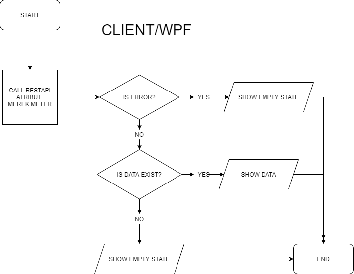
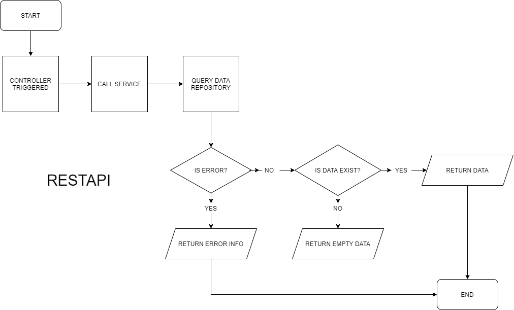
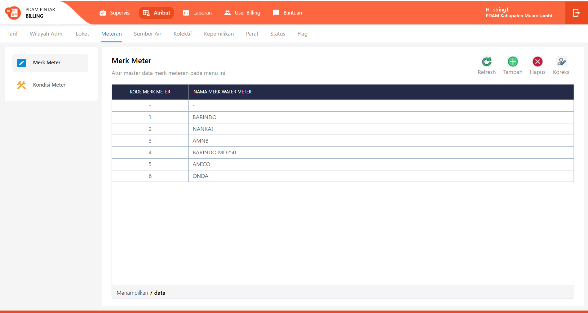
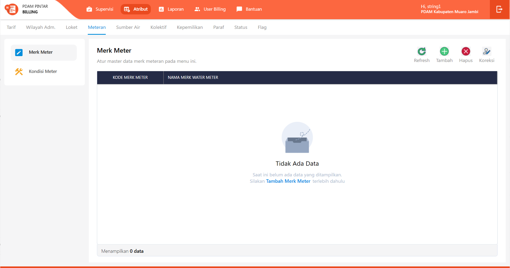
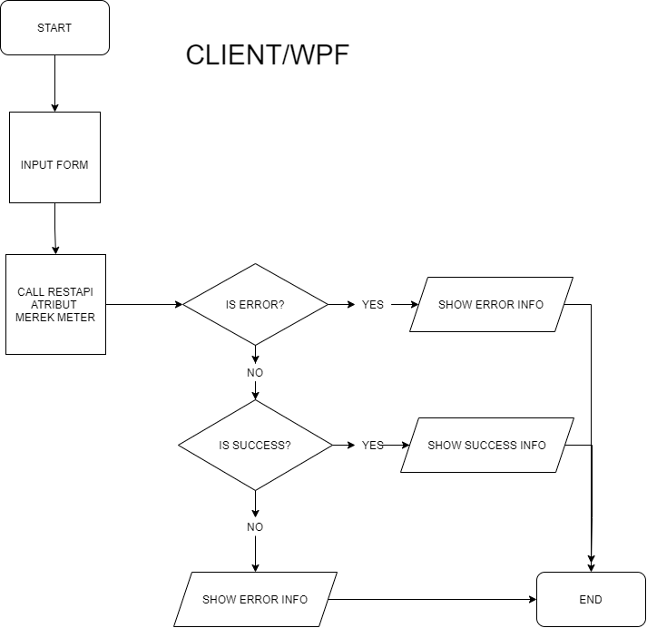
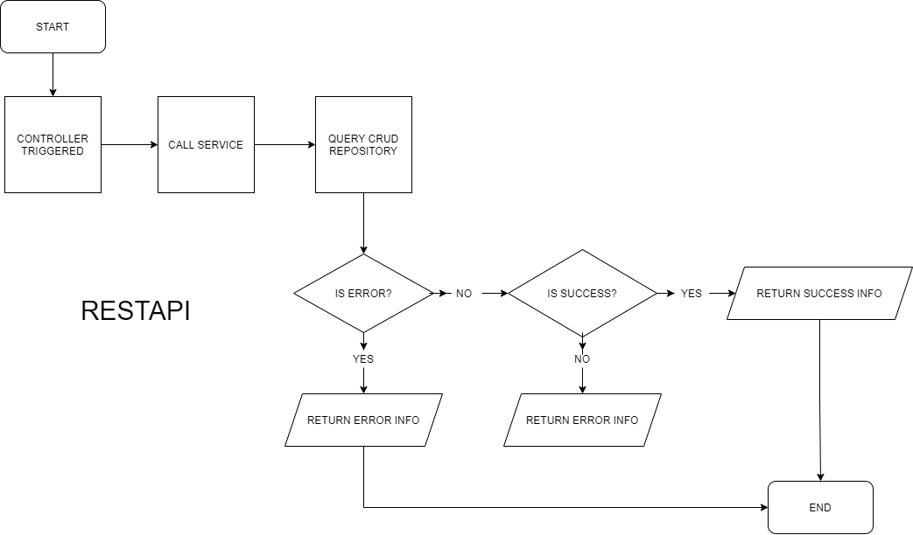
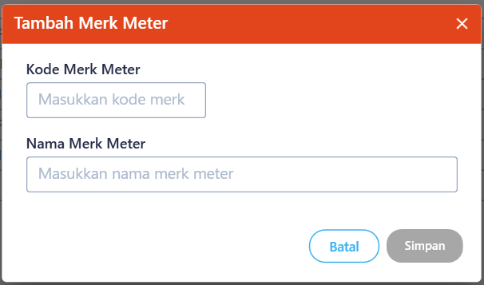
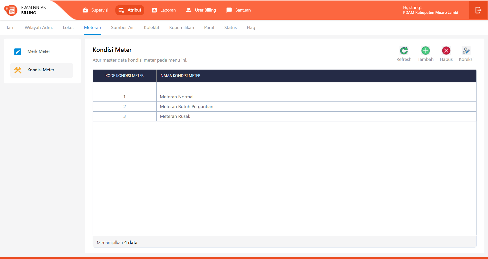
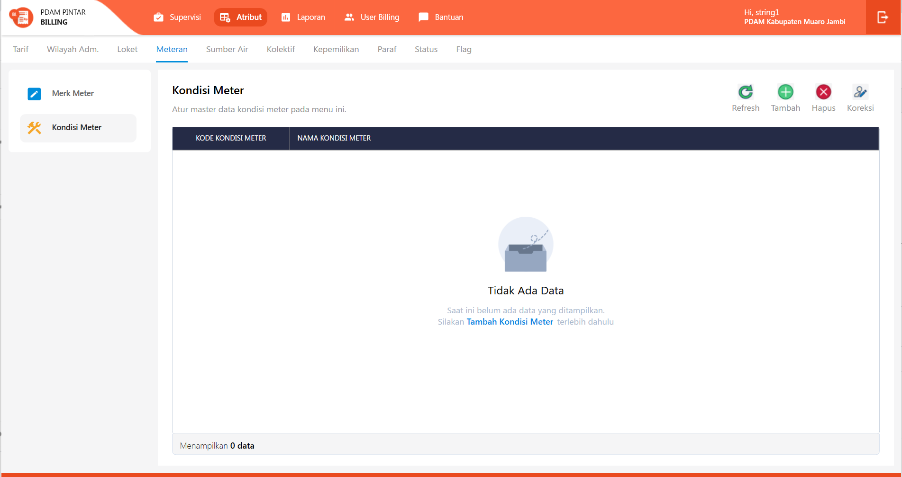
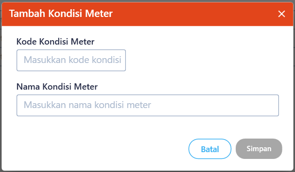

= Flow Atribut Meteran

Dokumen ini berisi tentang _flow_ CRUD pada menu _Atribut Meteran_ dari sistem Sipintar.NET.

Terdapat 2 sub-menu pada halaman menu Atribut Meteran, yakni: 

* <<#1-merk-meter, Merk Meter>>
* <<#2-kondisi-meter, Kondisi Meter>>
{sp} +
{sp} +

== 1. Merk Meter

Berikut adalah _flow_ dari Atribut Merk Meter:

=== 1.1. Flow Page Atribut Merk Meter

Berikut adalah _flow_ dari show halaman Atribut Merk Meter. Saat membuka halaman atribut merk meter, sistem akan melakukan serangkaian proses:

1. Mendapatkan data pada page tersebut dengan memanggil URL REST API;
2. Pada sisi REST API, akan melakukan rangkaian proses __query__ ke _database_; 
3. REST API mengembalikan hasil __query__ ke Client; 
4. Client menampilkan hasil __query__ oleh REST API. Jika __query__ tidak bermasalah dan datanya tidak nol, maka akan _show_ tabel, apabila tidak maka akan _show_ _empty state_.

==== Flow WPF

==== Flow REST API

{sp} +
{sp} +
Berikut adalah _screenshot_ _main table_ Atribut Merk Meter:

{sp} +
{sp} +
Berikut adalah _screenshot_ _empty state_:

{sp} +

=== 1.2. Flow Input CRUD

Berikut adalah _flow_ untuk input CRUD menu Atribut Merk Meter. Input data dilakukan oleh _user_ melalui _dialog form_.

==== Flow WPF

==== Flow REST API

{sp} +
{sp} +
Berikut adalah _screenshot_ input _dialog form_:

=== 1.3. Endpoint URL REST API

Pada menu ini, URL REST API yang digunakan adalah: 

[cols="10%,25%,65%",frame=all, grid=all]
|===
^.^h| *Method* 
^.^h| *URL* 
^.^h| *Deskripsi*

|GET 
| /api/v1/master-merek-meter 
| Digunakan untuk Get data, wajib menambahkan *IdPdam* dan *IdUserRequest* pada URI param ketika request

|POST 
| /api/v1/master-merek-meter 
| Digunakan untuk Tambah data, wajib menambahkan *IdPdam* dan *IdUserRequest* pada body ketika request

|PATCH 
| /api/v1/master-merek-meter 
| Digunakan untuk Ubah data, wajib menambahkan *IdPdam* dan *IdUserRequest* serta *IdEntity* pada body ketika request

|DELETE 
| /api/v1/master-merek-meter 
| Digunakan untuk Hapus data, wajib menambahkan *IdPdam* dan *IdUserRequest* serta *IdEntity* pada URI param ketika request
|===

==== Code Notes

Fitur ini menggunakan tabel _master_attribute_merek_meter_ untuk menyimpan datanya.
{sp} +
{sp} +

== 2. Kondisi Meter

Berikut adalah _flow_ dari Atribut Kondisi Meter:

=== 2.1. Flow Page Atribut Kondisi Meter

Berikut adalah _flow_ dari show halaman Atribut Kondisi Meter. Saat membuka _page_ Atribut Kondisi Meter, aplikasi akan melakukan serangkaian proses berikut:

1. Mendapatkan data pada halaman tersebut dengan memanggil URL REST API;
2. Pada sisi REST API, akan melakukan rangkaian proses _query_ ke _database_; 
3. REST API mengembalikan hasil _query_ ke Client; 
4. Client menampilkan hasil _query_ oleh REST API. Jika _query_ tidak bermasalah dan datanya tidak nol, maka akan _show_ tabel, apabila tidak maka akan _show empty state_.

==== Flow WPF

==== Flow REST API

{sp} +
{sp} +
Berikut adalah screenshot main tabel atribut kondisi meter:

{sp} +
{sp} +
Berikut adalah _screenshot_ _empty state_:

{sp} +

=== 2.2. Flow Input CRUD

Berikut adalah _flow_ untuk input CRUD menu Atribut Kondisi Meter. Input data dilakukan oleh _user_ melalui _dialog form_.

==== Flow WPF

==== Flow REST API

{sp} +
{sp} +
Berikut adalah _screenshot_ input _dialog form_:

=== 2.3. Endpoint URL REST API

Pada menu ini, URL REST API yang digunakan adalah:

|===
| *Method* |*URL* | *Deskripsi*
|GET | /api/v1/master-kondisi-meter | Digunakan untuk Get data, wajib menambahkan *IdPdam* dan *IdUserRequest* pada URI param ketika request
|POST | /api/v1/master-kondisi-meter | Digunakan untuk Tambah data, wajib menambahkan *IdPdam* dan *IdUserRequest* pada body ketika request
|PATCH | /api/v1/master-kondisi-meter | Digunakan untuk Ubah data, wajib menambahkan *IdPdam* dan *IdUserRequest* serta *IdEntity* pada body ketika request
|DELETE | /api/v1/master-kondisi-meter | Digunakan untuk Hapus data, wajib menambahkan *IdPdam* dan *IdUserRequest* serta *IdEntity* pada URI param ketika request
|===

==== Code Notes

Fitur ini menggunakan tabel _master_attribute_kondisi_meter_ untuk menyimpan datanya.

==== Other Source

https://drive.google.com/file/d/11puWTqzM8qDLKZUX7RAa0Yeh8x-gT3Sf/view?usp=sharing[Diagram Source (editable with email @bsa.id)]