= Flow Atribut Tarif

Dokumen ini berisi tentang _flow_ CRUD pada menu *Atribut Tarif* dari sistem Sipintar.NET.

Terdapat 7 sub-menu pada halaman menu Atribut Tarif, yakni: 

* <<#1-golongan, Golongan>>
* <<#2-diameter, Diameter>>
* <<#3-administrasi-lain, Administrasi Lain>>
* <<#4-pemeliharaan-lain, Pemeliharaan Lain>>
* <<#5-retribusi-lain, Retribusi Lain>>
* <<#6-materai, Materai>>
* <<#7-tarif-golongan-L2T2, Tarif Golongan L2T2>>
{sp} +
{sp} +

== 1. Golongan

Berikut adalah _flow_ dari Atribut Golongan:

=== 1.1. Flow Page Atribut Golongan

Berikut adalah _flow_ dari _show_ halaman Atribut Golongan. Saat membuka _page_ Atribut Golongan, aplikasi akan melakukan serangkaian proses berikut:

1. Mendapatkan data pada _page_ tersebut dengan memanggil URL REST API;
2. Pada sisi REST API, akan melakukan rangkaian proses _query_ ke _database_; 
3. REST API mengembalikan hasil _query_ ke Client; 
4. Client menampilkan hasil _query_ oleh REST API. Jika _query_ tidak bermasalah dan datanya tidak nol maka akan _show_ tabel, apabila tidak maka akan _show empty state_.

==== Flow WPF

==== Flow REST API

{sp} +
{sp} +
Berikut adalah __screenshot__ _main table_ Atribut Golongan:

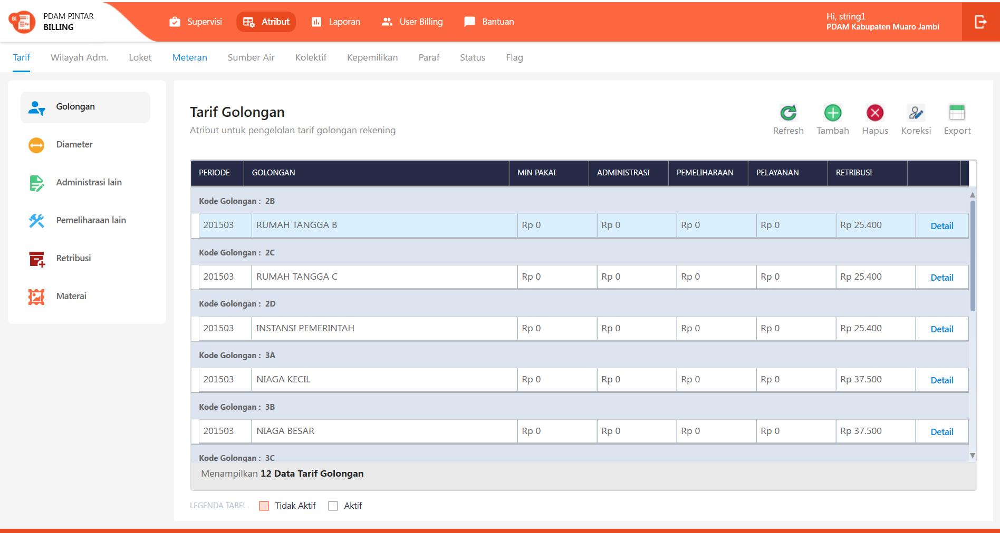
{sp} +

=== 1.2. Flow Input CRUD

Berikut adalah flow untuk input CRUD menu Atribut Golongan. Input data dilakukan oleh User melalui __dialog form__.

==== Flow WPF

==== Flow REST API

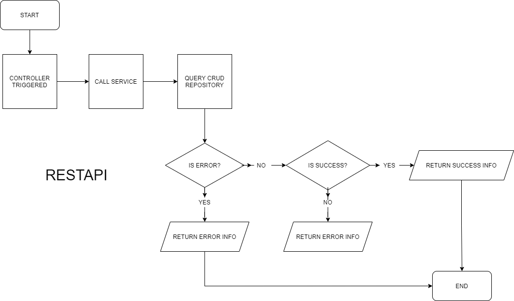
{sp} +
{sp} +
Berikut adalah __screenshot__ input __dialog form__:

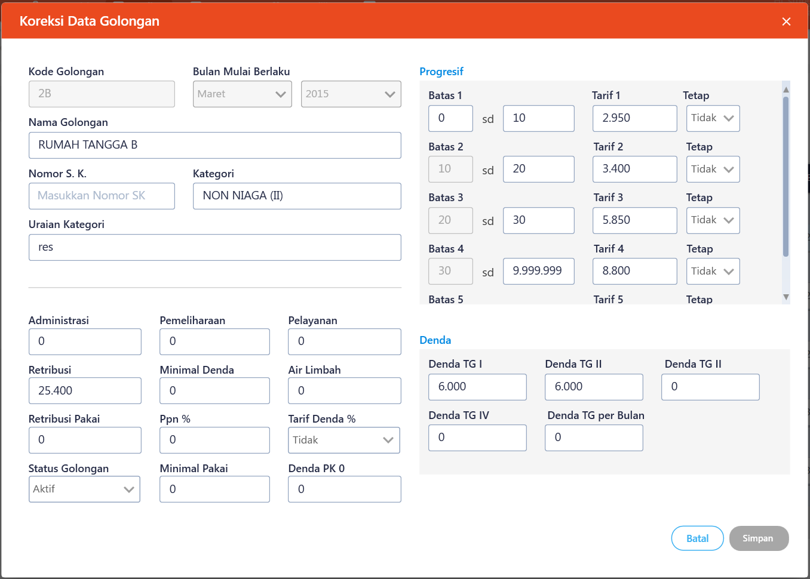

=== 1.3. Endpoint URL REST API

Pada menu ini, URL REST API yang digunakan adalah: 

[cols="10%,25%,65%",frame=all, grid=all]
|===
^.^h| *Method* 
^.^h| *URL* 
^.^h| *Deskripsi*

|GET 
| /api/v1/master-tarif-golongan 
| Digunakan untuk Get data, wajib menambahkan *IdPdam* dan *IdUserRequest* pada URI param ketika request

|POST 
| /api/v1/master-tarif-golongan 
| Digunakan untuk Tambah data, wajib menambahkan *IdPdam* dan *IdUserRequest* pada body ketika request

|PATCH 
| /api/v1/master-tarif-golongan 
| Digunakan untuk Ubah data, wajib menambahkan *IdPdam* dan *IdUserRequest* serta *IdEntity* pada body ketika request

|DELETE 
| /api/v1/master-tarif-golongan 
| Digunakan untuk Hapus data, wajib menambahkan *IdPdam* dan *IdUserRequest* serta *IdEntity* pada URI param ketika request
|===

==== Code Notes

Fitur ini menggunakan tabel _master_tarif_golongan_ dan _master_tarif_golongan_detail_ untuk menyimpan datanya.
{sp} +
{sp} +

== 2. Diameter

Berikut adalah _flow_ dari Atribut Diameter:

=== 2.1. Flow Page Atribut Diameter

Berikut adalah _flow_ dari _show_ halaman Atribut Diameter. Saat membuka page Atribut Diameter, aplikasi akan melakukan serangkaian proses berikut:

1. Mendapatkan data pada _page_ tersebut dengan memanggil URL REST API;
2. Pada sisi REST API, akan melakukan rangkaian proses _query_ ke _database_; 
3. REST API mengembalikan hasil _query_ ke Client; 
4. Client menampilkan hasil _query_ oleh REST API. Jika _query_ tidak bermasalah dan datanya tidak nol, maka akan _show_ tabel, apabila tidak maka akan _show_ _empty state_.

==== Flow WPF

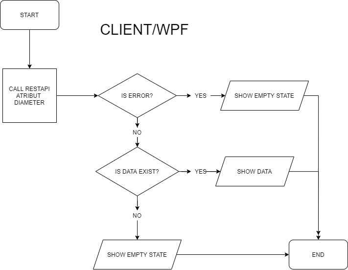

==== Flow REST API

{sp} +
{sp} +
Berikut adalah __screenshot__ _main table_ Atribut Diameter:

image::../../images-sipintar/billing/atribut/sipintar-atribut-diameter-3.png[900,600]
{sp} +

=== 2.2. Flow Input CRUD

Berikut adalah flow untuk input CRUD menu Atribut Diameter. Input data dilakukan oleh User melalui _dialog form_.

==== Flow WPF

==== Flow REST API

{sp} +
{sp} +
Berikut adalah __screenshot__ input _dialog form_:

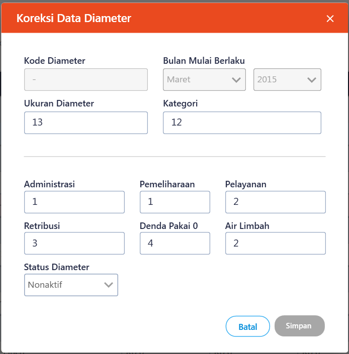

=== 2.3. Endpoint URL REST API

Pada menu ini, URL REST API yang digunakan adalah: 

|===
| *Method* |*URL* | *Deskripsi*
|GET | /api/v1/master-tarif-diameter | Digunakan untuk Get data, wajib menambahkan *IdPdam* dan *IdUserRequest* pada URI param ketika request
|POST | /api/v1/master-tarif-diameter | Digunakan untuk Tambah data, wajib menambahkan *IdPdam* dan *IdUserRequest* pada body ketika request
|PATCH | /api/v1/master-tarif-diameter | Digunakan untuk Ubah data, wajib menambahkan *IdPdam* dan *IdUserRequest* serta *IdEntity* pada body ketika request
|DELETE | /api/v1/master-tarif-diameter | Digunakan untuk Hapus data, wajib menambahkan *IdPdam* dan *IdUserRequest* serta *IdEntity* pada URI param ketika request
|===

==== Code Notes

Fitur ini menggunakan tabel _master_tarif_diameter_ dan _master_tarif_diameter_detail_ untuk menyimpan datanya.
{sp} +
{sp} +

== 3. Administrasi Lain

Berikut adalah _flow_ dari Atribut Administrasi Lain:

=== 3.1. Flow Page Atribut Administrasi Lain

Berikut adalah _flow_ dari show halaman Atribut Administrasi Lain. Saat membuka page Atribut Administrasi Lain, aplikasi akan melakukan serangkaian proses berikut:

1. Mendapatkan data pada _page_ tersebut dengan memanggil URL REST API;
2. Pada sisi REST API, akan melakukan rangkaian proses _query_ ke _database_; 
3. REST API mengembalikan hasil _query_ ke Client; 
4. Client menampilkan hasil _query_ oleh REST API. Jika _query_ tidak bermasalah dan datanya tidak nol, maka akan _show_ tabel, apabila tidak maka akan _show_ _empty state_.

==== Flow WPF

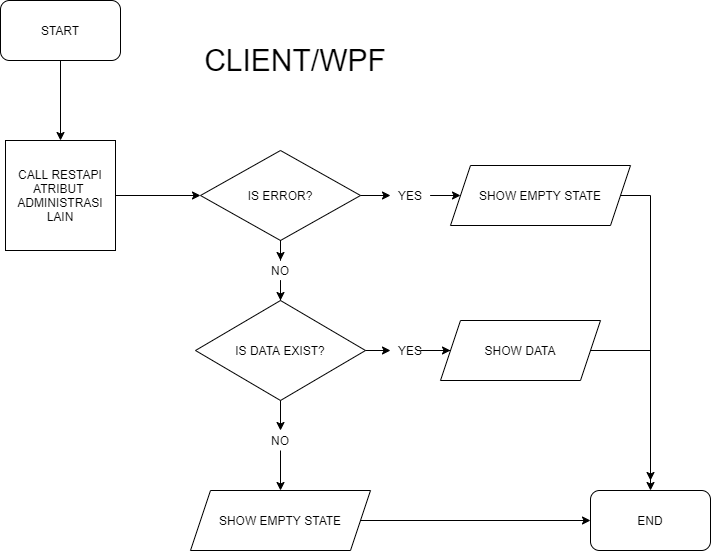

==== Flow REST API

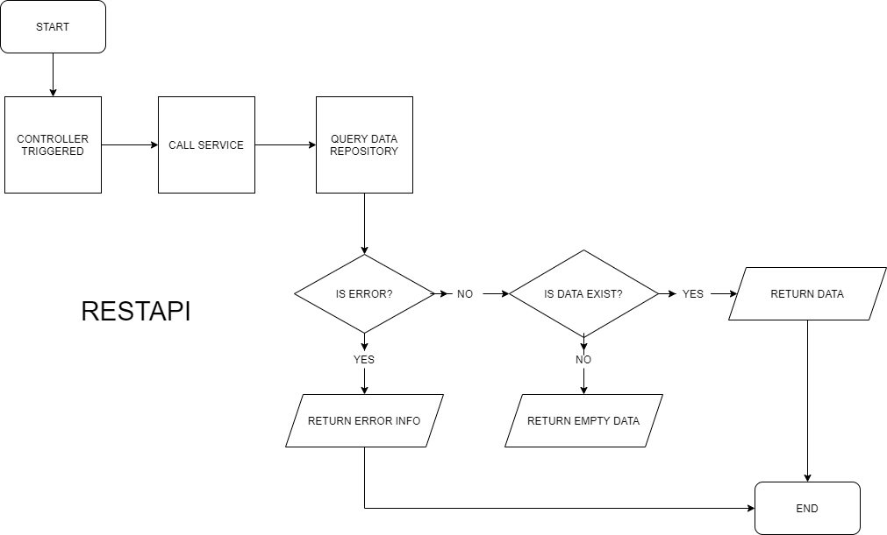
{sp} +
{sp} +
Berikut adalah __screenshot__ _main table_ Atribut Administrasi Lain:

{sp} +

=== 3.2. Flow Input CRUD

Berikut adalah flow untuk input CRUD menu Atribut Administrasi Lain. Input data dilakukan oleh User melalui _dialog form_.

==== Flow WPF

==== Flow REST API

{sp} +
{sp} +
Berikut adalah _screenshot_ input _dialog form_:

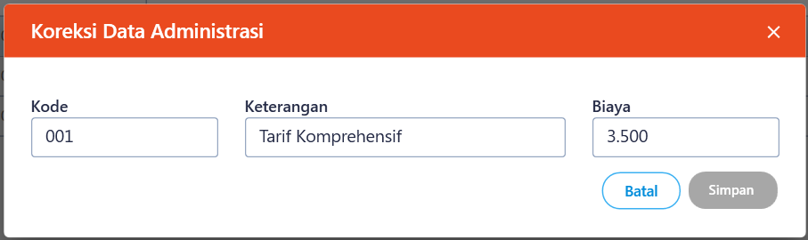

=== 3.3. Endpoint URL REST API

Pada menu ini, URL REST API yang digunakan adalah: 

|===
| *Method* |*URL* | *Deskripsi*
|GET | /api/v1/master-tarif-administrasi-lain | Digunakan untuk Get data, wajib menambahkan *IdPdam* dan *IdUserRequest* pada URI param ketika request
|POST | /api/v1/master-tarif-administrasi-lain | Digunakan untuk Tambah data, wajib menambahkan *IdPdam* dan *IdUserRequest* pada body ketika request
|PATCH | /api/v1/master-tarif-administrasi-lain | Digunakan untuk Ubah data, wajib menambahkan *IdPdam* dan *IdUserRequest* serta *IdEntity* pada body ketika request
|DELETE | /api/v1/master-tarif-administrasi-lain | Digunakan untuk Hapus data, wajib menambahkan *IdPdam* dan *IdUserRequest* serta *IdEntity* pada URI param ketika request
|===

==== Code Notes

Fitur ini menggunakan tabel _master_tarif_administrasi_lain_ untuk menyimpan datanya.
{sp} +
{sp} +

== 4. Pemeliharaan Lain

Berikut adalah _flow_ dari Atribut Pemeliharaan Lain:

=== 4.1. Flow Page Atribut Pemeliharaan Lain

Berikut adalah _flow_ dari show halaman Atribut Pemeliharaan Lain. Saat membuka page Atribut Pemeliharaan Lain, aplikasi akan melakukan serangkaian proses berikut:

1. Mendapatkan data pada _page_ tersebut dengan memanggil URL REST API;
2. Pada sisi REST API, akan melakukan rangkaian proses _query_ ke database; 
3. REST API mengembalikan hasil _query_ ke Client; 
4. Client menampilkan hasil _query_ oleh REST API. Jika _query_ tidak bermasalah dan datanya tidak nol, maka akan _show_ tabel, apabila tidak maka akan _show_ _empty state_.

==== Flow WPF

==== Flow REST API

{sp} +
{sp} +
Berikut adalah _screenshot_ _main table_ Atribut Pemeliharaan Lain:

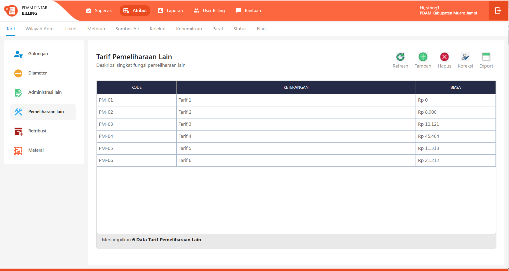
{sp} +

=== 4.2. Flow Input CRUD

Berikut adalah flow untuk input CRUD menu Atribut Pemeliharaan Lain. Input data dilakukan oleh User melalui _dialog form_.

==== Flow WPF

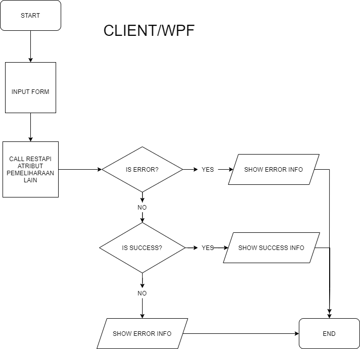

==== Flow REST API

{sp} +
{sp} +
Berikut adalah _screenshot_ input _dialog form_:

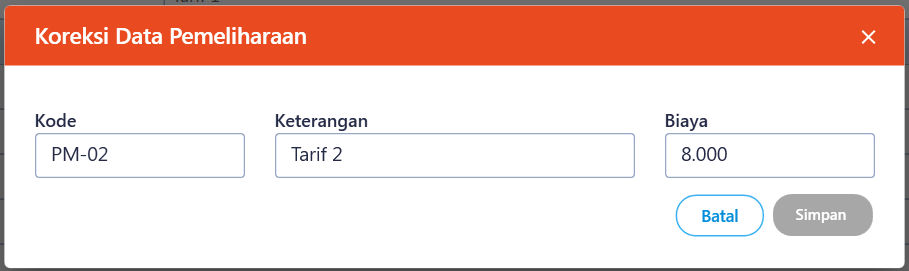

=== 4.3. Endpoint URL REST API

Pada menu ini, URL REST API yang digunakan adalah: 

|===
| *Method* |*URL* | *Deskripsi*
|GET | /api/v1/master-tarif-pemeliharaan-lain | Digunakan untuk Get data, wajib menambahkan *IdPdam* dan *IdUserRequest* pada URI param ketika request
|POST | /api/v1/master-tarif-pemeliharaan-lain | Digunakan untuk Tambah data, wajib menambahkan *IdPdam* dan *IdUserRequest* pada body ketika request
|PATCH | /api/v1/master-tarif-pemeliharaan-lain | Digunakan untuk Ubah data, wajib menambahkan *IdPdam* dan *IdUserRequest* serta *IdEntity* pada body ketika request
|DELETE | /api/v1/master-tarif-pemeliharaan-lain | Digunakan untuk Hapus data, wajib menambahkan *IdPdam* dan *IdUserRequest* serta *IdEntity* pada URI param ketika request
|===

==== Code Notes

Fitur ini menggunakan tabel _master_tarif_pemeliharaan_lain_ untuk menyimpan datanya.
{sp} +
{sp} +

== 5. Retribusi Lain

Berikut adalah flow dari Atribut Retribusi Lain:

=== 5.1. Flow Page Atribut Retribusi Lain

Berikut adalah _flow_ dari _show_ halaman Atribut Retribusi Lain. Saat membuka _page_ Atribut Retribusi Lain, aplikasi akan melakukan serangkaian proses berikut:

1. Mendapatkan data pada _page_ tersebut dengan memanggil URL REST API;
2. Pada sisi REST API, akan melakukan rangkaian proses _query_ ke _database_; 
3. REST API mengembalikan hasil _query_ ke Client; 
4. Client menampilkan hasil _query_ oleh REST API. Jika _query_ tidak bermasalah dan datanya tidak nol, maka akan _show_ tabel, apabila tidak maka akan _show_ _empty state_.

==== Flow WPF

==== Flow REST API

{sp} +
{sp} +
Berikut adalah _screenshot_ _main table_ Atribut Retribusi Lain:

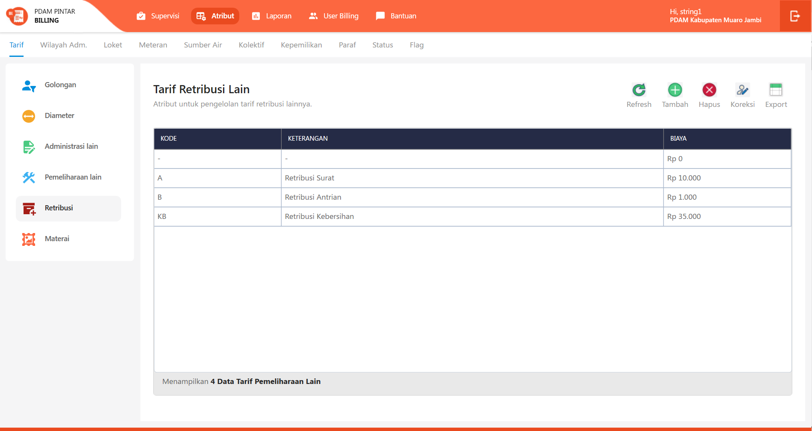
{sp} +

=== 5.2. Flow Input CRUD

Berikut adalah _flow_ untuk input CRUD menu Atribut Retribusi Lain. Input data dilakukan oleh User melalui _dialog form_.

==== Flow WPF

==== Flow REST API

{sp} +
{sp} +
Berikut adalah _screenshot_ input _dialog form_:

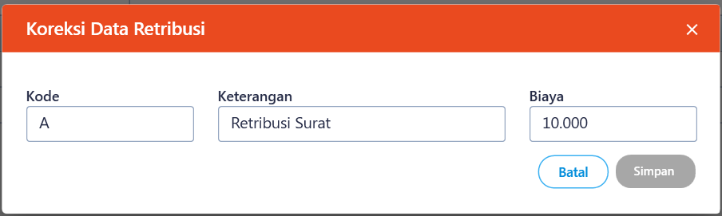

=== 5.3. Endpoint URL REST API
Pada menu ini, URL REST API yang digunakan adalah: 
|===
| *Method* |*URL* | *Deskripsi*
|GET | /api/v1/master-tarif-retribusi-lain | Digunakan untuk Get data, wajib menambahkan *IdPdam* dan *IdUserRequest* pada URI param ketika request
|POST | /api/v1/master-tarif-retribusi-lain | Digunakan untuk Tambah data, wajib menambahkan *IdPdam* dan *IdUserRequest* pada body ketika request
|PATCH | /api/v1/master-tarif-retribusi-lain | Digunakan untuk Ubah data, wajib menambahkan *IdPdam* dan *IdUserRequest* serta *IdEntity* pada body ketika request
|DELETE | /api/v1/master-tarif-retribusi-lain | Digunakan untuk Hapus data, wajib menambahkan *IdPdam* dan *IdUserRequest* serta *IdEntity* pada URI param ketika request
|===

==== Code Notes

Fitur ini menggunakan tabel _master_tarif_retribusi_lain_ untuk menyimpan datanya.
{sp} +
{sp} +

== 6. Materai

Berikut adalah _flow_ dari Atribut Materai:

=== 6.1. Flow Page Atribut Materai

Berikut adalah _flow_ dari _show_ halaman Atribut Materai. Saat membuka page Atribut Materai, aplikasi akan melakukan serangkaian proses berikut:

1. Mendapatkan data pada _page_ tersebut dengan memanggil URL REST API;
2. Pada sisi REST API, akan melakukan rangkaian proses _query_ ke _database_; 
3. REST API mengembalikan hasil _query_ ke Client; 
4. Client menampilkan hasil _query_ oleh REST API. Jika _query_ tidak bermasalah dan datanya tidak nol, maka akan _show_ tabel, apabila tidak maka akan _show_ _empty state_.

==== Flow WPF

==== Flow REST API

{sp} +
{sp} +
Berikut adalah _screenshot_ _main table_ Atribut Tarif Materai:

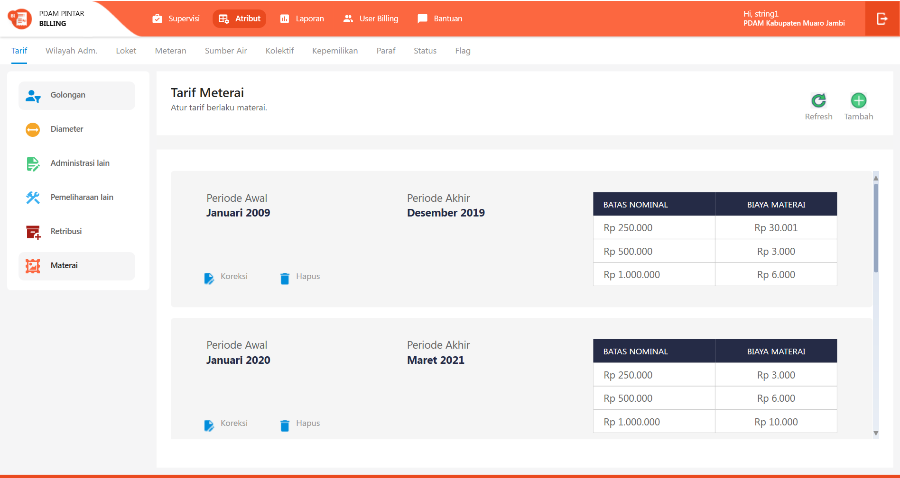
{sp} +

=== 6.2. Flow Input CRUD

Berikut adalah _flow_ untuk input CRUD menu Atribut Materai. Input data dilakukan oleh User melalui _dialog form_.

==== Flow WPF

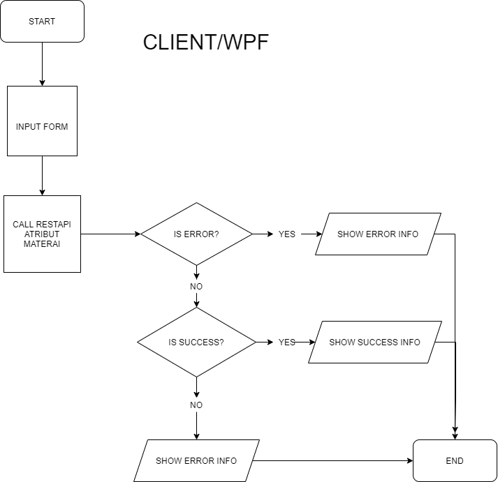

==== Flow REST API

{sp} +
{sp} +
Berikut adalah _screenshot_ input _dialog form_:

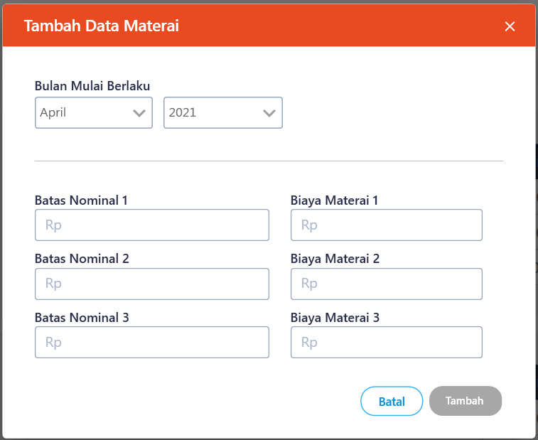

=== 6.3. Endpoint URL REST API

Pada menu ini, URL REST API yang digunakan adalah: 

|===
| *Method* |*URL* | *Deskripsi*
|GET | /api/v1/master-meterai | Digunakan untuk Get data, wajib menambahkan *IdPdam* dan *IdUserRequest* pada URI param ketika request
|POST | /api/v1/master-meterai | Digunakan untuk Tambah data, wajib menambahkan *IdPdam* dan *IdUserRequest* pada body ketika request
|PATCH | /api/v1/master-meterai | Digunakan untuk Ubah data, wajib menambahkan *IdPdam* dan *IdUserRequest* serta *IdEntity* pada body ketika request
|DELETE | /api/v1/master-meterai | Digunakan untuk Hapus data, wajib menambahkan *IdPdam* dan *IdUserRequest* serta *IdEntity* pada URI param ketika request
|===

==== Code Notes

Fitur ini menggunakan tabel _master_tarif_materai_ untuk menyimpan datanya.

== 7. Tarif Golongan L2T2

Berikut adalah _flow_ dari Atribut Tarif Golongan L2T2:

=== 7.1. Flow Page Tarif Golongan L2T2

Berikut adalah _flow_ dari _show_ halaman Atribut Tarif Golongan L2T2. Saat membuka _page_ Atribut Tarif Golongan L2T2, aplikasi akan melakukan serangkaian proses berikut:

1. Mendapatkan data pada page tersebut dengan memanggil URL REST API;
2. Pada sisi REST API, akan melakukan rangkaian proses _query_ ke _database_; 
3. REST API mengembalikan hasil _query_ ke Client; 
4. Client menampilkan hasil _query_ oleh REST API. Jika _query_ tidak bermasalah dan datanya tidak nol, maka akan show tabel, apabila tidak maka akan show empty state.

==== Flow WPF

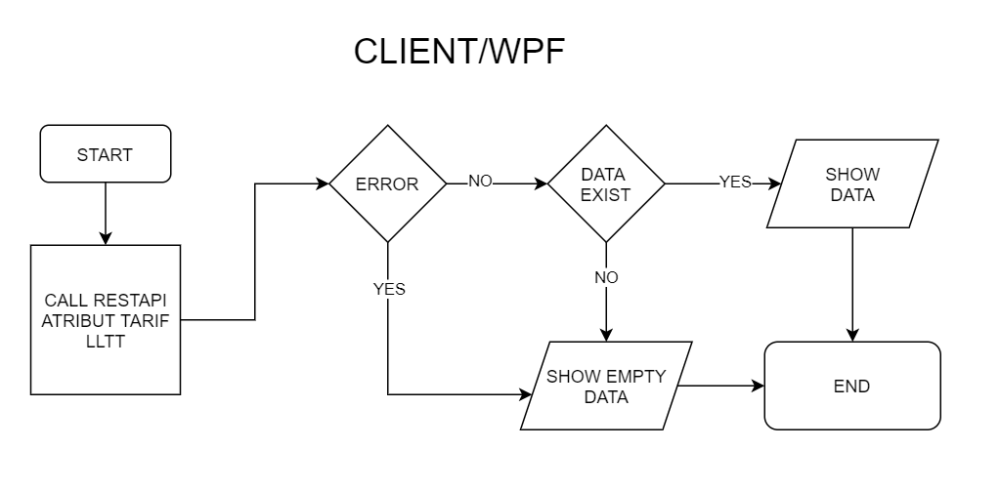

==== Flow REST API

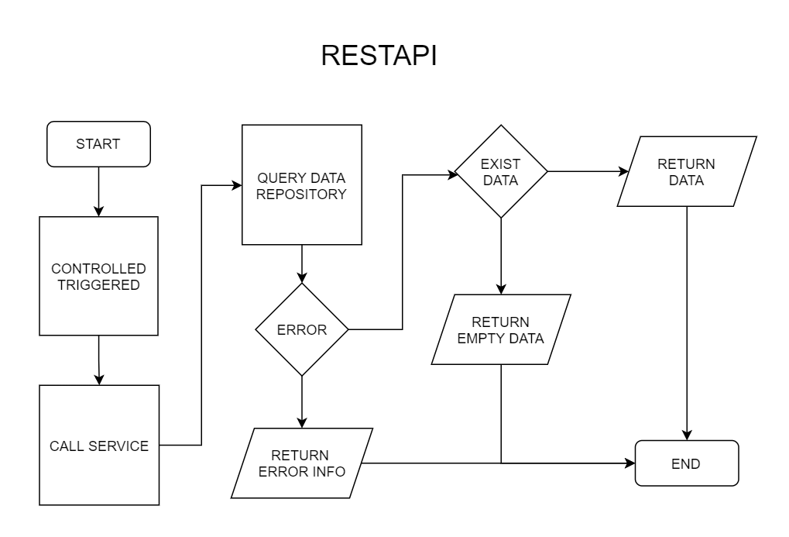
{sp} +
{sp} +
Berikut adalah _screenshot_ _main table_ atribut golongan:

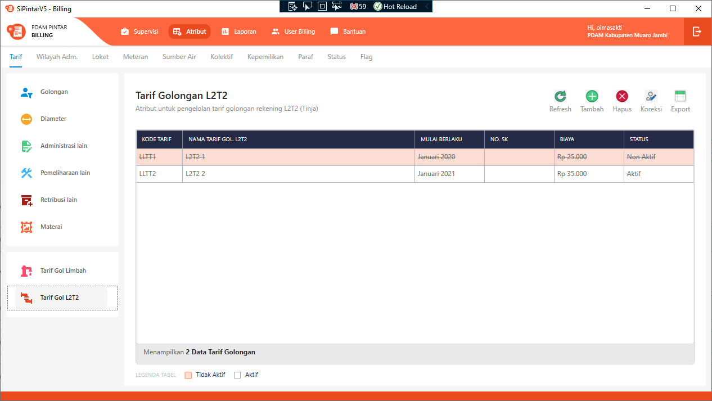
{sp} +

=== 7.2. Flow CREATE, UPDATE, dan DELETE

Berikut adalah _flow_ untuk tindakan CREATE, UPDATE, dan DELETE menu  Atribut Tarif Golongan L2T2. Input data dilakukan oleh User melalui _dialog form_.

==== Flow WPF

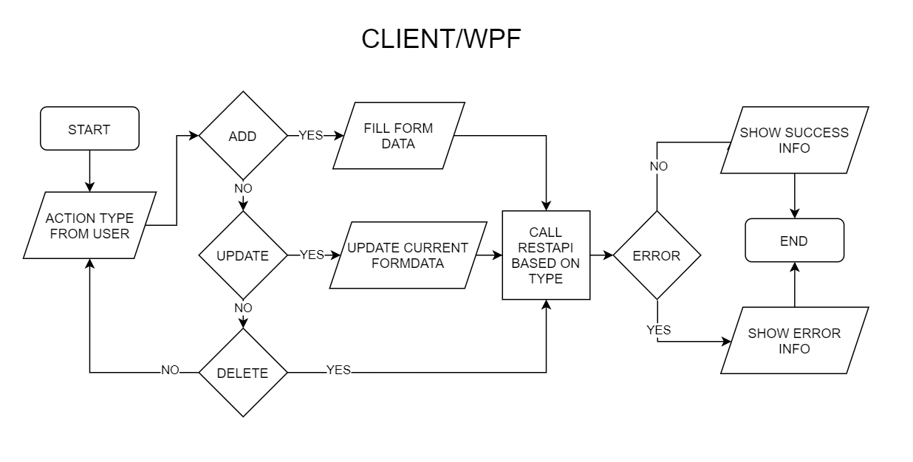

==== Flow REST API

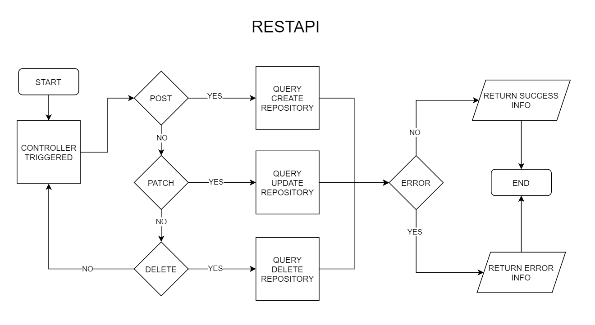
{sp} +
{sp} +
Berikut adalah _screenshot_ _dialog form_:

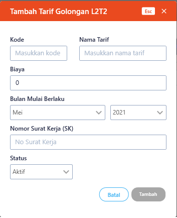

=== 7.3. Endpoint URL REST API

Pada menu ini, URL REST API yang digunakan adalah: 

|===
| *Method* |*URL* | *Deskripsi*
|GET | /api/v1/master-tarif-lltt | Digunakan untuk Get data, wajib menambahkan *IdPdam* dan *IdUserRequest* pada URI param ketika request
|POST | /api/v1/master-tarif-lltt | Digunakan untuk Tambah data, wajib menambahkan *IdPdam* dan *IdUserRequest* pada body ketika request
|PATCH | /api/v1/master-tarif-lltt | Digunakan untuk Ubah data, wajib menambahkan *IdPdam* dan *IdUserRequest* serta *IdEntity* pada body ketika request
|DELETE | /api/v1/master-tarif-lltt | Digunakan untuk Hapus data, wajib menambahkan *IdPdam* dan *IdUserRequest* serta *IdEntity* pada URI param ketika request
|===

==== Code Notes

Fitur ini menggunakan tabel master_tarif_lltt untuk menyimpan datanya.
{sp} +
{sp} +

==== Other Source

https://drive.google.com/file/d/11puWTqzM8qDLKZUX7RAa0Yeh8x-gT3Sf/view?usp=sharing[Diagram Source (editable with email @bsa.id)]
