= Flow Atribut Wilayah Administrasi

Dokumen ini berisi tentang _flow_ CRUD pada menu *Atribut Wilayah Administrasi* dari sistem Sipintar.NET.

Terdapat 5 sub-menu pada halaman menu Atribut Wilayah Administrasi, yakni: 

* <<#1-area-wilayah, Area Wilayah>>
* <<#2-kelurahan, Kelurahan>>
* <<#3-blok, Blok>>
* <<#4-district-meter-area-dma, District Meter Area (DMA)>>
* <<#5-district-meter-zona-dmz, District Meter Zona (DMZ)>>
{sp} +
{sp} +

== 1. Area Wilayah

Berikut adalah _flow_ dari Atribut Area Wilayah:

=== 1.1. Flow Page Atribut Area Wilayah

Berikut adalah _flow_ dari _show_ halaman Atribut Area Wilayah. Saat membuka halaman Atribut Area Wilayah, sistem akan melakukan serangkaian proses berikut:

1. Mendapatkan data pada halaman tersebut dengan memanggil URL REST API;
2. Pada sisi REST API, akan melakukan rangkaian proses _query_ ke _database_; 
3. REST API mengembalikan hasil _query_ ke Client; 
4. Client menampilkan hasil _query_ oleh REST API. Jika _query_ tidak bermasalah dan datanya tidak nol maka akan _show_ tabel, apabila tidak maka akan _show empty state_.

==== Flow WPF

==== Flow REST API

{sp} +
{sp} +
Berikut adalah _screenshot_ _main table_ Atribut Area wilayah:

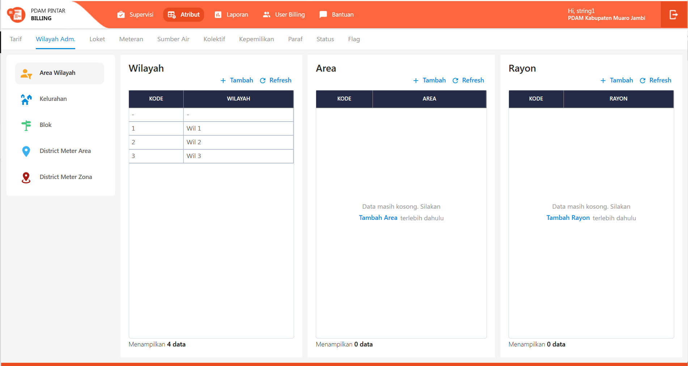
{sp} +

=== 1.2. Flow Input CRUD

Berikut adalah _flow_ untuk input CRUD menu Atribut Area Wilayah. Input data dilakukan oleh User melalui _dialog form_.

==== Flow WPF

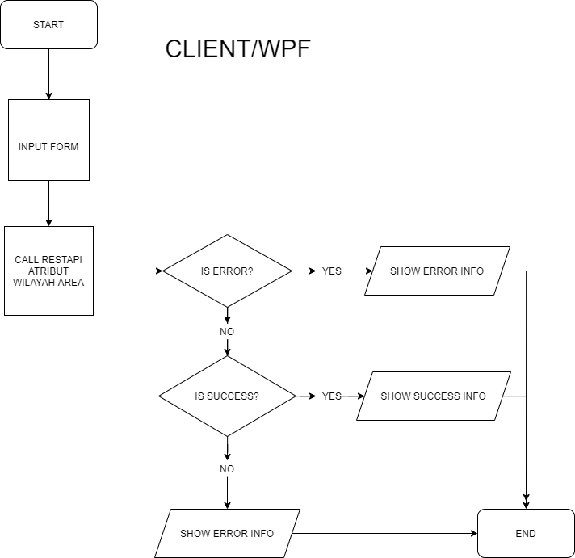

==== Flow REST API

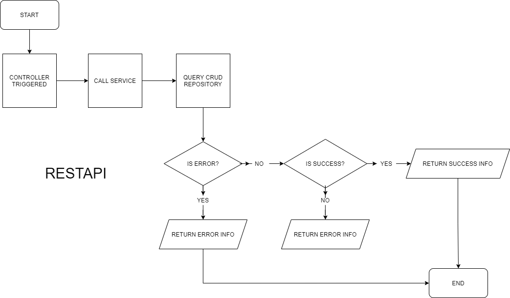
{sp} +
{sp} +
Berikut adalah _screenshot_ input _dialog form_:

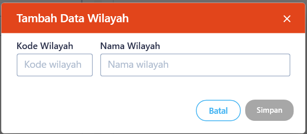

=== 1.3. Endpoint URL REST API

Pada menu ini, URL REST API yang digunakan adalah: 

[cols="10%,25%,65%",frame=all, grid=all]
|===
^.^h| *Method* 
^.^h| *URL* 
^.^h| *Deskripsi*

|GET 
a| /api/v1/master-wilayah

/api/v1/master-area

/api/v1/master-rayon 
| Digunakan untuk Get data, wajib menambahkan *IdPdam* dan *IdUserRequest* pada URI param ketika request

|POST 
a| /api/v1/master-wilayah

/api/v1/master-area

/api/v1/master-rayon 
| Digunakan untuk Tambah data, wajib menambahkan *IdPdam* dan *IdUserRequest* pada body ketika request

|PATCH 
a| /api/v1/master-wilayah

/api/v1/master-area

/api/v1/master-rayon | Digunakan untuk Ubah data, wajib menambahkan *IdPdam* dan *IdUserRequest* serta *IdEntity* pada body ketika request

|DELETE 
a| /api/v1/master-wilayah

/api/v1/master-area

/api/v1/master-rayon 
| Digunakan untuk Hapus data, wajib menambahkan *IdPdam* dan *IdUserRequest* serta *IdEntity* pada URI param ketika request
|===

==== Code Notes

Fitur ini menggunakan tabel _master_attribute_wilayah_, _master_attribute_area_, dan _master_attribute_rayon_ untuk menyimpan datanya.
{sp} +
{sp} +

== 2. Kelurahan

Berikut adalah flow dari Atribut Kelurahan:

=== 2.1. Flow Page Atribut Kelurahan

Berikut adalah _flow_ dari show halaman Atribut Kelurahan. Saat membuka _page_ Atribut Kelurahan, sistem akan melakukan serangkaian proses berikut:

1. Mendapatkan data pada _page_ tersebut dengan memanggil URL REST API;
2. Pada sisi REST API, akan melakukan rangkaian proses _query_ ke _database_; 
3. REST API mengembalikan hasil _query_ ke Client; 
4. Client menampilkan hasil _query_ oleh REST API. Jika _query_ tidak bermasalah dan datanya tidak nol, maka akan _show_ tabel, apabila tidak maka akan _show_ empty state.

==== Flow WPF

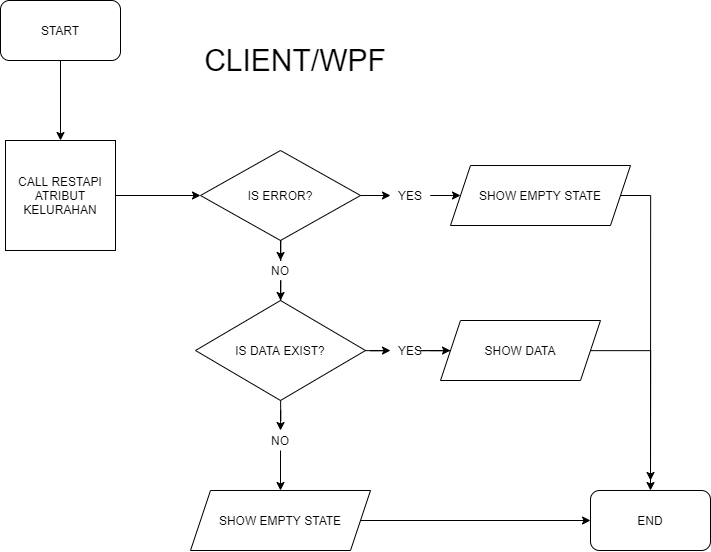

==== Flow REST API

{sp} +
{sp} +
Berikut adalah _screenshot_ _main table_ Atribut Kelurahan:

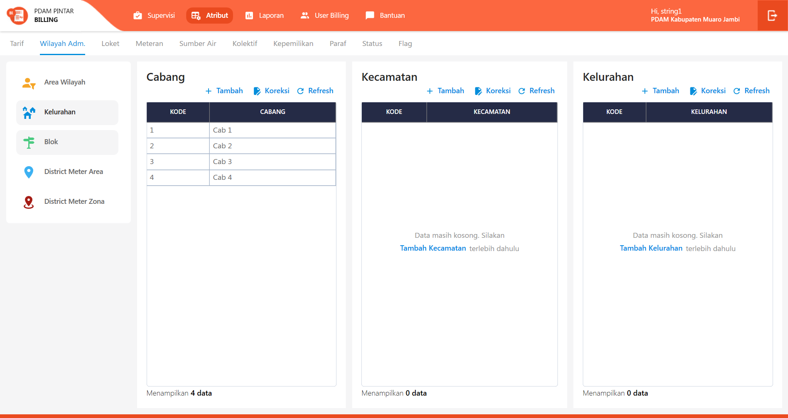
{sp} +

=== 2.2. Flow Input CRUD

Berikut adalah _flow_ untuk input CRUD menu Atribut Kelurahan. Input data dilakukan oleh User melalui _dialog form_.

==== Flow WPF

==== Flow REST API

{sp} +
{sp} +
Berikut adalah _screenshot_ input _dialog form_:

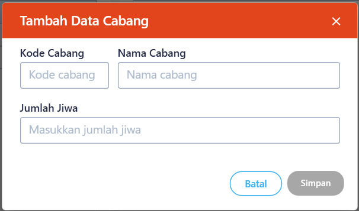

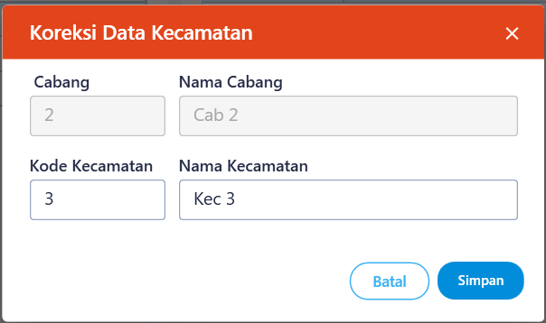

=== 2.3. Endpoint URL REST API

Pada menu ini, URL REST API yang digunakan adalah: 

[cols="10%,25%,65%",frame=all, grid=all]
|===
^.^h| *Method* 
^.^h| *URL* 
^.^h| *Deskripsi*

|GET 
| /api/v1/master-cabang

/api/v1/master-kecamatan

/api/v1/master-kelurahan 
| Digunakan untuk Get data, wajib menambahkan *IdPdam* dan *IdUserRequest* pada URI param ketika request

|POST 
a| /api/v1/master-cabang

/api/v1/master-kecamatan

/api/v1/master-kelurahan 
| Digunakan untuk Tambah data, wajib menambahkan *IdPdam* dan *IdUserRequest* pada body ketika request

|PATCH 
a| /api/v1/master-cabang

/api/v1/master-kecamatan

/api/v1/master-kelurahan 
| Digunakan untuk Ubah data, wajib menambahkan *IdPdam* dan *IdUserRequest* serta *IdEntity* pada body ketika request

|DELETE 
a| /api/v1/master-cabang

/api/v1/master-kecamatan

/api/v1/master-kelurahan 
| Digunakan untuk Hapus data, wajib menambahkan *IdPdam* dan *IdUserRequest* serta *IdEntity* pada URI param ketika request
|===

==== Code Notes

Fitur ini menggunakan tabel _master_attribute_cabang_, _master_attribute_kecamatan_, dan _master_attribute_kelurahan_ untuk menyimpan datanya.
{sp} +
{sp} +

== 3. Blok

Berikut adalah _flow_ dari Atribut Blok:

=== 3.1. Flow Page Atribut Blok

Berikut adalah _flow_ dari _show_ halaman Atribut Blok. Saat membuka _page_ Atribut Blok, sistem akan melakukan serangkaian proses berikut:

1. Mendapatkan data pada _page_ tersebut dengan memanggil URL REST API;
2. Pada sisi REST API, akan melakukan rangkaian proses _query_ ke _database_; 
3. REST API mengembalikan hasil _query_ ke Client; 
4. Client menampilkan hasil _query_ oleh REST API. Jika _query_ tidak bermasalah dan datanya tidak nol, maka akan _show_ tabel, apabila tidak maka akan _show empty state_.

==== Flow WPF

==== Flow REST API

{sp} +
{sp} +
Berikut adalah _screenshot_ _main table_ Atribut Blok:

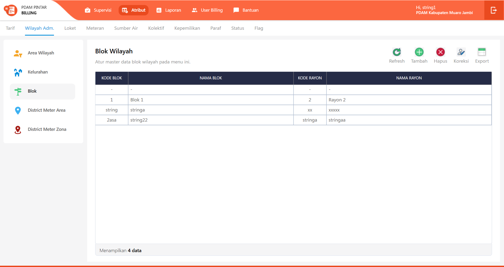
{sp} +

=== 3.2. Flow Input CRUD

Berikut adalah _flow_ untuk input CRUD menu Atribut Blok. Input data dilakukan oleh User melalui _dialog form_.

==== Flow WPF

==== Flow REST API

{sp} +
{sp} +
Berikut adalah _screenshot_ input _dialog form_:

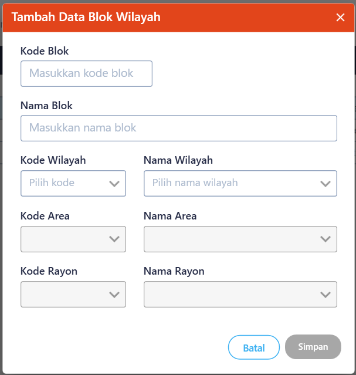

=== 3.3. Endpoint URL REST API

Pada menu ini, URL REST API yang digunakan adalah: 

[cols="10%,25%,65%",frame=all, grid=all]
|===
^.^h| *Method* 
^.^h| *URL* 
^.^h| *Deskripsi*

|GET 
| /api/v1/master-blok 
| Digunakan untuk Get data, wajib menambahkan *IdPdam* dan *IdUserRequest* pada URI param ketika request

|POST 
| /api/v1/master-blok 
| Digunakan untuk Tambah data, wajib menambahkan *IdPdam* dan *IdUserRequest* pada body ketika request

|PATCH 
| /api/v1/master-blok 
| Digunakan untuk Ubah data, wajib menambahkan *IdPdam* dan *IdUserRequest* serta *IdEntity* pada body ketika request

|DELETE 
| /api/v1/master-blok 
| Digunakan untuk Hapus data, wajib menambahkan *IdPdam* dan *IdUserRequest* serta *IdEntity* pada URI param ketika request
|===

==== Code Notes

Fitur ini menggunakan tabel _master_attribute_blok_ untuk menyimpan datanya.
{sp} +
{sp} +

== 4. District Meter Area (DMA)

Berikut adalah flow dari Atribut DMA:

=== 4.1. Flow Page Atribut DMA

Berikut adalah _flow_ dari _show_ halaman Atribut DMA. Saat membuka _page_ Atribut DMA, sistem akan melakukan serangkaian proses berikut:

1. Mendapatkan data pada _page_ tersebut dengan memanggil URL REST API;
2. Pada sisi REST API, akan melakukan rangkaian proses _query_ ke _database_; 
3. REST API mengembalikan hasil _query_ ke Client; 
4. Client menampilkan hasil _query_ oleh REST API. Jika _query_ tidak bermasalah dan datanya tidak nol maka akan show tabel, apabila tidak maka akan show empty state.

==== Flow WPF

==== Flow REST API

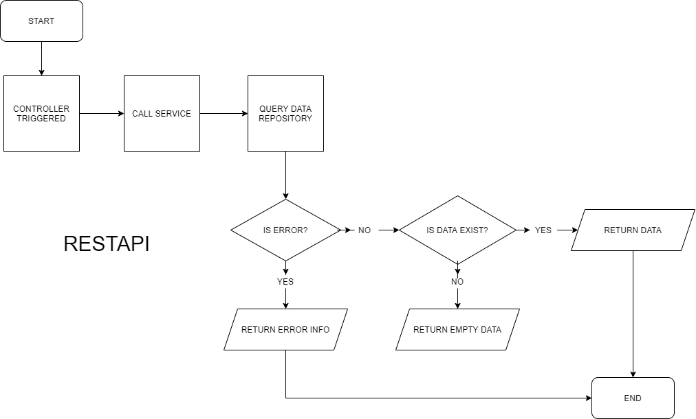
{sp} +
{sp} +
Berikut adalah _screenshot_ main tabel atribut DMA:

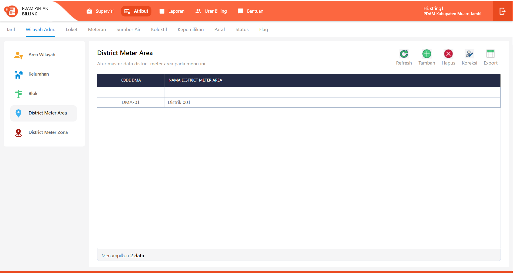
{sp} +

=== 4.2. Flow Input CRUD

Berikut adalah flow untuk input CRUD menu atribut DMA. Input data dilakukan oleh User melalui _dialog form_.

==== Flow WPF

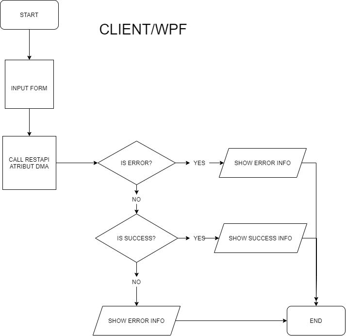

==== Flow REST API

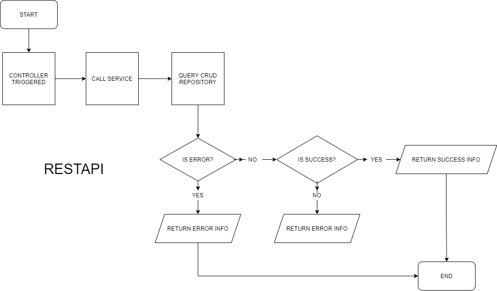
{sp} +
{sp} +
Berikut adalah _screenshot_ input _dialog form_:

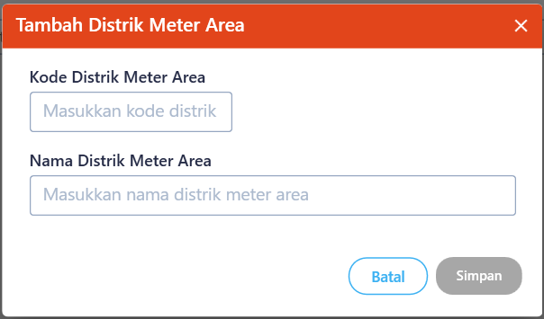

=== 4.3. Endpoint URL REST API

Pada menu ini, URL REST API yang digunakan adalah: 

|===
| *Method* |*URL* | *Deskripsi*
|GET | /api/v1/master-dma | Digunakan untuk Get data, wajib menambahkan *IdPdam* dan *IdUserRequest* pada URI param ketika request
|POST | /api/v1/master-dma | Digunakan untuk Tambah data, wajib menambahkan *IdPdam* dan *IdUserRequest* pada body ketika request
|PATCH | /api/v1/master-dma | Digunakan untuk Ubah data, wajib menambahkan *IdPdam* dan *IdUserRequest* serta *IdEntity* pada body ketika request
|DELETE | /api/v1/master-dma | Digunakan untuk Hapus data, wajib menambahkan *IdPdam* dan *IdUserRequest* serta *IdEntity* pada URI param ketika request
|===

==== Code Notes

Fitur ini menggunakan tabel _master_attribute_dma_ untuk menyimpan datanya.
{sp} +
{sp} +

== 5. District Meter Zona (DMZ)

Berikut adalah _flow_ dari Atribut DMZ:

=== 5.1. Flow Page Atribut DMZ

Berikut adalah _flow_ dari _show_ halaman Atribut DMZ. Saat membuka _page_ Atribut DMZ, sistem akan melakukan serangkaian proses berikut:

1. Mendapatkan data pada page tersebut dengan memanggil URL REST API;
2. Pada sisi REST API, akan melakukan rangkaian proses _query_ ke _database_; 
3. REST API mengembalikan hasil _query_ ke Client; 
4. Client menampilkan hasil _query_ oleh REST API. Jika _query_ tidak bermasalah dan datanya tidak nol, maka akan _show_ tabel, apabila tidak maka akan _show empty state_.

==== Flow WPF

==== Flow REST API

{sp} +
{sp} +
Berikut adalah _screenshot_ _main table_ Atribut DMZ:

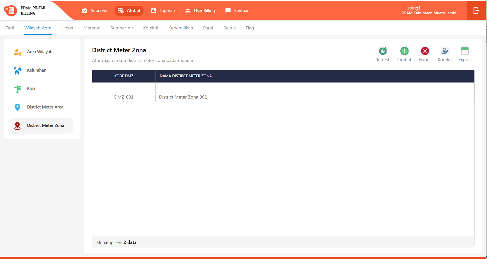
{sp} +

=== 5.2. Flow Input CRUD

Berikut adalah _flow_ untuk input CRUD menu Atribut DMZ. Input data dilakukan oleh User melalui _dialog form_.

==== Flow WPF

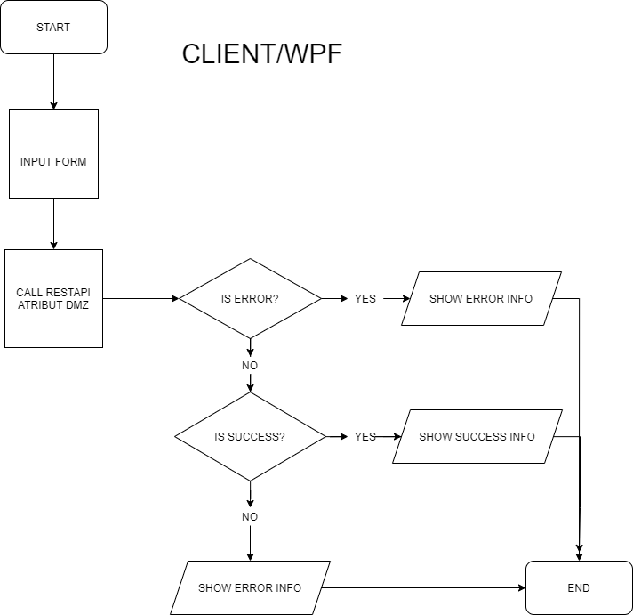

==== Flow REST API

{sp} +
{sp} +
Berikut adalah _screenshot_ input _dialog form_:

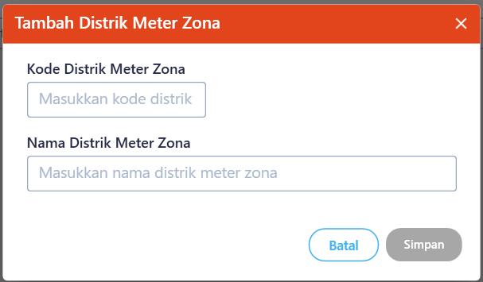

=== 5.3. Endpoint URL REST API

Pada menu ini, URL REST API yang digunakan adalah: 

|===
| *Method* |*URL* | *Deskripsi*
|GET | /api/v1/master-dmz | Digunakan untuk Get data, wajib menambahkan *IdPdam* dan *IdUserRequest* pada URI param ketika request
|POST | /api/v1/master-dmz | Digunakan untuk Tambah data, wajib menambahkan *IdPdam* dan *IdUserRequest* pada body ketika request
|PATCH | /api/v1/master-dmz | Digunakan untuk Ubah data, wajib menambahkan *IdPdam* dan *IdUserRequest* serta *IdEntity* pada body ketika request
|DELETE | /api/v1/master-dmz | Digunakan untuk Hapus data, wajib menambahkan *IdPdam* dan *IdUserRequest* serta *IdEntity* pada URI param ketika request
|===

==== Code Notes

Fitur ini menggunakan tabel _master_attribute_dmz_ untuk menyimpan datanya.

==== Other Source

https://drive.google.com/file/d/11puWTqzM8qDLKZUX7RAa0Yeh8x-gT3Sf/view?usp=sharing[Diagram Source (editable with email @bsa.id)]