= Flow Bantuan - Saran Pengaduan dan FAQ

Dokumen ini berisi tentang _flow_ pada menu _Saran Pengaduan_ dan _FAQ_ dari sistem Sipintar.NET.

Berikut adalah _flow_ dari Bantuan - Saran Pengaduan:

== 1. Saran Pengaduan

Berikut adalah _flow_ dari _show_ halaman Bantuan Saran Pengaduan. Saat membuka halaman Bantuan, sistem akan melakukan serangkaian proses berikut:

1. Mendapatkan data pada halaman tersebut dengan memanggil URL REST API;
2. Pada sisi REST API, akan melakukan rangkaian proses _query_ ke _database_; 
3. REST API mengembalikan hasil _query_ ke Client; 
4. Client menampilkan hasil _query_ oleh REST API. Jika _query_ tidak bermasalah dan datanya tidak nol, maka akan _show checkbox_.

Berikut adalah penjelasan terkait Fitur Saran Pengaduan :

. Tampilan Utama Fitur Saran Pengaduan => Menampilkan tampilan untuk melakukan saran atau keluhan terhadap sistem Sipintar Billing. +
+
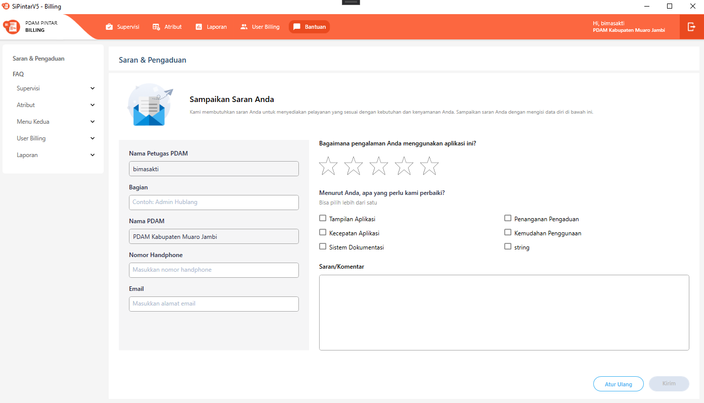
{sp} +

.. Pengirim saran & Keluhan => Fitur ini digunakan untuk meng-input data pengguna sistem yang ingin memberikan saran atau keluhan. Adapun data yang harus diisi adalah Bagian, No HP, dan Email: +
+
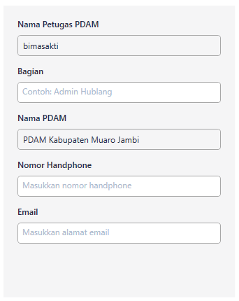
{sp} 
 ** Bagian => Bagian dapat diisi dengan bagian atau divisi petugas yang akan diadukan keluhannya, contohnya seperti bagian Hubungan Langganan
 ** No Hp => Nomor kontak yang menginput keluhan terhadap sistem Sipintar Billing (yang dapat dihubungi).
 ** Email => Jika pemberi keluhan mempunyai email, ini bisa di inputkan. Jika tidak mempunyai email, bisa di kosongkan.

.. Pemberian Rating => Fitur ini untuk memberikan penilaian terhadap kepuasan pengguna sistem atas performa sistem Sipintar Billing. +
+
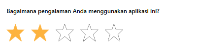
{sp} 

.. Saran Perbaikan => Fitur ini digunakan untuk melaporkan apa saja yang diperbaiki, baik tampilan, kecepatan aplikasi, dan sebagainya, jika pengguna sistem kurang puas terhadap Sipintar Billing. +
+
Saran Perbaikan => /api/v1/master-saran-pertanyaan +
+
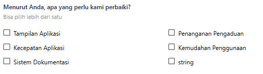
{sp} 

.. Saran Komentar => Fitur ini digunakan untuk memberikan komentar atau saran terhadap performa sistem Sipintar. +
+
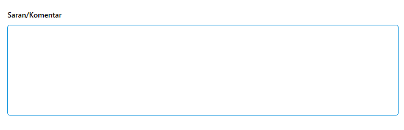
{sp} +

.. Reset Ulang => Fitur ini digunakan untuk mengulang kembali ke keadaan saat pertama kali mengklik Bantuan.

.. Kirim => Fitur ini digunakan untuk mengirim saran pengaduan terhadap performa sistem Sipintar Billing. +
+
Kirim => /api/v1/master-saran-pertanyaan +
+
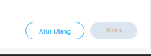
{sp} +

Berikut adalah penjelasan terkait Fitur FAQ :

. Tampilan Utama FAQ => Menampilkan beberapa panduan untuk menggunakan fitur Sipintar Billing. Panduan sudah diklasifikasikan berdasarkan letak fitur. +
+
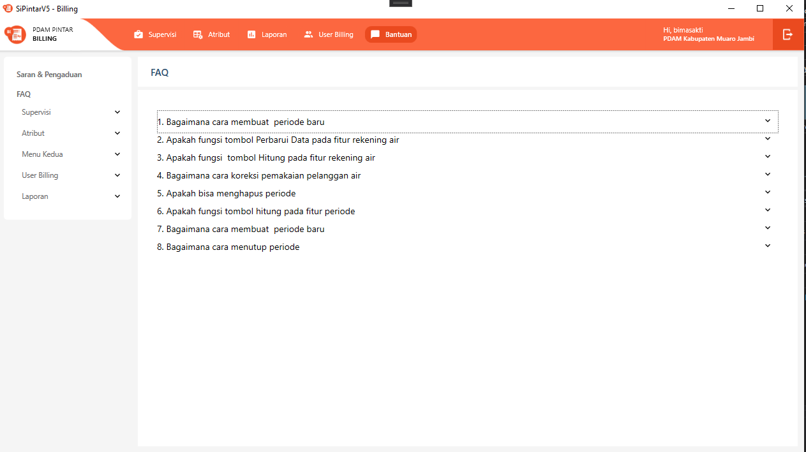
{sp} +
Jika berdasarkan pada klasifikasi fitur, tampilan sama dengan tampilan menu utama FAQ, yang membedakan hanya  daftar panduannya saja. Jika ingin ditambahkan panduan baru pada daftar panduan FAQ, harus disiapkan file .html dan letakan pada folder FAQ. tinggal masukan sesuai pada klasifikasi panduan mana file itu ingin ditampilkan. Jika file .html menampilkan gambar, file gambar dapat diletakkan pada folder Assets. +
+
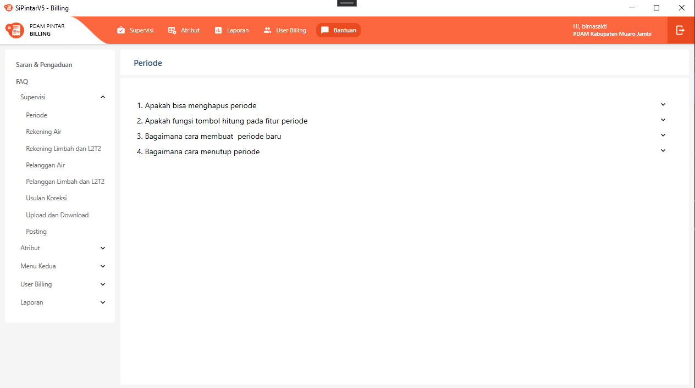
{sp} +

+
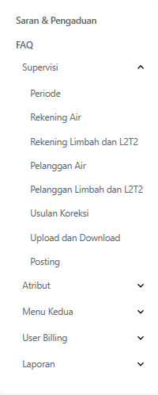
{sp} +

+
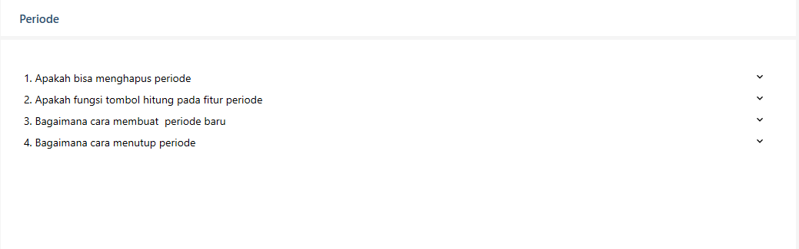
{sp} +

== 2. Flow Chart 

. REST API +
+
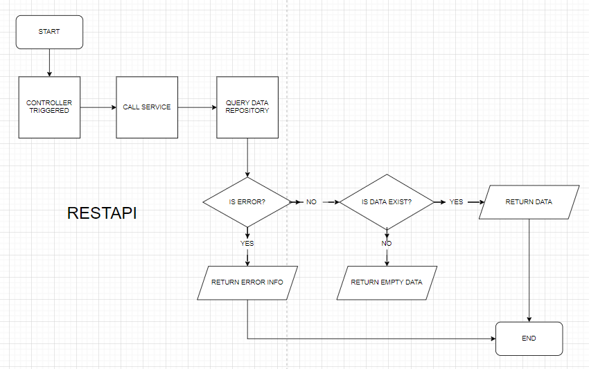
{sp} +
+
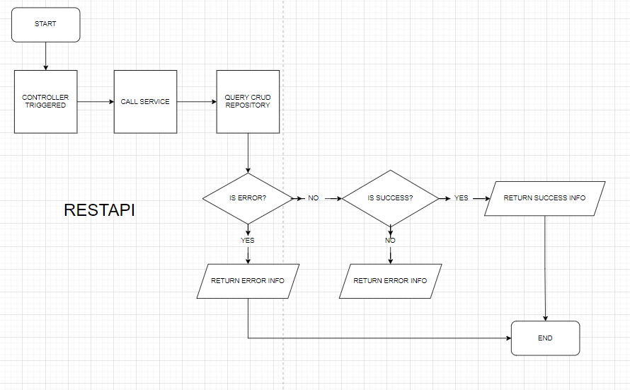
{sp} +

. WPF +
+
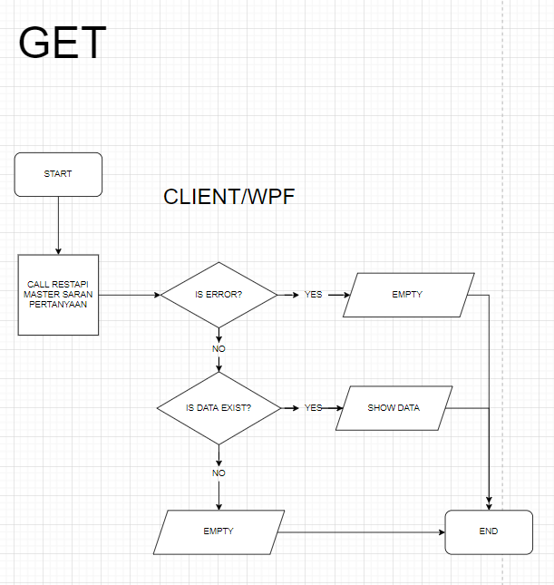
{sp} +
+
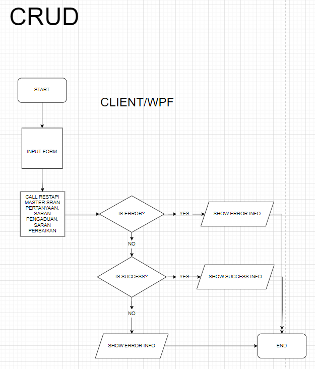
{sp} +

== 3. Endpoint URL REST API

Pada menu ini, URL REST API yang digunakan adalah: 

[cols="10%,25%,65%",frame=all, grid=all]
|===
^.^h| *Method* 
^.^h| *URL* 
^.^h| *Deskripsi*

|GET 
| /api/v1/master-saran-pertanyaan 
| Digunakan untuk Get data, wajib *IdUserRequest* pada URI param ketika request

|POST 
| /api/v1/saran-pengaduan 
| Digunakan untuk Tambah data, wajib menambahkan *IdPdam* dan *IdUserRequest* pada body ketika request

|
| /api/v1/saran-perbaikan 
| 

|===

=== Code Notes

Fitur ini menggunakan tabel _master_saran_pertanyaan_, _saran_pengaduan_, _saran_perbaikan_.

=== Other Source

https://drive.google.com/file/d/11puWTqzM8qDLKZUX7RAa0Yeh8x-gT3Sf/view?usp=sharing[Diagram Source (editable with email @bsa.id)]