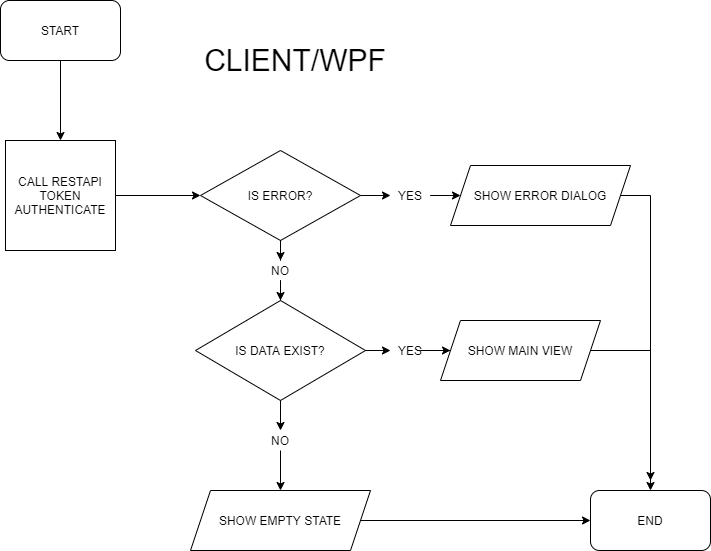
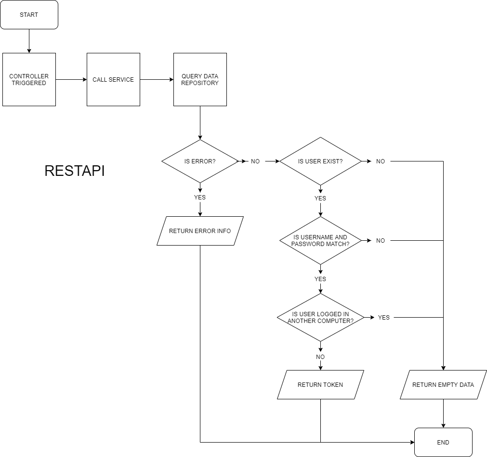
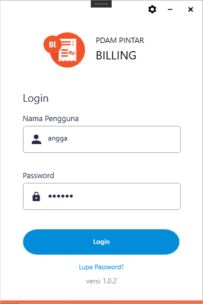
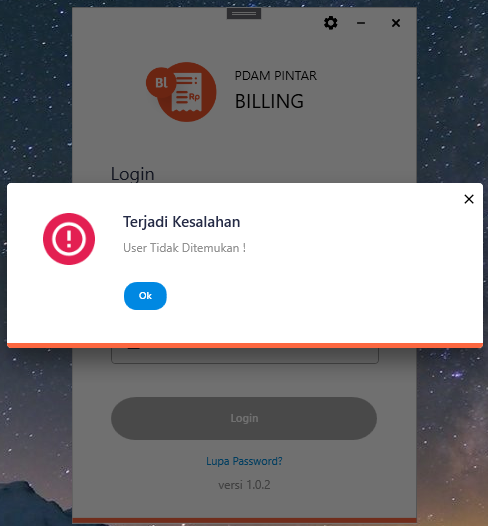
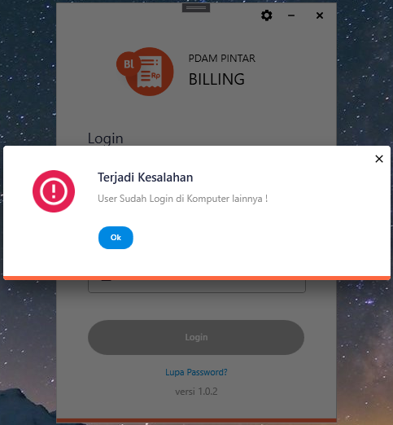

= Flow Login

Dokumen ini berisi tentang flow pada saat _Login_ dari sistem Sipintar.NET.

Berikut adalah flow dari login:

== 1. Flow Login

Berikut adalah flow dari halaman Login. Setelah mengisi _username_ dan _password_, aplikasi akan melakukan serangkaian proses berikut:

1. Mendapatkan _access token_ dengan memanggil URL REST API;
2. Pada sisi REST API, akan melakukan rangkaian proses _query_ ke _database_; 
3. REST API mengembalikan hasil _query_ ke client; 
4. Client menampilkan hasil _query_ oleh REST API. Jika _query_ tidak bermasalah dan datanya tidak nol, maka akan masuk ke halaman utama, apabila tidak maka akan menampilkan _error dialog_.

=== Flow WPF

=== Flow REST API

Pada REST API terdapat pengecekan untuk mengetahui apakah user dengan _username_ dan _password_ yang diinputkan sedang _login_ pada komputer lain, melalui pengecekan ada atau tidaknya token dengan kriteria berikut:

1. *IdUser* token sama dengan IdUser yang mencoba _login_
2. *IdComputer* token berbeda dengan IdComputer yang mencoba _login_
3. *RefreshTokenRevokedAt* token tidak sama dengan _null_ 
4. *RefreshTokenExpiredAt* token lebih dari _timestamp_ saat _login_

Berikut adalah _screenshot form login_:

Berikut adalah screenshot saat terjadi _error_:

{sp} +

== 2. Endpoint URL REST API

Pada menu ini, URL REST API yang digunakan adalah: 

[cols="10%,25%,65%",frame=all, grid=all]
|===
^.^h| *Method* 
^.^h| *URL* 
^.^h| *Deskripsi*

|POST 
| /api/v1/master-token/authenticate 
| Digunakan untuk mendapatkan access token, pada body request terdapat *IdComputer*, *NamaUser*, serta *Password*, wajib menambahkan *IdPdam* dan *IdUserRequest* pada body ketika request
|===

=== Code Notes

Fitur ini menggunakan tabel _master_token_ untuk menyimpan datanya.

=== Other Source

https://drive.google.com/file/d/11puWTqzM8qDLKZUX7RAa0Yeh8x-gT3Sf/view?usp=sharing[Diagram Source (editable with email @bsa.id)]