= Flow Supervisi Pelanggan Air

Dokumen ini berisi tentang _flow_ CRUD pada menu *Supervisi Pelanggan Air* dari sistem Sipintar.NET.

== 1. Supervisi Pelanggan Air

Berikut adalah _flow_ dari Supervisi Pelanggan Air:

=== 1. Flow Page Supervisi Pelanggan Air

Berikut adalah _flow_ dari _show_ halaman Supervisi Pelanggan Air. Saat membuka halaman Supervisi Pelanggan Air, sistem akan melakukan serangkaian proses berikut:

1. Mendapatkan data pada halaman tersebut dengan memanggil URL REST API;
2. Pada sisi REST API, akan melakukan rangkaian proses _query_ ke _database_; 
3. REST API mengembalikan hasil _query_ ke Client; 
4. Client menampilkan hasil _query_ oleh REST API. Jika _query_ tidak bermasalah dan datanya tidak nol, maka akan _show_ tabel, apabila tidak maka akan _show empty state_.

==== Flow WPF
 
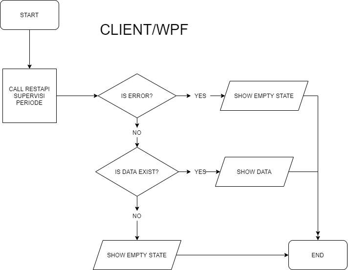

==== Flow REST API

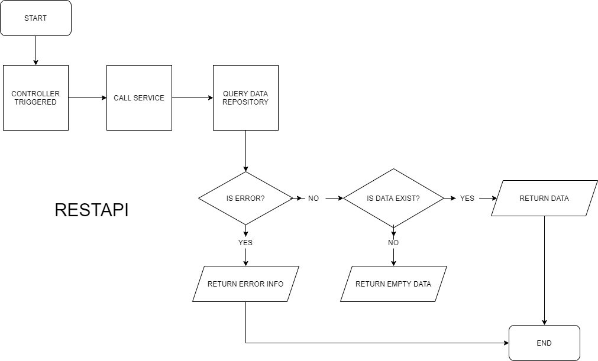
{sp} +
{sp} +
Berikut adalah _screenshot_ _main table_ Supervisi Pelanggan:

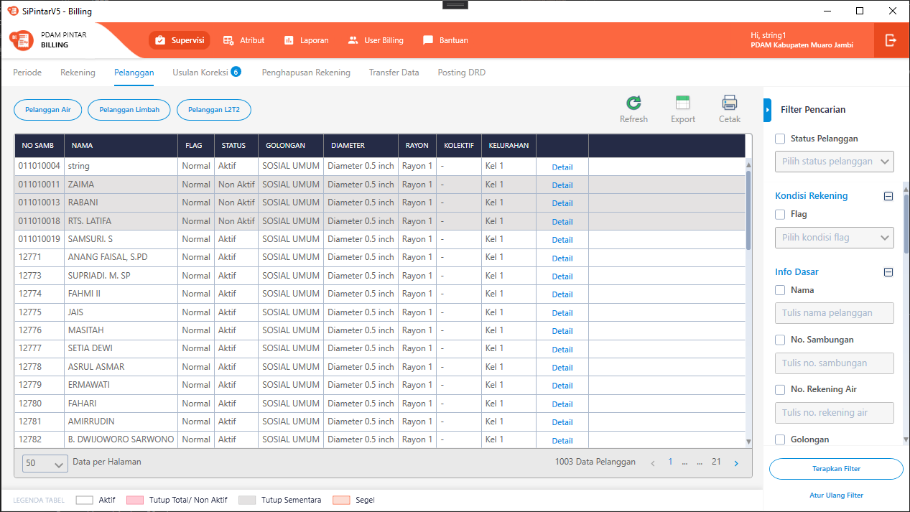
{sp} +

=== 2. Flow Menu Klik Kanan

Berikut adalah _flow_ untuk input CRUD menu Supervisi Pelanggan. Input data dilakukan oleh User melalui _dialog form_.

==== Flow WPF

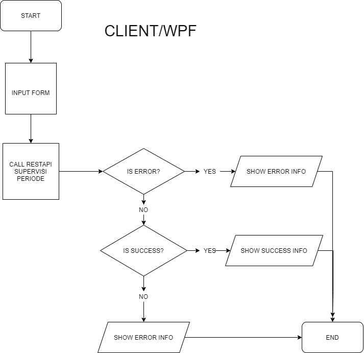

==== Flow REST API

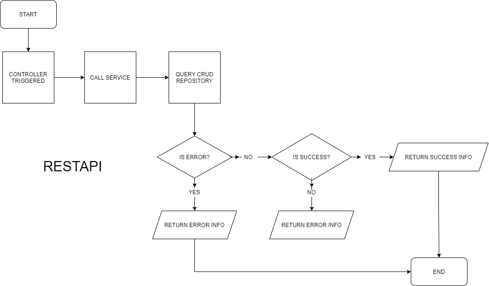
{sp} +
{sp} +
Berikut adalah _screenshot_ menu klik kanan:

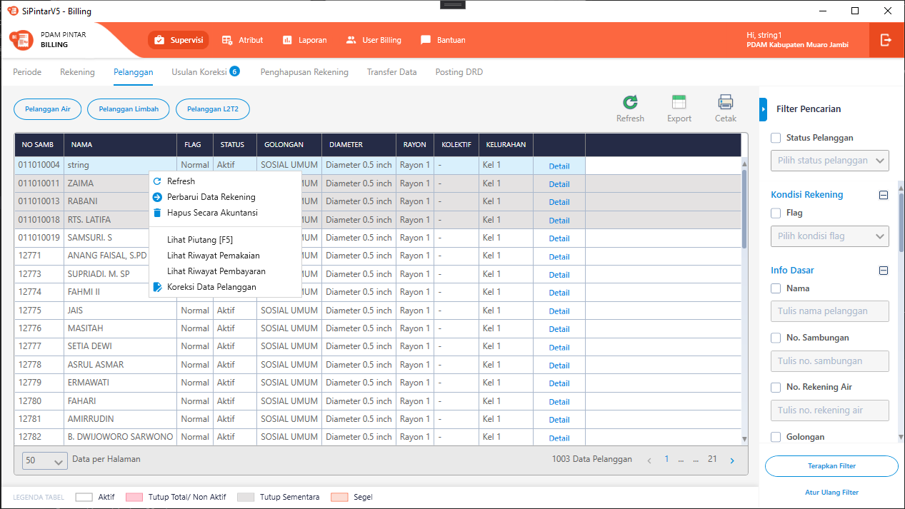
{sp} +
{sp} +

* Perbarui Data Rekening +
+
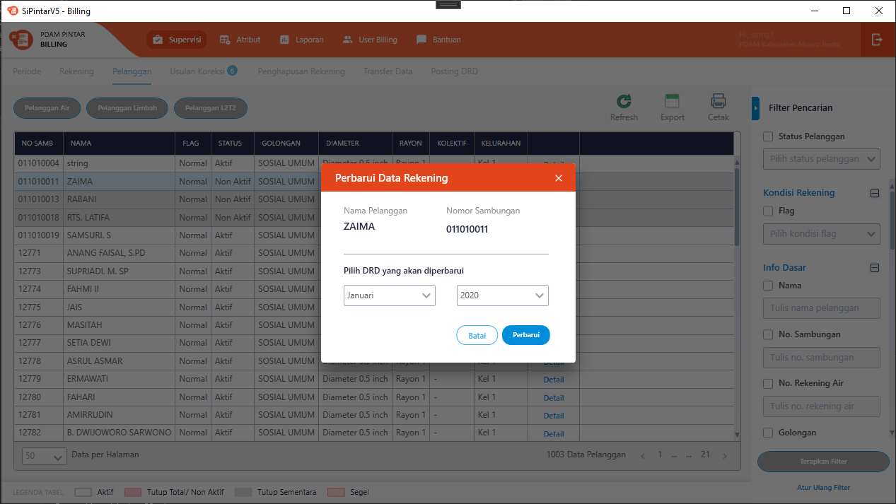

* Hapus Secara Akuntansi +
+
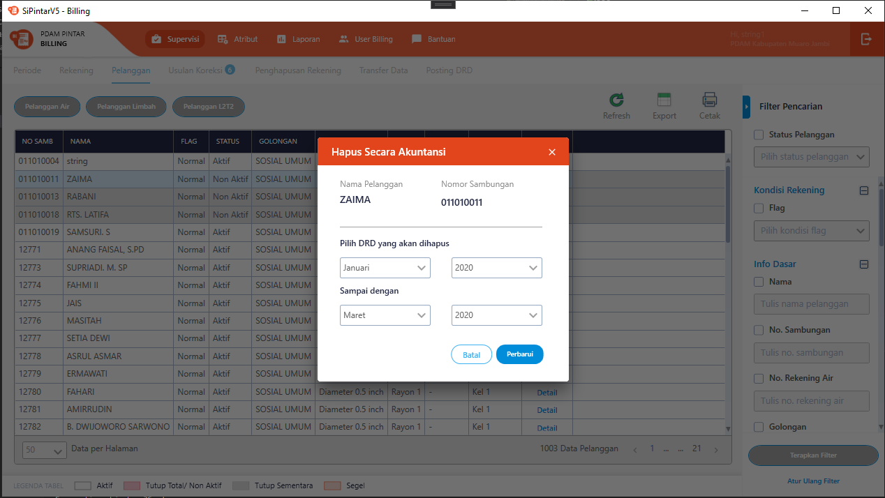

* Lihat Piutang +
+
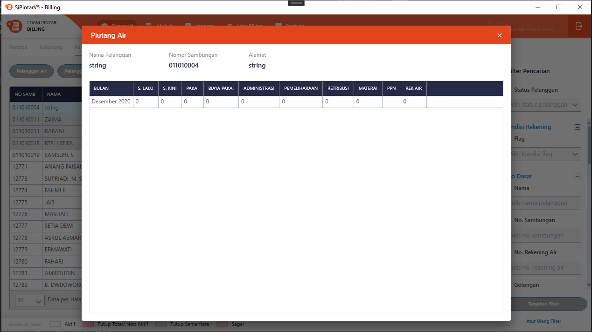

* Lihat Riwayat Pemakaian +
+
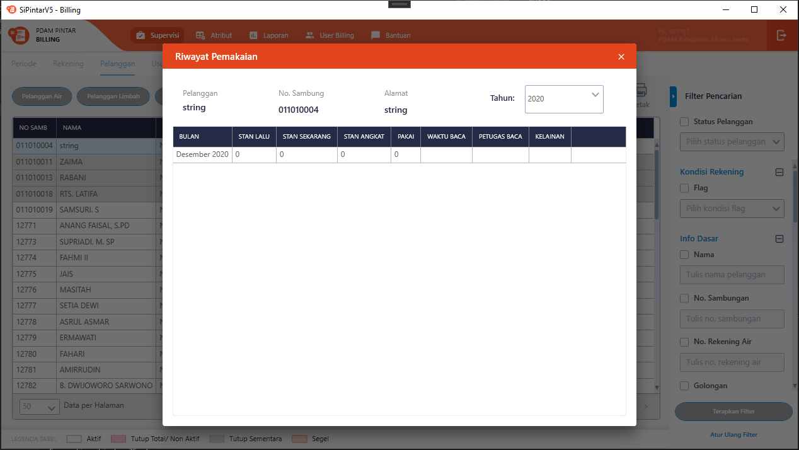

* Lihat Riwayat Pembayaran +
+
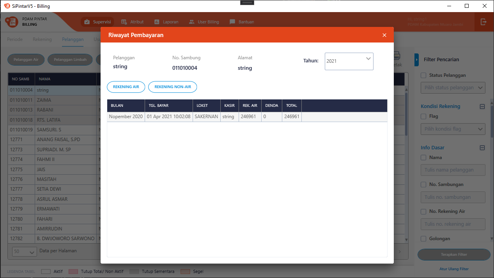

* Koreksi Data Pelanggan +
+
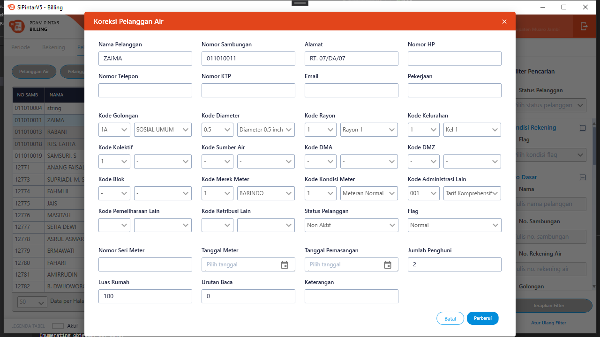

=== 3. Endpoint URL REST API

Pada menu ini, URL REST API yang digunakan adalah: 

[cols="10%,25%,65%",frame=all, grid=all]
|===
^.^h| *Method* 
^.^h| *URL* 
^.^h| *Deskripsi*

|GET 
| /api/v1/master-pelanggan-air 
| Digunakan untuk *Get Data Pelanggan Air*, wajib menambahkan *IdPdam* dan *IdUserRequest* pada URI param ketika request

|PATCH 
| /api​/v1​/rekening-air-perbarui-data 
| Digunakan untuk *Perbarui Data Rekening*, menggunakan parameter *KodePeriode* dan *IdPelangganAir*

|PATCH 
| /api/v1/rekening-air-set-hapus-secara-akuntansi 
| Digunakan untuk *Hapus Secara Akuntansi*, menggunakan parameter *KodePeriodeAwal*, *KodePeriodeAkhir* dan *IdPelangganAir*

|GET 
| /api/v1/rekening-air-piutang 
| Digunakan untuk *Lihat Piutang*, menggunakan parameter *IdPelangganAir*

|GET 
| /api/v1/rekening-air-riwayat-pakai 
| Digunakan untuk *Lihat Riwayat Pemakaian*, menggunakan parameter *IdPelangganAir* dan *TahunPeriode*

|GET 
| /api/v1/rekening-air-history-pelunasan-pembatalan 
| Digunakan untuk *Lihat Riwayat Pembayaran*, menggunakan parameter *IdPelangganAir*, *StatusTransaksi=true* dan *TahunPeriode*

|PATCH 
| /api/v1/master-pelanggan-air 
| Digunakan untuk *Koreksi Data Pelanggan*
|===

==== Code Notes

Fitur ini menggunakan tabel _master_pelanggan_air_ untuk menyimpan datanya.

==== Other Source

https://drive.google.com/file/d/11puWTqzM8qDLKZUX7RAa0Yeh8x-gT3Sf/view?usp=sharing[Diagram Source (editable with email @bsa.id)]