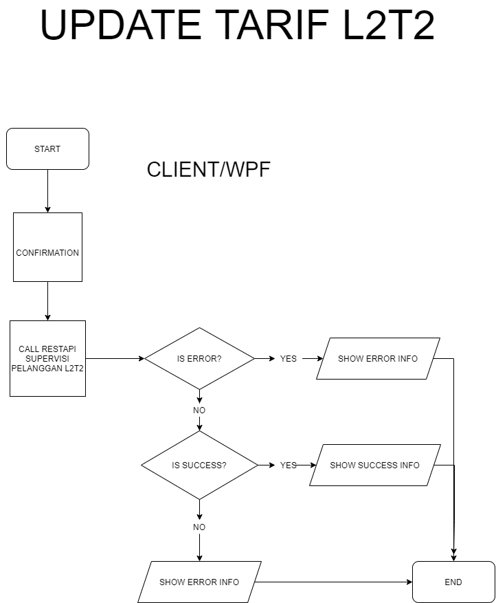

= Flow Supervisi Pelanggan L2T2

Dokumen ini berisi tentang _flow_ CRUD pada menu *Supervisi Pelanggan L2T2* dari sistem Sipintar.NET.

== 1. Supervisi Pelanggan L2T2

Berikut adalah _flow_ dari Supervisi Pelanggan L2T2:

=== 1. Flow Page Supervisi Pelanggan L2T2

Pada halaman awal ketika kita mengarahkan ke menu Pelanggan L2T2, sistem akan melakukan serangkaian proses berikut:

1. Mendapatkan data pada halaman tersebut dengan memanggil URL REST API GET data pelanggan L2T2;
2. Pada sisi REST API, akan melakukan rangkaian proses _query_ ke _database_; 
3. REST API mengembalikan hasil _query_ ke Client; 
4. Client menampilkan hasil _query_ oleh REST API. Jika _query_ tidak bermasalah dan datanya, ada maka akan show tabel, apabila tidak ada data maka akan _show empty state_.

==== Flow WPF

==== Flow REST API

{sp} +
{sp} +
Berikut adalah _screenshot_ _main table_ Supervisi Pelanggan L2T2:

{sp} +
Pada halaman pertama ini, kita juga melakukan serangkaian proses GET data yang diperlukan untuk opsi _combo box filter_ yang ada di _sidebar_ kanan halaman.
{sp} +

=== 2. Flow CREATE/EDIT/DELETE

Untuk melakukan penambahan data, User dapat mengakses menu TAMBAH yang ada pada _toolbar_ di bagian atas halaman. Begitu juga untuk edit data, User dapat melakukan modifikasi data dengan memilih terlebih data yang ingin diubah, kemudian pilih _toolbar_ *KOREKSI*. Kedua opsi ini juga dapat dilakukan dengan klik kanan di dalam area tabel. Input data dilakukan oleh User melalui _dialog form_.

==== Flow WPF

==== Flow REST API

{sp} +
{sp} +
Berikut adalah _screenshot_ _form dialog_ yang dapat diisi oleh User:

{sp} +
{sp} +

===== Hapus Data

Ketika akan menghapus data, User akan dihadapkan dengan tampilan _dialog confirmation_ terlebih dahulu. Menu Hapus Data dapat diakses melalui _toolbar_ bagian atas tabel atau melalui klik kanan menu pada tabel.

image::../../images-sipintar/billing/supervisi/sipintar-supervisi-pelanggan-l2t2-3.png[600,400]

===== Perbarui Data Rekening

Perbarui data rekening dapat dilakukan dengan melakukan klik kanan pada data pelanggan yang akan diperbarui. Kemudian User harus memilih periode rekening untuk pelanggan bersangkutan yang akan diperbarui.

image::../../images-sipintar/billing/supervisi/sipintar-supervisi-pelanggan-l2t2-4.png[600,400]

===== Lihat Piutang

===== Lihat Riwayat Pembayaran

===== Lain-lain

_Export_ data dapat diakses melalui _toolbar_ di atas tabel.

{sp} +
Untuk menu-menu lain dapat dicoba secara manual. Tidak dijelaskan secara implisit disini karena bukan _core function_ dari modul bersangkutan.

=== 3. Endpoint URL REST API

Pada menu ini, URL REST API yang digunakan adalah: 

[cols="10%,25%,65%",frame=all, grid=all]
|===
^.^h| *Method* 
^.^h| *URL* 
^.^h| *Deskripsi*

|GET 
| /api/v1/master-pelanggan-lltt 
| Digunakan untuk *Get Data Pelanggan L2T2*, wajib menambahkan *IdPdam* dan *IdUserRequest* pada URI param ketika request

|PATCH 
| /api​/v1​/rekening-lltt-perbarui-data 
| Digunakan untuk *Perbarui Data Rekening*, menggunakan parameter *KodePeriode* dan *IdPelangganLltt*

|GET 
| /api/v1/rekening-lltt-piutang 
| Digunakan untuk *Lihat Piutang*, menggunakan parameter *IdPelangganL2T2*

|GET 
| /api/v1/rekening-l2t2-history-pelunasan-pembatalan 
| Digunakan untuk *Lihat Riwayat Pembayaran*, menggunakan parameter *IdPelangganLltt*, *StatusTransaksi=true* dan *TahunPeriode*

|PATCH 
| /api/v1/master-pelanggan-lltt 
| Digunakan untuk *Koreksi Data Pelanggan*

|DELETE 
| /api/v1/master-pelanggan-lltt 
| Digunakan untuk *Hapus Data Pelanggan*
|===

==== Code Notes

Fitur ini menggunakan tabel _master_pelanggan_lltt_ untuk menyimpan data utamanya.

==== Other Source

https://drive.google.com/file/d/11puWTqzM8qDLKZUX7RAa0Yeh8x-gT3Sf/view?usp=sharing[Diagram Source (editable with email @bsa.id)]