= Flow Supervisi Penghapusan Rekening

Dokumen ini berisi tentang _flow_ CRUD pada menu *Supervisi Penghapusan Rekening* dari sistem Sipintar.NET.

== 1. Supervisi Penghapusan Rekening

Berikut adalah _flow_ dari Supervisi Penghapusan Rekening:

=== 1. Flow Page Supervisi Penghapusan Rekening

Pada halaman awal ketika kita mengarahkan ke menu Penghapusan Rekening, sistem akan melakukan serangkaian proses berikut:

1. Mendapatkan data pada halaman tersebut dengan memanggil URL REST API GET data penghapusan rekening;
2. Pada sisi REST API, akan melakukan rangkaian proses _query_ ke database; 
3. REST API mengembalikan hasil _query_ ke Client; 
4. Client menampilkan hasil _query_ oleh REST API. Jika _query_ tidak bermasalah dan datanya ada, maka akan _show_ tabel, apabila tidak ada data maka akan _show empty state_.

==== Flow WPF

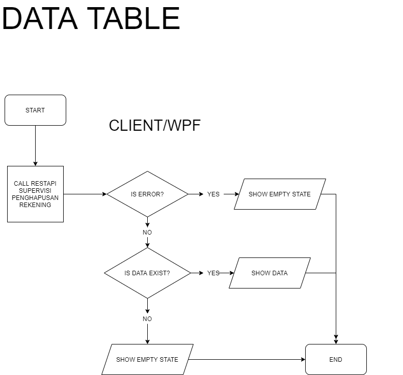

==== Flow REST API

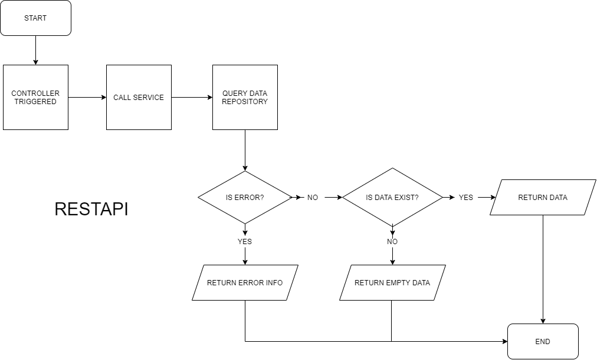
{sp} +
{sp} +
Berikut adalah _screenshot_ _main table_ Supervisi Penghapusan Rekening:

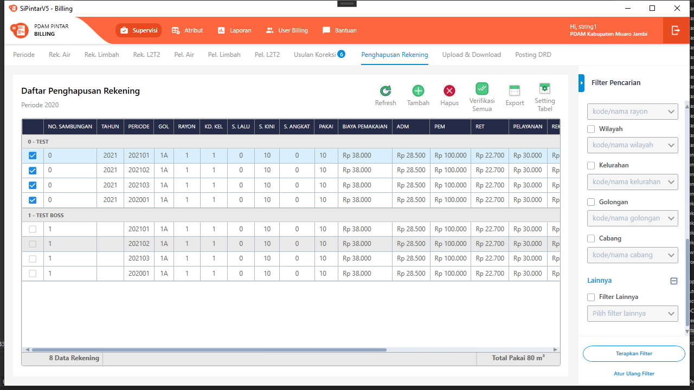
{sp} +
Pada halaman pertama ini, kita juga melakukan serangkaian proses GET data yang diperlukan untuk opsi _combo box filter_ yang ada di _sidebar_ kanan halaman.
{sp} +

=== 2. Flow TAMBAH/HAPUS/VERIFIKASI

==== Tambah Data

Ketika akan menambah data, User akan dihadapkan dengan tampilan _dialog form_ untuk mencari piutang terlebih dahulu. Menu tambah data dapat diakses melalui _toolbar_ bagian atas tabel.

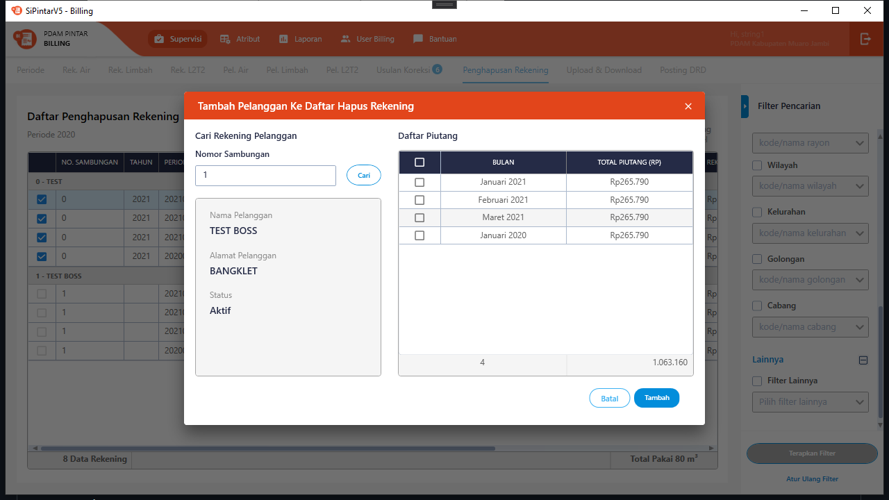

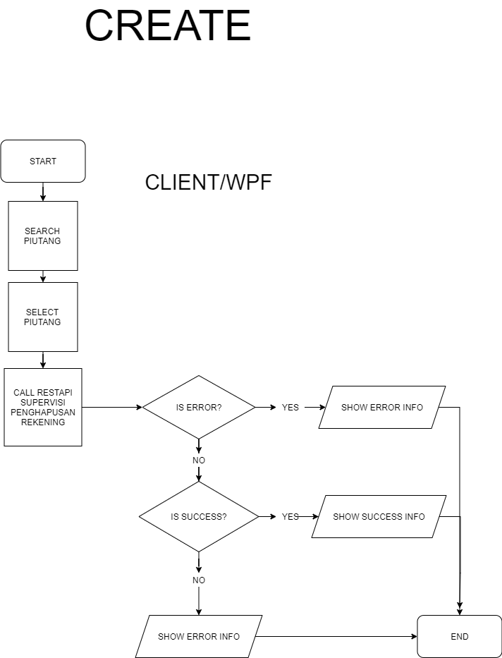

==== Hapus Data

Ketika akan menghapus data, User akan dihadapkan dengan tampilan _dialog confirmation_ terlebih dahulu. Menu hapus data dapat diakses melalui _toolbar_ bagian atas tabel atau melalui klik kanan menu pada tabel.

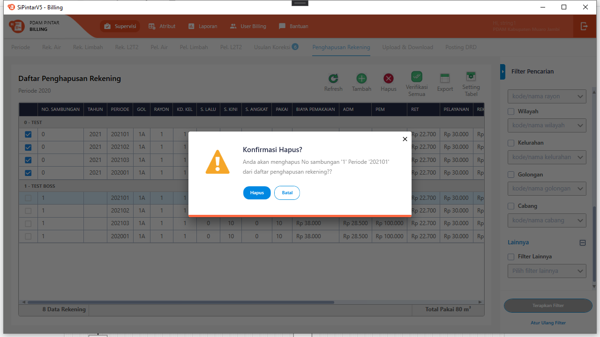

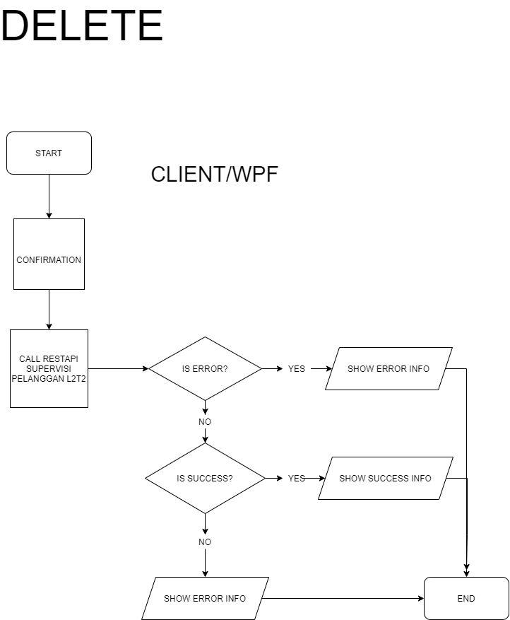

==== Verifikasi

Verifikasi data penghapusan rekening dapat dilakukan dengan melakukan klik kanan pada data pelanggan, yang akan diverifikasi atau pada toolbar bagian atas tabel bila ingin verifikasi semua data. Kemudian User harus memilih tanggal hapus secara akuntansi dan selanjutnya menginputkan _password_.

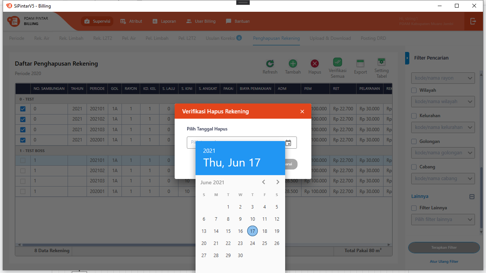

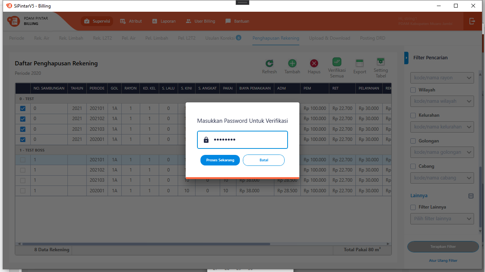

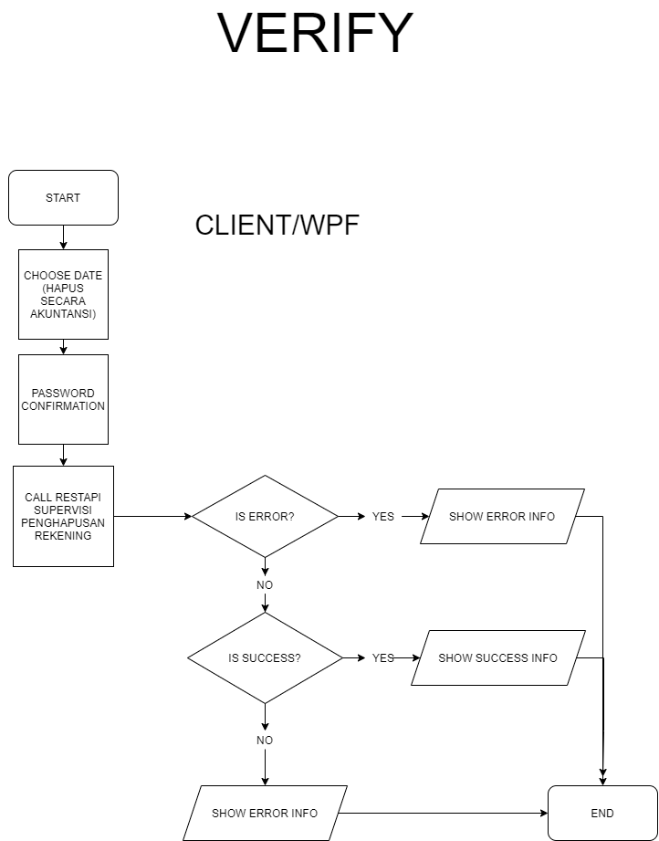

==== Lain-lain

_Export_ data dapat diakses melalui _toolbar_ di atas tabel.

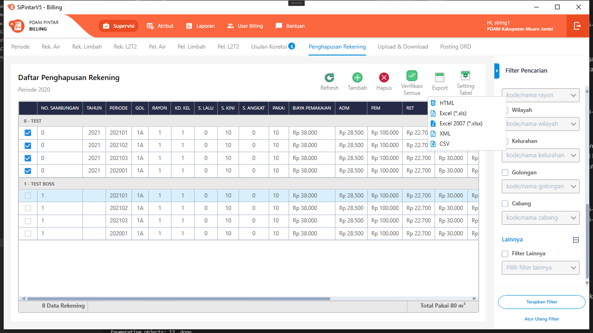
{sp} +
_Setting_ tabel dapat diakses melalui _toolbar_ di atas tabel.

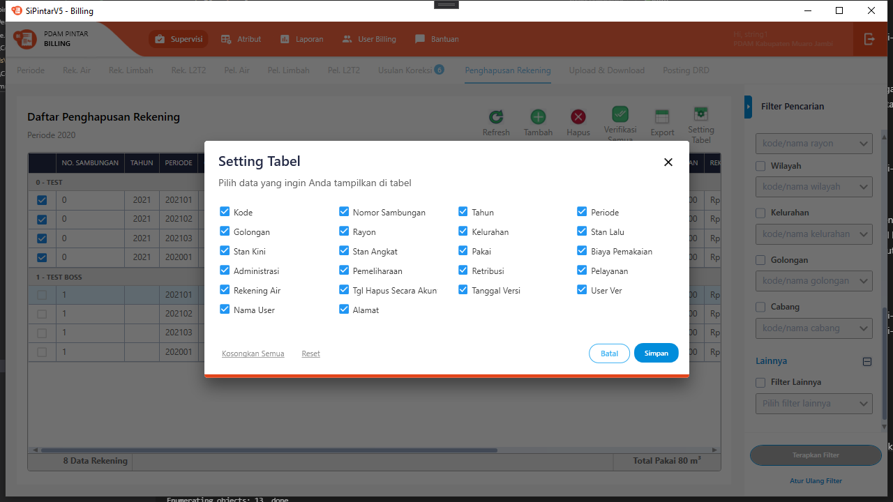
{sp} +
Untuk menu-menu lain dapat dicoba secara manual. Tidak dijelaskan secara implisit disini karena bukan _core function_ dari modul bersangkutan.

=== 3. Endpoint URL REST API

Pada menu ini, URL REST API yang digunakan adalah: 

[cols="10%,25%,65%",frame=all, grid=all]
|===
^.^h| *Method* 
^.^h| *URL* 
^.^h| *Deskripsi*

|GET 
| /api/v1/hps-scr-akuntansi-rekening-air 
| Digunakan untuk *Get Data Penghapusan Rekening*, wajib menambahkan *IdPdam* dan *IdUserRequest* pada URI param ketika request

|POST 
| /api/v1/hps-scr-akuntansi-rekening-air-add 
| Digunakan untuk *Tambah Usulan Penghapusan Rekening*, menggunakan parameter *IdPelangganAir* dan list *IdPeriode*

|PATCH 
| /api/v1/hps-scr-akuntansi-rekening-air-verifikasi 
| Digunakan untuk *Verifikasi Usulan Penghapusan Rekening*, menggunakan parameter berupa *TglHapusSecaraAkuntansi*, *PasswordUser* dan list *IdRekeningAir*

|DELETE 
| /api/v1/hps-scr-akuntansi-rekening-air 
| Digunakan untuk *Hapus Usulan Penghapusan Rekening*

|GET 
| /api/v1/rekening-air-piutang 
| Digunakan untuk *Cari Piutang* saat *Tambah Data*, menggunakan parameter *NoSamb*
|===

==== Code Notes

Fitur ini menggunakan tabel _master_pelanggan_lltt_ untuk menyimpan data utamanya.

==== Other Source

https://drive.google.com/file/d/11puWTqzM8qDLKZUX7RAa0Yeh8x-gT3Sf/view?usp=sharing[Diagram Source (editable with email @bsa.id)]