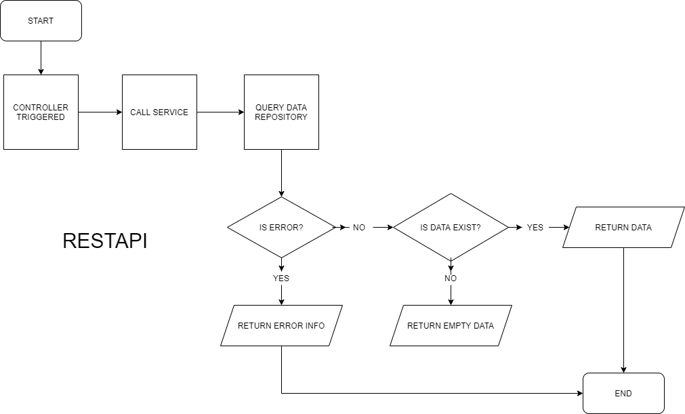

= Flow Supervisi Periode

Dokumen ini berisi tentang _flow_ CRUD pada menu *Supervisi Periode* dari sistem Sipintar.NET.

Berikut adalah flow dari Supervisi Periode:

== 1. Flow Page Supervisi Periode

Berikut adalah _flow_ dari _show_ halaman Supervisi Periode. Saat membuka _page_ Supervisi Periode, sistem akan melakukan serangkaian proses berikut:

1. Mendapatkan data pada page tersebut dengan memanggil URL REST API;
2. Pada sisi REST API, akan melakukan rangkaian proses _query_ ke _database_; 
3. REST API mengembalikan hasil _query_ ke Client; 
4. Client menampilkan hasil _query_ oleh REST API. Jika _query_ tidak bermasalah dan datanya tidak nol, maka akan _show_ tabel, apabila tidak maka akan _show empty state_.

=== Flow WPF

=== Flow REST API

{sp} +
{sp} +
Berikut adalah _screenshot_ _main table_ Supervisi Periode:

{sp} +

== 2. Flow Input CRUD

Berikut adalah _flow_ untuk input CRUD menu Supervisi Periode. Input data dilakukan oleh User melalui _dialog form_.

=== Flow WPF

image::../../images-sipintar/billing/supervisi/sipintar-supervisi-periode-4.png[600,400]

=== Flow REST API

{sp} +
{sp} +
Berikut adalah _screenshot_ input _dialog form_:

== 3. Endpoint URL REST API

Pada menu ini, URL REST API yang digunakan adalah: 

[cols="10%,25%,65%",frame=all, grid=all]
|===
^.^h| *Method* 
^.^h| *URL* 
^.^h| *Deskripsi*

|GET 
| /api/v1/master-periode 
| Digunakan untuk Get data, wajib menambahkan *IdPdam* dan *IdUserRequest* pada URI param ketika request

|POST 
| /api/v1/master-periode 
| Digunakan untuk Tambah data, wajib menambahkan *IdPdam* dan *IdUserRequest* pada body ketika request

|PATCH 
| /api/v1/master-periode 
| Digunakan untuk Ubah data, wajib menambahkan *IdPdam* dan *IdUserRequest* serta *IdEntity* pada body ketika request

|DELETE 
| /api/v1/master-periode 
| Digunakan untuk Hapus data, wajib menambahkan *IdPdam* dan *IdUserRequest* serta *IdEntity* pada URI param ketika request
|===

=== Code Notes

Fitur ini menggunakan tabel _master_periode_ untuk menyimpan datanya.

=== Other Source

https://drive.google.com/file/d/11puWTqzM8qDLKZUX7RAa0Yeh8x-gT3Sf/view?usp=sharing[Diagram Source (editable with email @bsa.id)]