= Flow Supervisi Riwayat Posting

Dokumen ini berisi tentang _flow_ pada menu *Riwayat Posting* dari sistem Sipintar.NET.

Berikut adalah _flow_ dari Supervisi Riwayat Posting:

== 1. Flow Page Supervisi Riwayat Posting

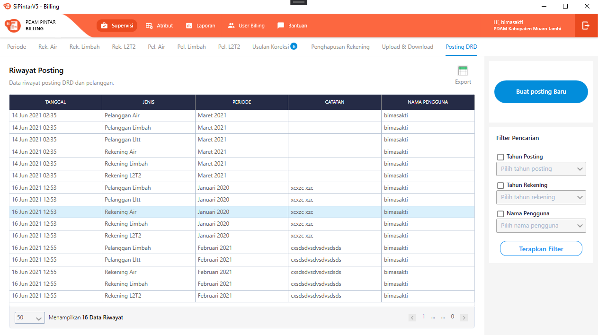
{sp} +

Berikut adalah _flow_ dari _show_ halaman Supervisi Riwayat Air. Saat membuka halaman Supervisi Riwayat Posting, sistem akan melakukan serangkaian proses berikut:

1. Mendapatkan data pada halaman tersebut dengan memanggil URL REST API;
2. Pada sisi REST API, akan melakukan rangkaian proses _query_ ke _database_; 
3. REST API mengembalikan hasil _query_ ke Client; 
4. Client menampilkan hasil _query_ oleh REST API. Jika _query_ tidak bermasalah dan datanya tidak nol, maka akan _show_ tabel, apabila tidak maka akan _show empty state_.

Berikut adalah penjelasan terkair Fitur Posting DRD :

. Tampilan Utama Fitur Posting DRD => manampilkan riwayat posting DRD (Air, Limbah, LLTT) dan pelanggan (Air, Limbah, LLTT), pilihan untuk melakukan _filtering_ data dan membuat posting Baru.
{sp} +
.. Buat Posting Baru => Fitur ini digunakan untuk membuat posting data DRD dan pelanggan. +
+
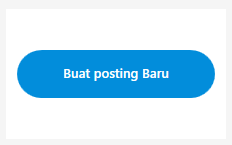
{sp} +

.. Filter Pencarian => fitur ini digunakan untuk menyaring data riwayat posting berdasarkan filter yang di pilih. Filter terdiri dari 4 bagian:

 ** Tahun Posting => Menampilkan data riwayat posting berdasarkan tahun kapan melakukan posting. _Value_ pada _combo box_ didapat dari 11 tahun kebelakang mulai dari tahun ini.
 ** Tahun Rekening => Menampilkan data riwayat posting berdasarkan tahun rekening. _Value_ pada _combo box_ diambil dari REST API.
 
 Tahun Posting => /api/v1/master-periode

** Nama Pengguna => Menampilkan data riwayat posting berdasarkan nama pengguna. _Value_ yang berisi pada _combo box_ diambil dari REST API:
 
 Nama Pengguna => /api/v1/master-user

** Terapkan Filter => Button untuk menampilkan datanya pada _grid_, sesuai filter - filter yang dipilih. _Value_ di ambil dari REST API:

 Terapkan Filter => /api/v1/riwayat-posting

.. Tabel Riwayat Posting => fitur ini untuk menampilkan isi tabel riwayat_posting. Pada tabel menampilkan berapa jumlah data pada tabel, pagination dan limit berapa data ditampilkan

 
.. Export => fungsi export disini untuk mengeksport data-data yang di tampilkan pada grid rekening air. Pilihan export yang dapat di pilih html, excel, excel 2007, xml, csv. +
+
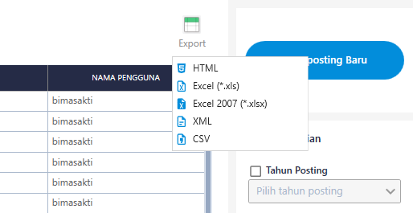
{sp} +

. Buat Posting Baru => untuk membuat posting data DRD dan pelanggan. +
+
Jika belum pernah melakukan posting pada periode yang di pilih maka tampilan akan seperti ini. +
+
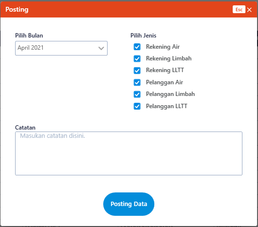
{sp} +
+
Jika data yang ingin di-posting sudah sesuai yang diinginkan, maka saat _button_ "Posting Data" diklik akan ada konfirmasi untuk ingin melanjutkan mem-posting atau tidak. Jika memilih posting, maka akan ada beberapa _hit_ ke REST API sesuai _checkbox_ yang dipilih:

  Posting Pelanggan Air => /api/v1/master-pelanggan-air-posting
  Posting Limbah => /api/v1/master-pelanggan-limbah-posting
  Posting LLTT => /api/v1/master-pelanggan-lltt-posting
  Posting Rekening Air => /api/v1/rekening-air-posting-drd-air
  Posting Rekening Limbah => /api/v1/rekening-limbah-posting-drd
  Posting Rekening LLTT => /api/v1/rekening-lltt-posting-drd

+
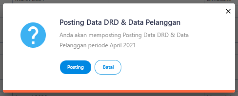
{sp} +

+

Jika bulan rekening sudah di-posting, maka akan ada _textblock_ untuk penanda jika rekening sudah pernah di-posting dan memberitahu jika pada catatan harus diisi atau tidak boleh kosong ataupun "-".

+
+
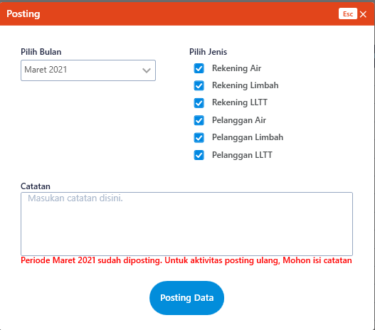
{sp} +
+
Jika catatan tidak diisi atau hanya diberi tanda "-", maka sistem akan menampilkan _dialog host_.
+
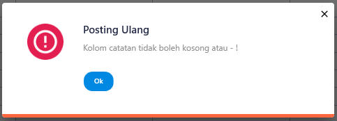
{sp} +

== 2. Flow Chart 

. REST API
+
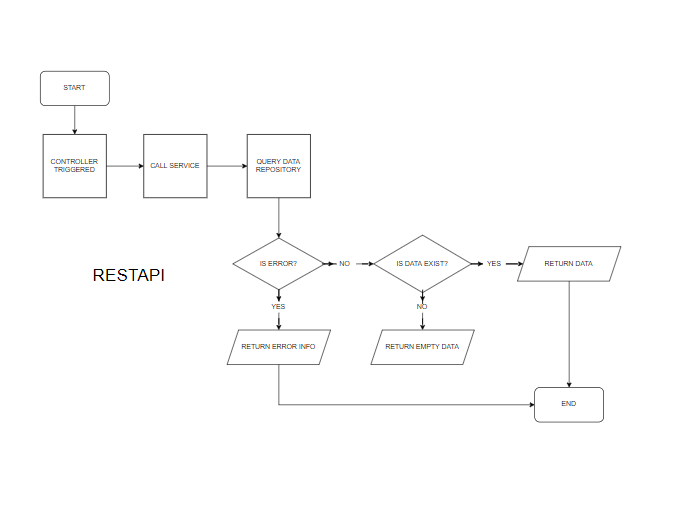
{sp} +
+
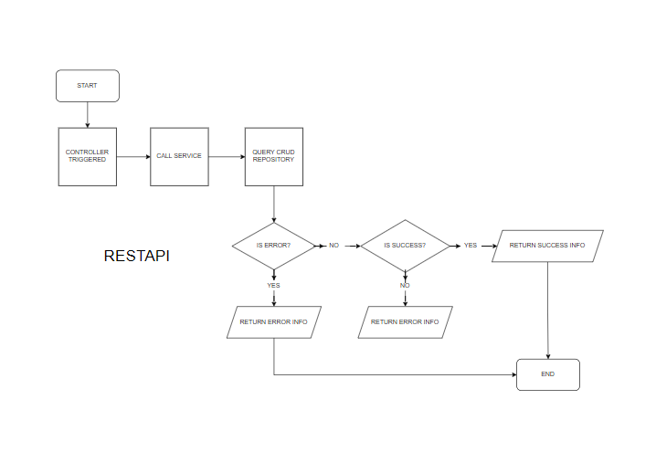
{sp} +

. WPF
+
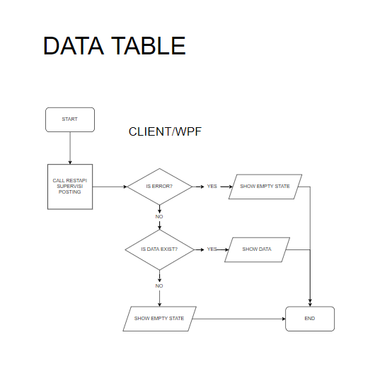
{sp} +
+
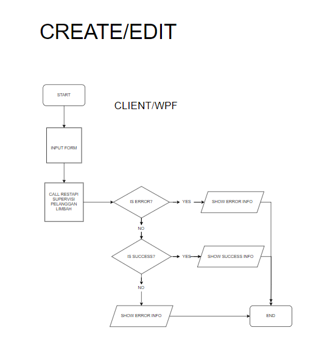
{sp} +

== 3. Endpoint URL REST API

Pada menu ini, URL REST API yang digunakan adalah: 

[cols="10%,25%,65%",frame=all, grid=all]
|===
^.^h| *Method* 
^.^h| *URL* 
^.^h| *Deskripsi*

|GET 
| /api/v1/master-periode 
| Digunakan untuk Get data, wajib menambahkan *IdPdam* dan *IdUserRequest* pada URI param ketika request

|
| /api/v1/master-user 
| 

|
|/api/v1/riwayat-posting
|

|POST 
| /api/v1/master-pelanggan-air-posting 
| Digunakan untuk Tambah data, wajib menambahkan *IdPdam* dan *IdUserRequest* pada body ketika request

|| /api/v1/master-pelanggan-limbah-posting | Wajib mengirim parameter *IdPdam*
|| /api/v1/master-pelanggan-lltt-posting |
|| /api/v1/rekening-air-posting-drd-air |
|| /api/v1/rekening-limbah-posting-drd |
|| /api/v1/rekening-lltt-posting-drd |
|===

=== Code Notes

Fitur ini menggunakan tabel _riwayat_posting_, _master_user_, _master_periode_, _posting_rekening_air_, _posting_rekening_air_detail_, _posting_rekening_air_transaksi_,
_posting_rekening_limbah_, _posting_rekening_limbah_detail_, _posting_rekening_limbah_transaksi_, _posting_rekening_lltt_, _posting_rekening_lltt_detail_, _posting_rekening_lltt_transaksi_,
_posting_pelanggan_air_, _posting_pelanggan_air_detail_, _posting_pelanggan_air_transaksi_,
_posting_pelanggan_limbah_, _posting_pelangganlimbah_detail_, _posting_pelanggan_limbah_transaksi_, _posting_pelanggan_lltt_, _posting_pelanggan_lltt_detail_, _posting_pelanggan_lltt_transaksi_,.

=== Other Source

https://drive.google.com/file/d/11puWTqzM8qDLKZUX7RAa0Yeh8x-gT3Sf/view?usp=sharing[Diagram Source (editable with email @bsa.id)]