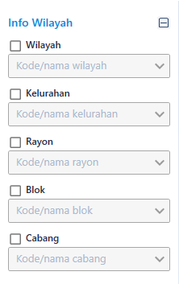

= Flow Supervisi Rekening Air

Dokumen ini berisi tentang _flow_ pada menu _Rekening Air_ dari sistem Sipintar.NET.

Berikut adalah _flow_ dari Supervisi Rekening Air:

== 1. Flow Page Supervisi Rekening Air

{sp} +

Berikut adalah _flow_ dari _show_ halaman Supervisi Rekening Air. Saat membuka _page_ Supervisi Rekening Air (Rek. Air), sistem akan melakukan serangkaian proses berikut:

1. Mendapatkan data pada _page_ tersebut dengan memanggil URL REST API berdasarkan periode yang dipilih, _default value_ pada periode adalah periode paling baru rekening. Untuk melihat periode rekening paling baru bisa dilihat pada _page_ Supervisi Periode ;
2. Pada sisi REST API, akan melakukan rangkaian proses _query_ ke _database_; 
3. REST API mengembalikan hasil _query_ ke Client; 
4. Client menampilkan hasil _query_ oleh REST API. Jika _query_ tidak bermasalah dan datanya, tidak nol maka akan _show_ tabel, apabila tidak maka akan _show empty state_.

Pada halaman Rekening Air di atas ada beberapa komponen :

. Filter Pencarian => Fitur ini digunakan untuk menyaring data rekening berdasarkan filter yang di pilih. Filter terdiri dari 8 bagian:

 ** Periode => Periode rekening yang ingin di tampilkan. value pada _combo box_ diambil dari REST API.
 
 periode => /api/v1/master-periode
 
 ** Status => Status rekening pelanggan, meliputi aktif, nonaktif, segel. value pada combobox diambil dari REST API.
 
 status => /api/v1/master-status
+

{sp} +

** Kondisi Rekening => berisi bebrapa Filter meliputi; kolektif, flag, tanggal bayar, rekening air, pakai, kasir, loket bayar. Beberapa _value_ yang berisi pada _combo box_ diambil dari REST API:
 
 kolektif => /api/v1/master-kolektif
 flag => /api/v1/master-flag
 kasir => /api/v1/master-user
 loket bayar => /api/v1/master-loket
+

{sp} +
 
** Info Dasar => Berisi beberapa filter terkait info dasar dari pelanggan; seperti nama, no. sambungan, no. rekening, golongan dan alamat. _Value_ pada golongan diambil dari REST API:

 golongan => /api/v1/master-tarif-golongan
+ 

{sp} +

** Info Wilayah => berisi beberapa filter meliputi dimana lokasi pelanggan tersebut, info ini terdiri dari wilayah, kelurahan, rayon, blok, cabang. Semua _value_ pada filter ini diambil dari REST API:

 wilayah => /api/v1/master-wilayah
 kelurahan => /api/v1/master-kelurahan
 rayon => /api/v1/master-rayon
 blok => /api/v1/master-blok
 cabang => /api/v1/master-cabang
+

{sp} +

** Info Water Meter => Berisi beberapa filter yang terkait dengan water meter, meliputi merek water meter, diameter, kondisi meter. Beberapa _value_ pada filter ini diambil dari REST API:

 merk water meter => /api/v1/master-merek-meter
 diameter => /api/v1/master-tarif-diameter
 kondisi meter => /api/v1/master-kondisi-meter
+ 

{sp} +

** Terapkan => _Button_ untuk menampilkan datanya pada _grid_, sesuai filter - filter yang dipilih. _Value_ diambil dari REST API:

 Terapkan => /api/v1/rekening-air
 
** Atur Ulang Filter => _Button_ untuk mereset kembali ke kondisi awal saat membuka halaman Rekening Air (Rek. Air).

. Informasi => fitur ini berisi beberapa informasi pelanggan, foto water meter pelanggan dan tagihan pelanggan. Informasi terdiri dari 3 bagian:

** Informasi Nama, Alamat, dan Foto Meter, informasi petugas baca => menampilkan nama pelanggan, alamat, foto meter pada periode rekening yang dipilih sesuai filter (Bulan Ini) dan periode sebelumnya (Bulan Lalu) dan petugas baca yang mengambil foto. +
+
image::../../images-sipintar/billing/supervisi/sipintar-supervisi-rekening-air-7.png[600,400]
{sp} +

** Foto water meter bisa di perbesar dengan mengklik _button_ yang ada di pojok kanan atas foto, dan akan menampilkan gambar seperti di bawah ini: +
+

{sp} +
Terdapat beberapa fungsi, sepeti merotasi foto, memperbesar foto, memperkecil foto dan menyesuaikan foto. Terdapat konfigurasi yang perlu diperhatikan untuk menampilkan foto. Lokasi foto mengakses tabel pengaturan_bacameter melalui REST API. Field yang perlu diperhatikan adalah aksesfotometer (Konfigurasi apakah akses foto akan di aktifkan atau tidak. 1 = aktif, 2 = non aktif) dan lokasifotometer  (konfigurasi lokasi foto yang ingin ditampilkan. untuk _Value_-nya "\\alamat ip atau domain \Foto". di dalam lokasi foto yang diambil pada REST API itu formating folder harus "dua digit bulan + dua digit tahun", untuk foto kecil yang sebelum diperbesar "_(dua digit bulan + dua digit tahun)/.thumbnails/(nosamb)_" dan untuk foto yang sudah diperbesar mengambil "_(dua digit bulan + dua digit tahun)/(nosamb)_". REST API yang mengakses ke tabel pengaturan bacameter :

 Pengaturan Bacameter => /api/v1/pengaturan-bacameter

** Informasi Rekening => Fitur ini berisi informasi nosamb (Nomor Sambungan), no rek (nomor rekening), status pelanggan, golongan, diameter, koderayon, rayon, kode wialayah, wialayah, kelaianan, kode pemeliharaan lain kode retribusi lain. Informasi ini muncul, jika pada _grid_ ada yang diklik. +
+

{sp} +

** Informasi Rincian Tagihan => Fitur ini berisi informasi rincian biaya rekening pelanggan pada periode yang dipilih.

 Informasi Rincian Tagihan => /api/v1/rekening-air-detail
+

{sp} +

* Tabel Rekening Air => Untuk menampilkan rekening-rekening pelanggan sesuai periode yang dipilih. Pada tabel, terdapat indikator/ penanda jika rekening tersebut sudah di bayarkan berwarna hijau, limit data yang ditampilkan, jumlah data rekening yang ada pada periode yang d pilih dan jumlah _paginate_. +
+

{sp} +

** Klik Kanan Tabel Rekening Air => Ada beberapa _action_ jika tabel dikklik kanan, dan beberapa _action_ memiliki kondisi jika rekening tersebut sudah terpublish atau belum terpublish seperti:

* Terpublish => Rekening tersebut dikatakan terpublish jika pada kolom publish tercentang atau ceklist. Rekening dapat terpublish jika rekening sudah terkoreksi, indikator rekening jika sudah terkoreksi pada kolom K sudah tercentang. +
+

{sp} +

* Belum Terpublish => Rekening tersebut dikatakan belum terpublish jika pada kolom publish tidak tercentang atau tidak _checklist_. +
+

{sp} +

. _Action_ yang ada pada saat klik kanan pada _grid_ Rekening Air. Ada berapa _action_ yang bisa digunakan jika  mengklik kanan pada _grid_ rekening air dengan kondisi tertentu. Kondisi tertentu yang dimaksud adalah:
* Kondisi Rekening Sudah Terpublish => Action yang ada dapat digunakan, jika rekening tersebut sudah terpublish:

** UnPublish => Action ini bisa digunkan jika rekening sudah terpublish. Unpublish ini fungsinya adalah untuk membatalkan rekening yang sudah terpublish / menjadikan rekening tersebut belum terpublish. REST API yang di-_hit_:

 Unpublish => /api/v1/rekening-air-unpublish
 
** Upload Ulang Tagihan =>  Action bisa digunakan jika rekening sudah terpublish. Upload ulang tagihan ini fungsinya adalah untuk mengupload kembali biaya rekening airnya. Ini biasanya digunakan jika ada kasus biaya rekening pelanggan tidak sesuai dan harus dikoreksi untuk mengirim tagihannya itu kembali dengan fitur ini.

 Upload Ulang Tagihan => /api/v1/upload-tagihan-air

** Lihat Piutang => Action ini bisa selalu digunakan, baik rekeningnya sudah terpublish atau belum terpublish. Lihat Piutang ini digunakan untuk melihat berapa piutang yang dimiliki oleh pelanggan tersebut.

 Lihat Piutang => /api/v1/rekening-air-piutang
+

{sp} +
 
** Lihat Riwayat Pemakaian => Action ini bisa selalu digunakan, baik rekeningnya sudah terpublish atau belum terpublish. Lihat Riwayat Pemakaian ini digunakan untuk melihat berapa pemakaian pelanggan selama setahun.
  
  Lihat Riwayat Pemakaian => /api/v1/rekening-air-riwayat-pakai
+

{sp} +
  
** Lihat Riwayat Pembayaran => Action ini bisa selalu di gunakan, baik rekeningnya sudah terpublish atau belum terpublish. Lihat Riwayat Pembayaran ini digunakan untuk melihat berapa tagihan yang sudah dibayar pelanggan selama setahun. +
+

{sp} +

* Kondisi Rekening Belum TerPublish => Action - action yang dapat digunakan, jika rekening tersebut belum terpublish:

** Perbarui Data Pelanggan => Action ini bisa di gunakan jika rekening air belum terpublish. Perbarui Data Pelanggan digunakan untuk memperbarui data rekening, yang diambil dari data pelanggan untuk acuan datanya, dan disesuai ke data rekening periode yang di pilih.

 Perbarui Data Pelanggan => /api/v1/rekening-air-perbarui-data 

** Koreksi => Action ini bisa digunakan jika rekening air belum terpublish, koreksi fungsinya untuk mengkoreksi jumlah pakai, stan lalu dan stan kini. Jika ada mengubah di antara ketiga itu, maka biayanya akan desesuaikan sesuai tarif golongan yang diberlakukan dan rekening otomatis langsung terpublish. 

 Kalkulasi Biaya => /api/v1/rekening-air-kalkulasi
 Koreksi => /api/v1/rekening-air-update
 Publish => /api/v1/rekening-air-publish
 kelainan => /api/v1/master-kelainan
 Petugas Baca => /api/v1/master-petugasbaca
+

{sp} +
 
** Hitung Ulang => Action ini bisa digunakan jika rekening air belum terpublish. Hitung Ulang digunakan untuk menghitung kembali biaya - biaya desesuaikan sesuai tarif golongan yang  masih diberlakukan. 
 
 Hitung Ulang => /api/v1/rekening-air-hitung-ulang
 
** Hapus =>  action ini bisa di gunakan jika rekening air belum terpublish. Hapus digunakan untuk menghapus rekening. Hapus disini hanya mengganti _value_ pada _field_ flaghapus menjadi 0 di tabel rekening_air.

 Hapus => /api/v1/rekening-air-hapus
 
** Publish => Action ini bisa digunakan jika rekening air belum terpublish. Publish digunakan untuk mempublish rekening guna persyaratan untuk dapat  di-upload rekeningnya. 

 Publish => /api/v1/rekening-air-publish
 
** Set Rekening Normal => Action ini bisa digunakan jika rekening air belum terpublish. Set Rekening Normal digunakan untuk mengubah _flag_ rekening menjadi 1 (Normal).

 Set Rekening Normal => /api/v1/rekening-air-update-non-administratif
+

{sp} +
 
** Set Tanpa Denda => Action ini bisa digunakan jika rekening air belum terpublish. Set Rekening Tanpa Denda digunakan untuk mengubah _flag_ rekening menjadi 2(Pelanggan Tanpa Denda)
 
  Set Rekening Normal => /api/v1/rekening-air-update-non-administratif
+

{sp} +
** Lihat Piutang => Action ini bisa selalu digunakan, baik rekeningnya sudah terpublish atau belum terpublish. Lihat Piutang ini digunakan untuk melihat berapa piutang yang dimiliki oleh pelanggan tersebut.

 Lihat Piutang => /api/v1/rekening-air-piutang
+

{sp} +
 
** Lihat Riwayat Pemakaian => Action ini bisa selalu digunakan, baik rekeningnya sudah terpublish atau belum terpublish. Lihat Riwayat Pemakaian ini digunakan untuk melihat berapa pemakaian pelanggan selama setahun.
  
  Lihat Riwayat Pemakaian => /api/v1/rekening-air-riwayat-pakai
+

{sp} +
  
** Lihat Riwayat Pembayaran => Action ini bisa selalu digunakan, baik rekeningnya sudah terpublish atau belum terpublish. Lihat Riwayat Pembayaran ini digunakan untuk melihat berapa tagihan yang sudah dibayar pelanggan selama setahun.

 Lihat Riwayat Pembayaran => /api/v1/rekening-air-history-pelunasan-pembatalan
+

{sp} +

. Pilihan menu / fitur yang ada pada halaman Rekening Air (Rek. Air) meliputi; Hitung, Export, Download Bacameter, Terbitkan Pelanggan, Publish Semua, Perbarui Semua Data, Setting Tabel. Berikut penjelasan setiap menu tersebut:

* Hitung => Fungsi hitung disini ada untuk menghitung semua data yang ditampilkan pada _grid_ rekening air.
 
 /api/v1/rekening-air-hitung-ulang
 
* Export => Fungsi _export_ disini untuk mengeksport data-data yang di tampilkan pada grid rekening air. Pilihan _export_ yang dapat dipilih html, excel, excel 2007, xml, csv.

* Download Bacameter => Fungsi download bacameter disini untuk men-_download_ hasil baca yang dihasilkan oleh aplikasi bacameter dan meng-_update_ datanya ke aplikasi billing; tabel yang ter-_update_ adalah rekening_air.

 Download Bacameter => /api/v1/download-hasil-baca
+

+

{sp} +

* Terbitkan Pelanggan  => Fungsi terbitkan pelanggan disini untuk memunculkan rekening pelanggan pada periode yang dipilih jika pada rekening air belum ada.

 Daftar Penerbitan Pelanggan => /api/v1/rekening-air-daftar-penerbitan-pelanggan
 Submit Penerbitan Pelanggan => /api/v1/rekening-air-terbitkan-pelanggan
+

{sp} +

* Publish Semua => Fungsi publish disini untuk mempublish semua rekening yang ditampilkan pada _grid_ rekening air.

  Publish Semua => /api/v1/rekening-air-publish
+

+

{sp} +

* Perbarui Semua Data => Fungsi Perbarui Semua Data di sini digunakan untuk memperbarui semua data, sama seperti Perbarui data pelanggan yang dapat diakses lewat klik kanan pada grid. Berbeda dengan klik kanan yang hanya satu persatu, menu ini dapat memperbarui datanya sesuai _grid_ yang ditampilkan.

 Perbarui Semua Data => /api/v1/rekening-air-perbarui-data
 
* Setting Tabel => Fungsi Setting Tabel di sini digunakanuntuk mengkonfigurasi kolom mana saja yang ingin ditampilkan pada _grid_ rekening air. +
+

{sp} +

== 2. Flow Chart 

. REST API
+

{sp} +
+

{sp} +

. WPF
+
image::../../images-sipintar/billing/supervisi/sipintar-supervisi-rekening-air-29.png[600,400]
{sp} +
+

{sp} +
+

{sp} +

== 3. Endpoint URL REST API

Pada menu ini, URL REST API yang digunakan adalah: 

[cols="10%,25%,65%",frame=all, grid=all]
|===
^.^h| *Method* 
^.^h| *URL* 
^.^h| *Deskripsi*

|GET 
| /api/v1/master-periode 
| Digunakan untuk Get data, wajib menambahkan *IdPdam* dan *IdUserRequest* pada URI param ketika request 

|
|/api/v1/master-status 
| 

|
|/api/v1/master-kolektif 
| 

|
|/api/v1/master-flag 
| 

|
|/api/v1/master-user
|

|
|/api/v1/master-loket
|

|
|/api/v1/master-tarif-golongan
|

|
|/api/v1/master-wilayah
|

|
|/api/v1/master-kelurahan
|

|
|/api/v1/master-rayon
|

|
|/api/v1/master-blok
|

|
|/api/v1/master-cabang
|

|
|/api/v1/master-merek-meter
|

|
|/api/v1/master-tarif-diameter
|

|
|/api/v1/master-kondisi-meter
|

|
| /api/v1/rekening-air
|

|
|/api/v1/rekening-air-detail
|

|
|/api/v1/rekening-air-piutang
|

|
|/api/v1/rekening-air-riwayat-pakai
|

|
|/api/v1/rekening-air-kalkulasi
|

|
|/api/v1/master-petugasbaca
|

|
|/api/v1/master-kelainan
|

|
|/api/v1/rekening-air-history-pelunasan-pembatalan
|

|
|/api/v1/rekening-air-daftar-penerbitan-pelanggan 
|

|POST 
| /api/v1/upload-tagihan-air 
| Digunakan untuk Tambah data, wajib menambahkan *IdPdam* dan *IdUserRequest* pada body ketika request

|PATCH 
| /api/v1/rekening-air-hitung-ulang 
| Digunakan untuk Ubah data, wajib menambahkan *IdPdam* dan *IdUserRequest* serta *IdEntity* pada body ketika request

|
|/api/v1/rekening-air-unpublish
|

|
|/api/v1/rekening-air-publish
|

|
|/api/v1/download-hasil-baca
|

|
|/api/v1/rekening-air-perbarui-data
|

|
|/api/v1/rekening-air-update-non-administratif
|

|
|/api/v1/rekening-air-update
|

|
|/api/v1/rekening-air-terbitkan-pelanggan 
|

|DELETE 
| /api/v1/rekening-air-hapus 
| Digunakan untuk Hapus data, wajib menambahkan *IdPdam* dan *IdUserRequest* serta *IdEntity* pada URI param ketika request
|===

=== Code Notes

Fitur ini menggunakan tabel _rekening_air_, _rekening_air_detail_, _master_periode_, _master_status_, _master_kolektif_, _master_flag_,  _master_user_, _master_loket_, _master_tarif_golongan_, _master_attribute_wilayah_, _master_attribute_kelurahan_, _master_attribute_rayon_, _master_attribute_blok_,
_master_attribute_cabang_, _master_attribute_merek_meter_, _master_tarif_diameter_, _master_attribute_kondisi_meter_, _master_attribute_kelainan_, _master_attribute_petugas_baca_.

=== Other Source

https://drive.google.com/file/d/11puWTqzM8qDLKZUX7RAa0Yeh8x-gT3Sf/view?usp=sharing[Diagram Source (editable with email @bsa.id)]