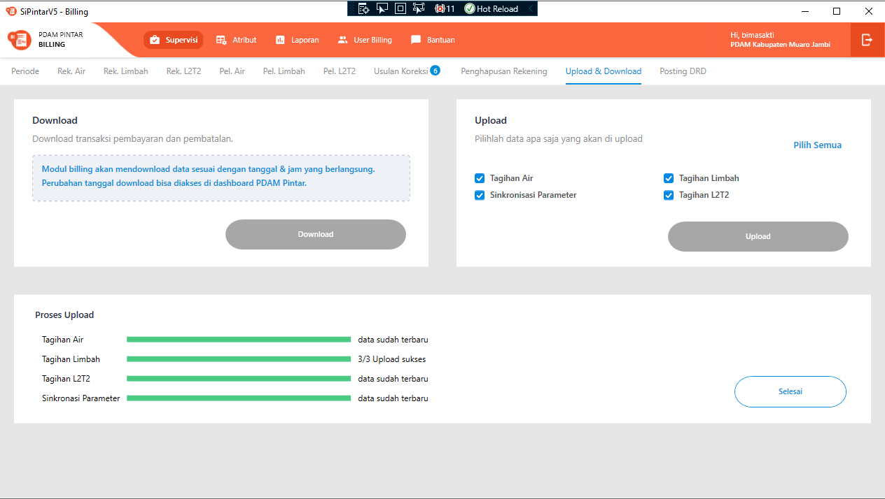

= Flow Supervisi Upload dan Download Data

Dokumen ini berisi tentang _flow_ untuk proses upload dan download data (Sinkron Data) pada submenu supervisi dari sistem Sipintar.NET.

Berikut adalah _flow_ dari Supervisi Upload and Download Data:

== 1. Flow Page Supervisi Upload dan Download

=== Flow WPF

image::../../images-sipintar/billing/supervisi/sipintar-supervisi-upload-download-1.png[600,600]

=== Flow REST API Upload

=== Flow REST API Download

{sp} +
{sp} +
Berikut adalah _screenshot_ _main table_ Supervisi Upload and Download:

{sp} +

== 2. Endpoint URLs REST API

Pada menu ini, URLs REST API yang digunakan adalah: 

[cols="10%,25%,65%",frame=all, grid=all]
|===
^.^h| *Method* 
^.^h| *URL* 
^.^h| *Deskripsi*

|GET 
| /api/v1/upload-tagihan-air-per-rayon-prepare 
| Digunakan untuk Get data tagihan air yang akan diupload, wajib menambahkan *IdPdam* dan *IdUserRequest* pada URI param ketika request

|GET 
| /api/v1/upload-tagihan-limbah-per-rayon-prepare 
| Digunakan untuk Get data tagihan limbah yang akan diupload, wajib menambahkan *IdPdam* dan *IdUserRequest* pada URI param ketika request

|GET 
| /api/v1/upload-tagihan-lltt-per-rayon-prepare 
| Digunakan untuk Get data tagihan lltt yang akan diupload, wajib menambahkan *IdPdam* dan *IdUserRequest* pada URI param ketika request

|POST 
| /api/v1/upload-tagihan-air-per-rayon 
| Digunakan untuk upload data tagihan air per rayon, wajib menambahkan *IdPdam*, *IdUserRequest*, *IdRayon* pada body ketika request

|POST 
| /api/v1/upload-tagihan-limbah-per-rayon 
| Digunakan untuk upload data tagihan limbah per rayon, wajib menambahkan *IdPdam*, *IdUserRequest*, *IdRayon* pada body ketika request

|POST 
| /api/v1/upload-tagihan-lltt-per-rayon 
| Digunakan untuk upload data tagihan lltt per rayon, wajib menambahkan *IdPdam*, *IdUserRequest*, *IdRayon* pada body ketika request

|POST 
| /api/v1/upload-all-attribute 
| Digunakan untuk sinkron data parameter, wajib menambahkan *IdPdam*, *IdUserRequest*, *IdRayon* pada body ketika request

|POST 
| /api/v1/download-pelanggan-air 
| Digunakan untuk mendownload data pelanggan air yang baru, wajib menambahkan *IdPdam*, *IdUserRequest*, *IdRayon* pada body ketika request

|POST 
| /api/v1/download-pelanggan-limbah 
| Digunakan untuk mendownload data pelanggan limbah yang baru, wajib menambahkan *IdPdam*, *IdUserRequest*, *IdRayon* pada body ketika request

|POST 
| /api/v1/download-pelanggan-lltt 
| Digunakan untuk mendownload data pelanggan lltt yang baru, wajib menambahkan *IdPdam*, *IdUserRequest*, *IdRayon* pada body ketika request

|POST 
| /api/v1/download-transaksi-air 
| Digunakan untuk mendownload data transaksi air yang baru, wajib menambahkan *IdPdam*, *IdUserRequest*, *IdRayon* pada body ketika request

|POST 
| /api/v1/download-transaksi-non-air 
| Digunakan untuk mendownload data transaksi non-air yang baru, wajib menambahkan *IdPdam*, *IdUserRequest*, *IdRayon* pada body ketika request

|POST 
| /api/v1/download-transaksi-limbah 
| Digunakan untuk mendownload data transaksi limbah yang baru, wajib menambahkan *IdPdam*, *IdUserRequest*, *IdRayon* pada body ketika request

|POST 
| /api/v1/download-transaksi-lltt 
| Digunakan untuk mendownload data transaksi lltt yang baru, wajib menambahkan *IdPdam*, *IdUserRequest*, *IdRayon* pada body ketika request
|===

=== Other Source

https://drive.google.com/drive/folders/1-dgkqtu-USdwCKSRQddVefvn6HLSrJ28?usp=sharing[Diagram Source (editable with email @bsa.id)]