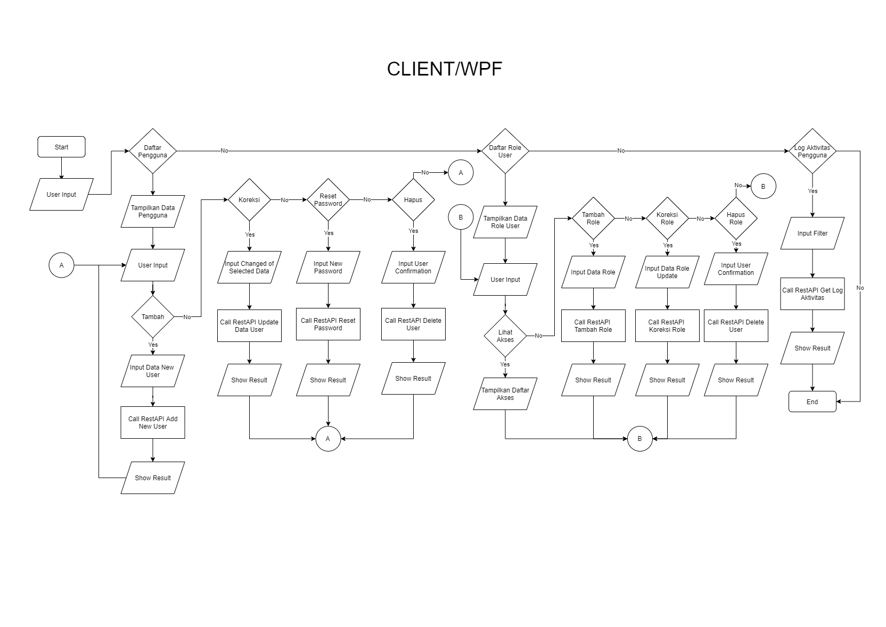
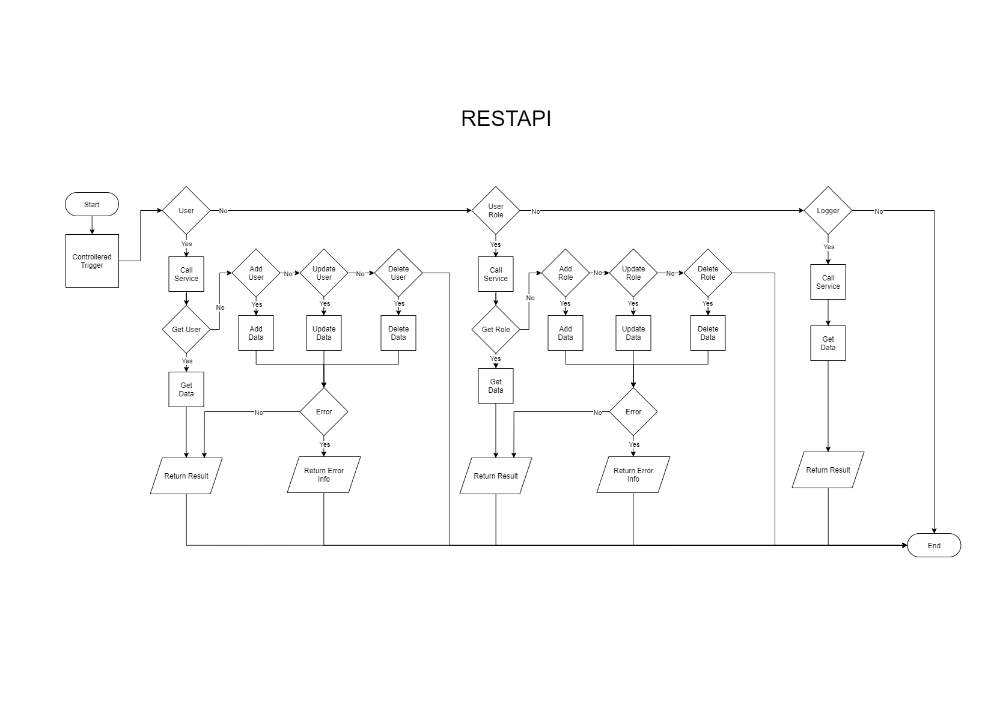

= Flow User Billing

Dokumen ini berisi tentang _flow_ CRUD pada menu user dari sistem Sipintar.NET.

Terdapat 3 sub-menu pada halaman menu User Billing, yakni: 

* <<#1-daftar-pengguna, Daftar Pengguna>>
* <<#2-daftar-role-user, Daftar Role User>>
* <<#3-log-aktivitas-pengguna, Log Aktivitas Pengguna>>
{sp} +
{sp} +

== 1. Daftar Pengguna

Berikut adalah daftar proses yang ada pada sub menu daftar pengguna:

1. Menampilkan data pengguna yang sudah ada;
2. Menambahkan pengguna baru; 
3. Mengubah data pengguna yang sudah ada; 
4. Mereset ulang password dari pengguna.
5. Menghapus data pengguna yang sudah ada.
{sp} +
{sp} +

Pada menu ini, URL REST API yang digunakan adalah: 

[cols="10%,25%,65%",frame=all, grid=all]
|===
^.^h| *Method* 
^.^h| *URL* 
^.^h| *Deskripsi*

|GET 
| /api/v1/master-user 
| Digunakan untuk Get data, wajib menambahkan *IdPdam* dan *IdUserRequest* pada URI param ketika request

|POST 
| /api/v1/master-user 
| Digunakan untuk Tambah data, wajib menambahkan *IdPdam* dan *IdUserRequest* pada body ketika request

|PATCH 
| /api/v1/master-user 
| Digunakan untuk Ubah data, wajib menambahkan *IdPdam* dan *IdUserRequest* serta *IdEntity* pada body ketika request

|DELETE 
| /api/v1/master-user 
| Digunakan untuk Hapus data, wajib menambahkan *IdPdam* dan *IdUserRequest* serta *IdEntity* pada URI param ketika request
|===
{sp} +
{sp} +

== 2. Daftar Role User
Berikut adalah daftar proses yang ada pada sub menu daftar pengguna:

1. Menampilkan data role yang sudah ada;
2. Menambahkan role baru; 
3. Mengubah akses/data role yang sudah ada; 
4. Menghapus data role yang sudah ada dengan ketentuan role tidak sedang digunakan oleh pengguna.
{sp} +
{sp} +

Pada menu ini, URL REST API yang digunakan adalah: 

[cols="10%,25%,65%",frame=all, grid=all]
|===
^.^h| *Method* 
^.^h| *URL* 
^.^h| *Deskripsi*

|GET 
| /api/v1/master-user-role 
| Digunakan untuk Get data, wajib menambahkan *IdPdam* dan *IdUserRequest* pada URI param ketika request

|POST 
| /api/v1/master-user-role 
| Digunakan untuk Tambah data, wajib menambahkan *IdPdam* dan *IdUserRequest* pada body ketika request

|PATCH 
| /api/v1/master-user-role 
| Digunakan untuk Ubah data, wajib menambahkan *IdPdam* dan *IdUserRequest* serta *IdEntity* pada body ketika request

|DELETE 
| /api/v1/master-user 
| Digunakan untuk Hapus data, wajib menambahkan *IdPdam* dan *IdUserRequest* serta *IdEntity* pada URI param ketika request
|===
{sp} +
{sp} +

== 3. Log Aktivitas Pengguna
Berikut adalah daftar proses yang ada pada sub menu daftar pengguna:

1. Menampilkan data log aktivitas pengguna;
{sp} +
{sp} +

Pada menu ini, URL REST API yang digunakan adalah: 

[cols="10%,25%,65%",frame=all, grid=all]
|===
^.^h| *Method* 
^.^h| *URL* 
^.^h| *Deskripsi*

|GET 
| /api/v1/master-logger 
| Digunakan untuk Get data, wajib menambahkan *IdPdam* dan *IdUserRequest* pada URI param ketika request
|===
{sp} +
{sp} +

=== Flow WPF

{sp} +
{sp} +

=== Flow REST API

{sp} +
{sp} +

=== Other Source

https://drive.google.com/drive/u/1/folders/1-dgkqtu-USdwCKSRQddVefvn6HLSrJ28[Diagram Source (editable with email @bsa.id)]
