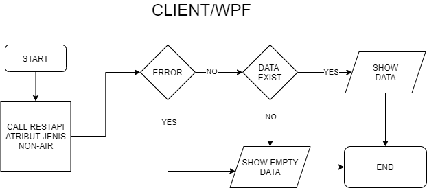
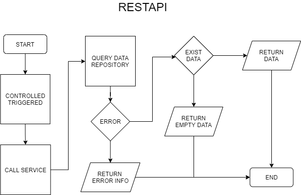
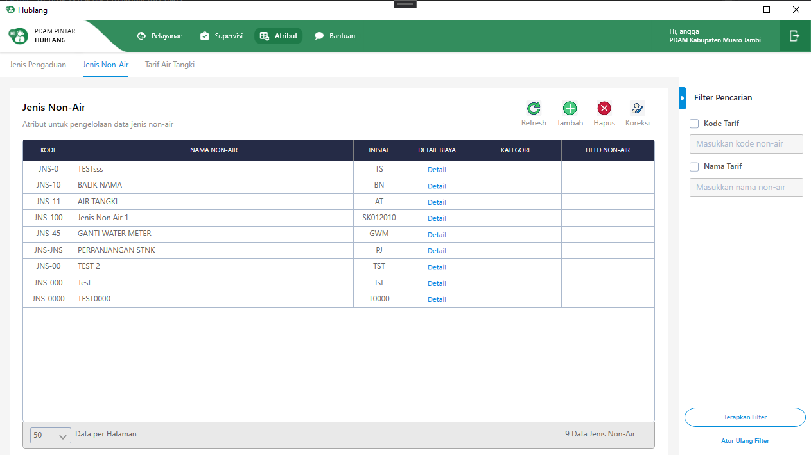
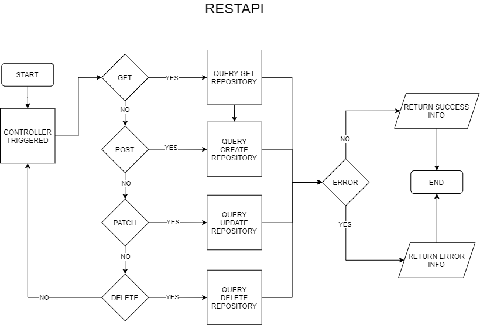
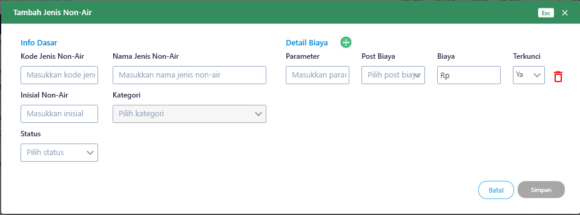

= Flow Atribut Jenis Non-Air

Dokumen ini berisi tentang flow CRUD pada menu _Atribut Jenis Non-Air_ dari sistem Sipintar.NET.

Berikut adalah flow dari Atribut Jenis Non-Air:

== 1. Flow Page Atribut Jenis Non-Air

Berikut adalah flow dari _show_ halaman Atribut Jenis Non-Air. Saat membuka _page_ atribut jenis non-air, aplikasi akan melakukan serangkaian proses berikut:

1. Mendapatkan data pada _page_ tersebut dengan memanggil URL REST API;
2. Pada sisi REST API, akan melakukan rangkaian proses _query_ ke _database_; 
3. REST API mengembalikan hasil _query_ ke Client; 
4. Client menampilkan hasil _query_ oleh REST API. Jika _query_ tidak bermasalah dan datanya tidak nol maka akan show tabel. Jika tidak, maka akan _show empty state_.

=== Flow WPF

=== Flow REST API

{sp} +
{sp} +
Berikut adalah screenshot main tabel atribut jenis non-air:

{sp} +
{sp} +

== 2. Flow Input CRUD

Berikut adalah flow untuk input CRUD menu atribut jenis non-air. Input data dilakukan oleh user melalui _dialog form_.

=== Flow REST API

{sp} +
{sp} +
Berikut adalah _screenshot_ input _dialog form_:

== 3. Endpoint URL REST API

Pada menu ini, URL REST API yang digunakan adalah: 

[cols="10%,25%,65%",frame=all, grid=all]
|===
^.^h| *Method* 
^.^h| *URL* 
^.^h| *Deskripsi*

|GET 
| /api/v1/master-jenis-non-air 
| Digunakan untuk Get data, wajib menambahkan *IdPdam* dan *IdUserRequest* pada URI param ketika request

|POST 
| /api/v1/master-jenis-non-air 
| Digunakan untuk Tambah data, wajib menambahkan *IdPdam* dan *IdUserRequest* pada body ketika request

|PATCH 
| /api/v1/master-jenis-non-air 
| Digunakan untuk Ubah data, wajib menambahkan *IdPdam* dan *IdUserRequest* serta *IdEntity* pada body ketika request

|DELETE 
| /api/v1/master-jenis-non-air 
| Digunakan untuk Hapus data, wajib menambahkan *IdPdam* dan *IdUserRequest* serta *IdEntity* pada URI param ketika request
|===

=== Code Notes

Fitur ini menggunakan tabel master_attribute_jenis_non_air dan master_attribute_jenis_nonair_detail untuk menyimpan datanya.

=== Other Source

https://drive.google.com/drive/folders/1-q1K4Bp48DtXKSKEdXlT6K7fUjdU5-P4?usp=sharing[Diagram Source (editable with email @bsa.id)]