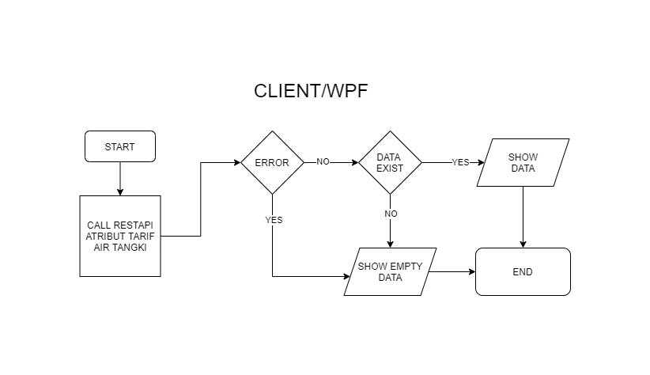
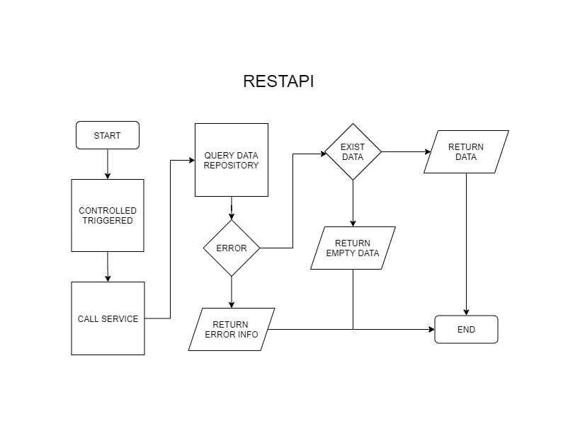
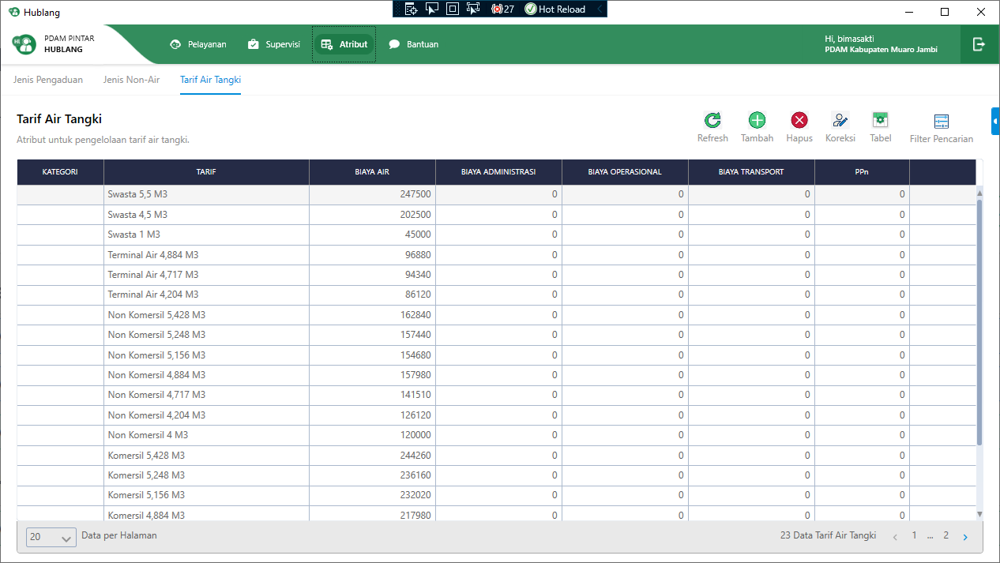
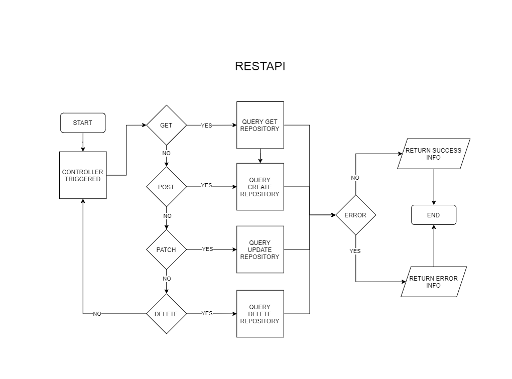
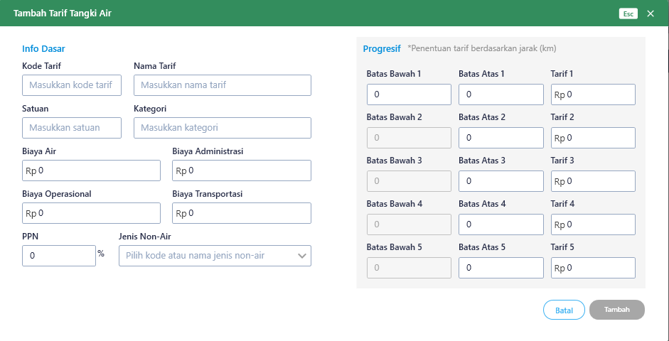

= Flow Atribut Tarif Air Tangki

Dokumen ini berisi tentang flow CRUD pada menu _Atribut Tarif Air Tangki_ dari sistem Sipintar.NET.

Berikut adalah flow dari Atribut Tarif Air Tangki:

== 1. Flow Page Atribut Tarif Air Tangki

Berikut adalah _flow_ dari show halaman Atribut Tarif Air Tangki. Saat membuka _page_ Atribut Tarif Air Tangki, aplikasi akan melakukan serangkaian proses berikut:

1. Mendapatkan data pada _page_ tersebut dengan memanggil URL REST API;
2. Pada sisi REST API, akan melakukan rangkaian proses _query_ ke _database_; 
3. REST API mengembalikan hasil _query_ ke Client; 
4. Client menampilkan hasil _query_ oleh REST API. Jika _query_ tidak bermasalah dan datan
ya tidak nol, maka akan menampilkan tabel. Jika tidak, maka akan _show empty state_.

=== Flow WPF

=== Flow REST API

{sp} +
{sp} +
Berikut adalah _screenshot_ _main table_ Atribut Tarif Air Tangki:

{sp} +
{sp} +

== 2. Flow Input CRUD

Berikut adalah _flow_ untuk _input_ CRUD menu Atribut Tarif Air Tangki. _Input_ data dilakukan oleh _user_ melalui dialog _form_.

=== Flow REST API

{sp} +
{sp} +
Berikut adalah _screenshot_ input _dialog form_:

== 3. Endpoint URL REST API

Pada menu ini, URL REST API yang digunakan adalah: 

[cols="10%,25%,65%",frame=all, grid=all]
|===
^.^h| *Method* 
^.^h| *URL* 
^.^h| *Deskripsi*

|GET 
| /api/v1/master-tarif-tangki 
| Digunakan untuk Get data, wajib menambahkan *IdPdam* dan *IdUserRequest* pada URI param ketika request

|POST 
| /api/v1/master-tarif-tangki 
| Digunakan untuk Tambah data, wajib menambahkan *IdPdam* dan *IdUserRequest* pada body ketika request

|PATCH 
| /api/v1/master-tarif-tangki 
| Digunakan untuk Ubah data, wajib menambahkan *IdPdam* dan *IdUserRequest* serta *IdEntity* pada body ketika request

|DELETE 
| /api/v1/master-tarif-tangki 
| Digunakan untuk Hapus data, wajib menambahkan *IdPdam* dan *IdUserRequest* serta *IdEntity* pada URI param ketika request
|===

=== Code Notes

Fitur ini menggunakan tabel master_tarif_tangki untuk menyimpan datanya.

=== Other Source

https://drive.google.com/drive/folders/1-dgkqtu-USdwCKSRQddVefvn6HLSrJ28?usp=sharing[Diagram Source (editable with email @bsa.id)]