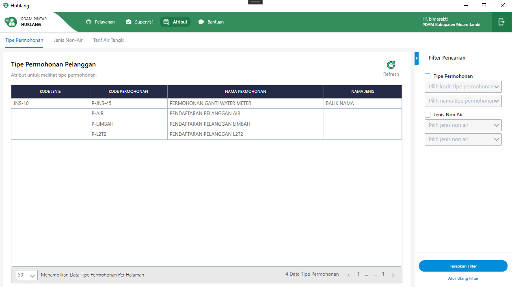
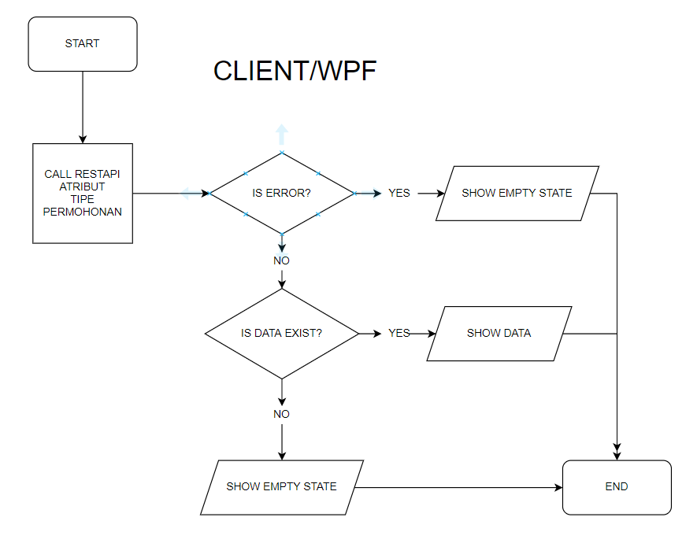

= Flow Atribut Tipe Permohonan

Dokumen ini berisi tentang _flow_ pada menu *Atribut Tipe Permohonan* dari sistem Sipintar.NET.

Berikut adalah _flow_ dari Atribut Tipe Permohonan:

== 1. Flow Page Atribut Tipe Permohonan

{sp} +

Berikut adalah _flow_ dari _show_ halaman Atribut Material. Saat membuka _page_ Atribut Permohonan, aplikasi akan melakukan serangkaian proses berikut:

1. Mendapatkan data pada _page_ tersebut dengan memanggil URL REST API;
2. Pada sisi REST API, akan melakukan rangkaian proses _query_ ke _database_; 
3. REST API mengembalikan hasil _query_ ke Client; 
4. Client menampilkan hasil _query_ oleh REST API. Jika _query_ tidak bermasalah dan datanya tidak nol maka akan _show_ tabel, apabila tidak maka akan _show empty state_.

Berikut adalah penjelasan terkair Fitur Tipe Permohonan Pelanggan :

. Tampilan Utama Fitur Tipe Permohonan Pelanggan => manampilkan pengolahan data tipe permohonan pelanggan dan pilihan melakukan filtering.

.. Filter Pencarian => fitur ini digunakan untuk menyaring data material berdasarkan filter yang di pilih. Filter terdiri dari 3 bagian:

 ** Tipe Permohonan => Menampilkan data tipe permohonan berdasarkan kode tipe permohonan atau tipe nama permohonan. _Value_ pada _combo box_ diambil dari REST API.

  Tipe Permohonan => /api/v1/master-tipe-permohonan

 ** Jenis Non Air => Menampilkan data jenis non air berdasarkan kode jenis non air atau nama jenis non air yang ingin di tampilkan. _Value_ pada _combo box_ diambil dari REST API..
  
  Jenis Non Air => /api/v1/master-jenis-non-air

** Terapkan Filter => Button untuk menampilkan datanya pada _grid_, sesuai filter - filter yang dipilih. _Value_ di ambil dari REST API:

 Terapkan Filter => /api/v1/master-tipe-permohonan

** Atur Ulang Filter => Button untuk mengembalikan filter pada saat pertama kali membuka fitur atribut tipe permohonan.

=== 1.1. Flow Chart 

. REST API
+

. WPF
+

=== 1.2. Endpoint URL REST API

Pada menu ini, URL REST API yang digunakan adalah: 

[cols="10%,25%,65%",frame=all, grid=all]
|===
^.^h| *Method* 
^.^h| *URL* 
^.^h| *Deskripsi*

|GET 
| /api/v1/master-tipe-permohonan 
| Digunakan untuk Get data, wajib menambahkan *IdPdam* dan *IdUserRequest* pada URI param ketika request

|
| /api/v1/master-jenis-non-air
|
|===

==== Code Notes

Fitur ini menggunakan tabel _master_attribute_tipe_permohonan_ untuk menyimpan datanya.
{sp} +

==== Other Source

https://drive.google.com/file/d/11puWTqzM8qDLKZUX7RAa0Yeh8x-gT3Sf/view?usp=sharing[Diagram Source (editable with email @bsa.id)]
