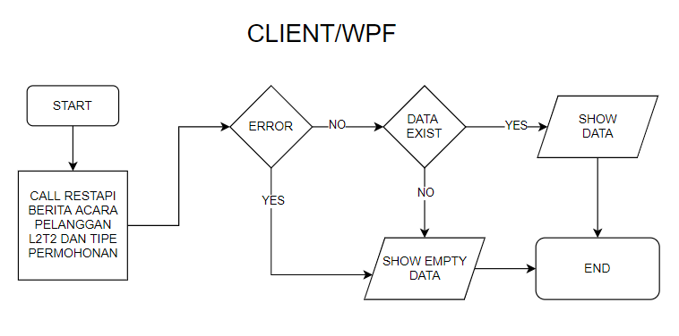
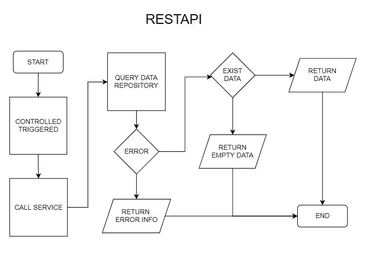
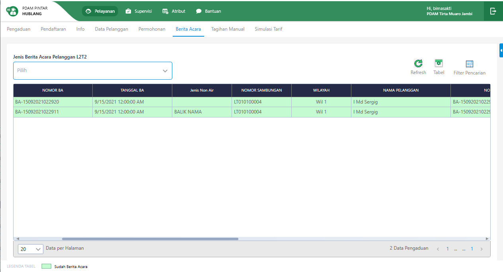
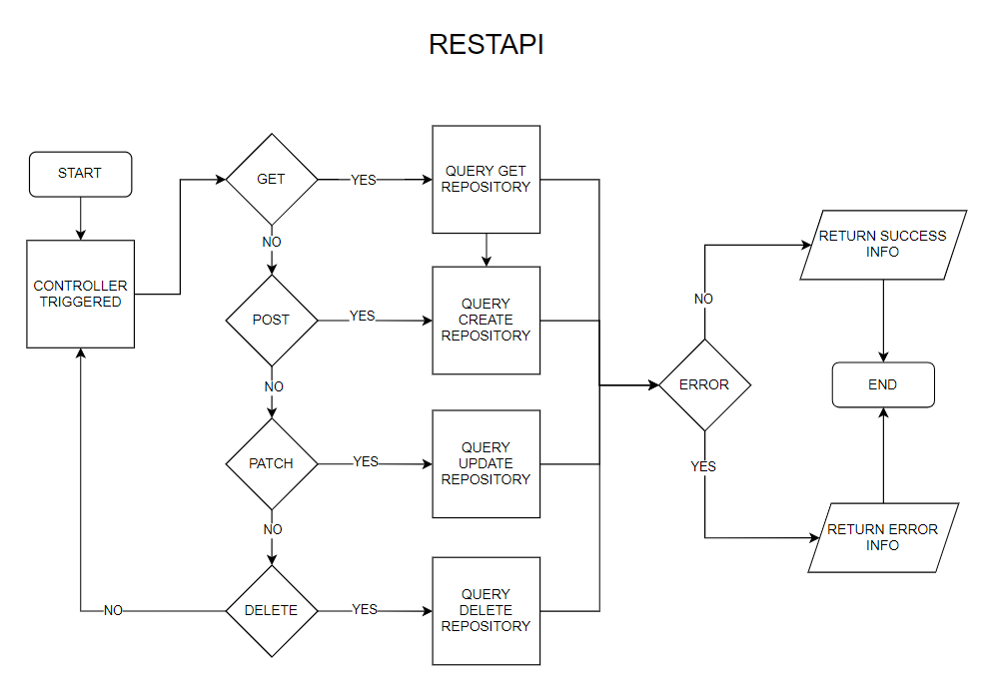
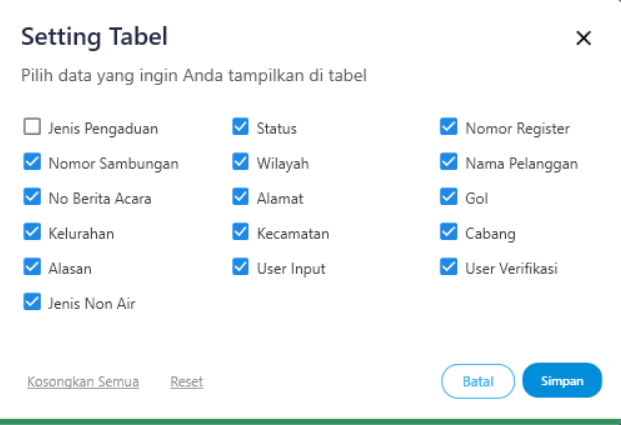
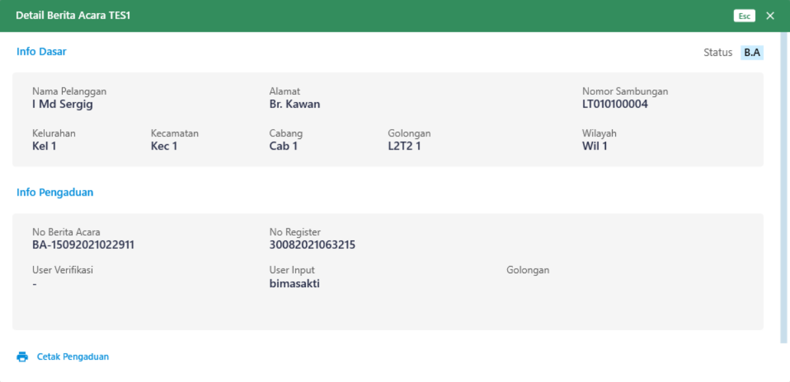

= Flow Berita Acara Pelanggan L2T2

Dokumen ini berisi tentang flow pada menu *Berita Acara Pelanggan L2T2* dari sistem Sipintar.NET.

Berikut adalah _flow_ dari *Berita Acara Pelanggan L2T2*:

== 1. Flow Page Berita Acara Pelanggan L2T2

Berikut adalah _flow_ dari show halaman Berita Acara Pelanggan L2T2. Saat membuka _page_ Berita Acara Pelanggan L2T2, aplikasi akan melakukan serangkaian proses berikut:

1. Mendapatkan data berita acara pelanggan L2T2 dan data filter pada _page_ tersebut dengan memanggil URL REST API;
2. Pada sisi REST API, akan melakukan rangkaian proses _query_ ke _database_; 
3. REST API mengembalikan hasil _query_ ke Client; 
4. Client menampilkan hasil _query_ oleh REST API. Jika _query_ tidak bermasalah dan datan
ya tidak nol, maka akan menampilkan tabel. Jika tidak, maka akan _show empty state_.

=== Flow WPF

=== Flow REST API

{sp} +
{sp} +
Berikut adalah _screenshot_ _main table_ Berita Acara Pelanggan L2T2:

{sp} +

== 2. Flow Input CRUD

Berikut adalah _flow_ untuk _input_ CRUD menu Berita Acara Pelanggan L2T2. _Input_ data dilakukan oleh _user_ melalui dialog _form_.

=== Flow REST API

{sp} +
{sp} +

Berikut adalah _screenshot_ _setting table_ detail _dialog form_:

Setting Tabel

Detail

== 3. Endpoint URL REST API

Pada menu ini, URL REST API yang digunakan adalah: 

[cols="10%,25%,65%",frame=all, grid=all]
|===
^.^h| *Method* 
^.^h| *URL* 
^.^h| *Deskripsi*

|GET 
| /api/v1/permohonan-pelanggan-lltt 
| Digunakan untuk Get data, wajib menambahkan *IdPdam* dan *IdUserRequest* pada URI param ketika _request_
|===

=== Code Notes

Fitur ini menggunakan tabel permohonan_pelanggan_lltt dan permohonan_pelanggan_lltt_detail untuk menampilkan datanya.

=== Other Source

https://drive.google.com/drive/folders/1DKgXwTwdozYKf8arIhWsvjSsg9KhxEim?usp=sharing[Diagram Source (editable with email @bsa.id)]
