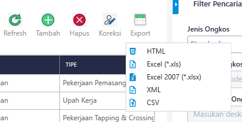
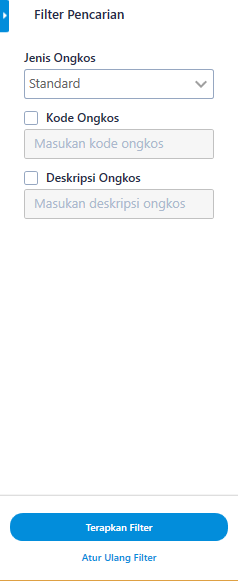
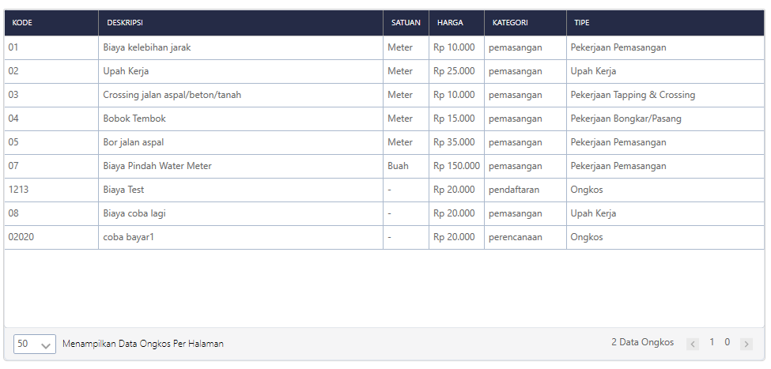
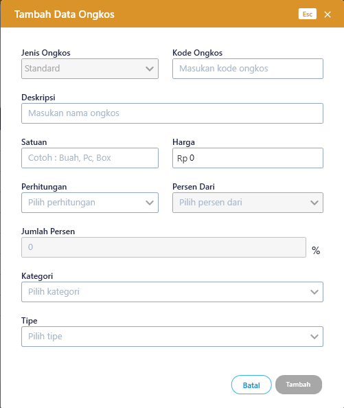
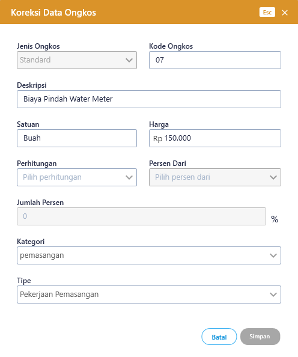
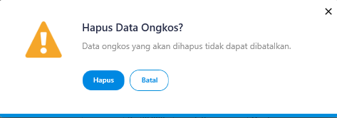
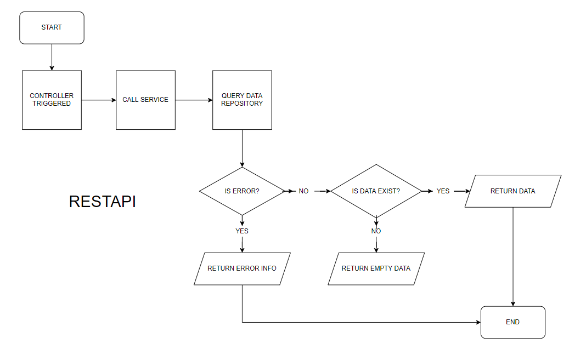
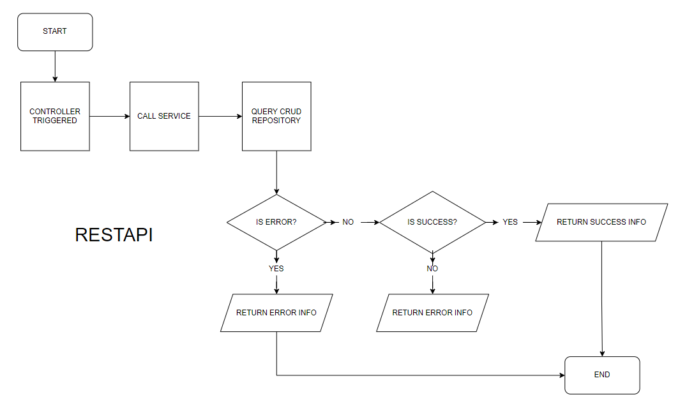
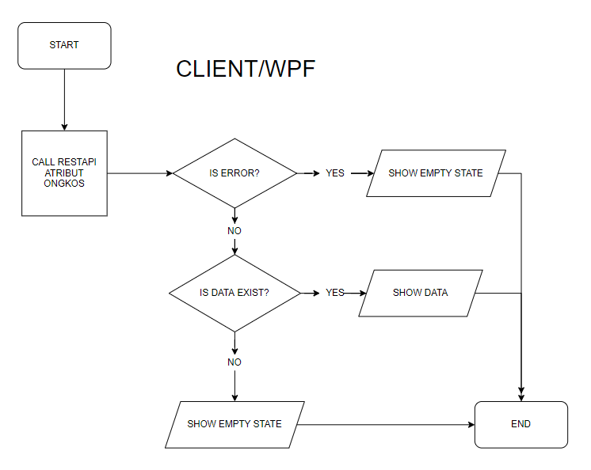
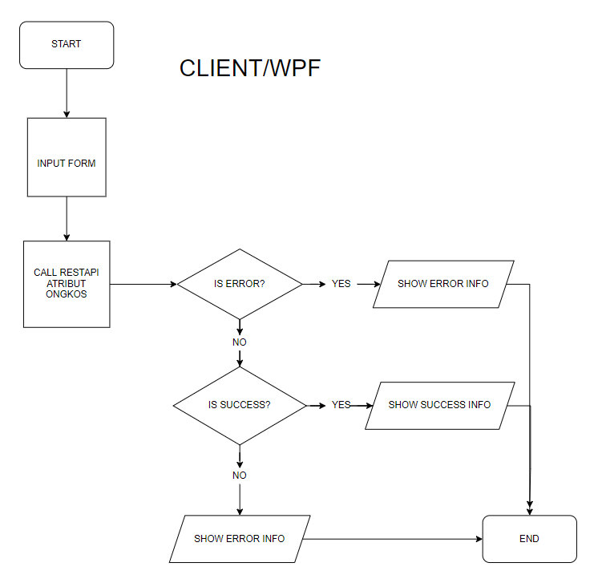

= Flow Atribut Ongkos

Dokumen ini berisi tentang _flow_ CRUD pada menu *Atribut Ongkos* dari sistem Sipintar.NET.

Berikut adalah _flow_ dari Atribut Ongkos:

== 1. Flow Page Atribut Ongkos

image::../../images-sipintar/perencanaan/atribut/sipintar-atribut-ongkos-1.png[600,400]
{sp} +

Berikut adalah _flow_ dari _show_ halaman Atribut Ongkos. Saat membuka _page_ Atribut Ongkos, aplikasi akan melakukan serangkaian proses berikut:

1. Mendapatkan data pada _page_ tersebut dengan memanggil URL REST API;
2. Pada sisi REST API, akan melakukan rangkaian proses _query_ ke _database_; 
3. REST API mengembalikan hasil _query_ ke Client; 
4. Client menampilkan hasil _query_ oleh REST API. Jika _query_ tidak bermasalah dan datanya tidak nol maka akan _show_ tabel, apabila tidak maka akan _show empty state_.

Berikut adalah penjelasan terkair Fitur Ongkos :

. Tampilan Utama Fitur Ongkos => manampilkan pengolahan data ongkos dan pilihan melakukan filtering.

.. Tambah => Fitur ini digunakan untuk menambah data ongkos baru.
.. Hapus => Fitur ini digunakan untuk menghapus data ongkos yang sudah ada, dengan memilih data yang ada pada tabel. 
.. Koreksi => Fitur ini digunakan untuk mengkoreksi data ongkos yang sudah ada, dengan memilih data yang ada pada tabel. 
.. Export => Fungsi export disini untuk mengeksport data-data yang di tampilkan pada grid ongkos. Pilihan export yang dapat di pilih html, excel, excel 2007, xml, csv. +
+

{sp} +

.. Filter Pencarian => fitur ini digunakan untuk menyaring data ongkos berdasarkan filter yang di pilih. Filter terdiri dari 3 bagian:

 ** Kategori => Menampilkan data onggkos berdasarkan kategorinya. _Value_ pada _combo box_ diambil dari REST API..

  Kategori => /api/v1/master-kategori

 ** Kode Ongkos => Menampilkan data ongkos berdasarkan kode ongkos yang ingin di tampilkan.
 ** Nama Ongkos => Menampilkan data ongkos berdasarkan nama ongkos yang ingin di tampilkan.

** Terapkan Filter => Button untuk menampilkan datanya pada _grid_, sesuai filter - filter yang dipilih. _Value_ di ambil dari REST API:

 Terapkan Filter => /api/v1/master-ongkos

** Atur Ulang Filter => Button untuk mengembalikan filter pada saat pertama kali membuka fitur atribut ongkos.
+ 

{sp} +

.. Tabel Ongkos => fitur ini untuk menampilkan isi tabel master_attribute_ongkos. Pada tabel menampilkan berapa jumlah data pada tabel, pagination dan limit berapa data ditampilkan.
+

{sp} +

. Tampilan Dilog Host Fitur Ongkos => manampilkan halaman untuk menambah, mengkoreksi dan menghapus data ongkos.
.. Tambah Data Ongkos => Menambah data ongkos baru dengan mengisi semua textbox dan memilih combobox yang ada dalam halaman dialog tambah data. Jika semua sudah terisi dan di pilih maka button tambah akan aktif.
+

{sp} +
.. Koreksi Data Ongkos => Mengkoreksi data ongkos yang sudah ada, harus ada nilai yang di ubah agak button simpan aktif.
+

{sp} +
*Note : Saat memilih nilai pada combobox perhitungan ada hal yang perlu di perhatikan, saat memilih "Reguler" combobox Persen Dari dan Jumlah Persen akan di disable, sementara jika memilih "Persentase" textbox Harga akan di disable, nilai textbox Harga akan terisi jika Persen Dari sudah di pilih dan Jumlah Persen sudah di isi.
.. Hapus Data Ongkos => Menghapus data ongkos yang sudah ada.
+

{sp} +

=== 1.1. Flow Chart 

. REST API
+

{sp} +
+

{sp} +

. WPF
+

{sp} +
+

{sp} +

=== 1.2. Endpoint URL REST API

Pada menu ini, URL REST API yang digunakan adalah: 

[cols="10%,25%,65%",frame=all, grid=all]
|===
^.^h| *Method* 
^.^h| *URL* 
^.^h| *Deskripsi*

|GET 
| /api/v1/master-ongkos 
| Digunakan untuk Get data, wajib menambahkan *IdPdam* dan *IdUserRequest* pada URI param ketika request

|POST 
| /api/v1/master-ongkos 
| Digunakan untuk Tambah data, wajib menambahkan *IdPdam* dan *IdUserRequest* pada body ketika request

|PATCH 
| /api/v1/master-ongkos 
| Digunakan untuk Ubah data, wajib menambahkan *IdPdam* dan *IdUserRequest* serta *IdEntity* pada body ketika request

|DELETE 
| /api/v1/master-ongkos 
| Digunakan untuk Hapus data, wajib menambahkan *IdPdam* dan *IdUserRequest* serta *IdEntity* pada URI param ketika request
|===

==== Code Notes

Fitur ini menggunakan tabel _master_attribute_ongkos_ untuk menyimpan datanya.
{sp} +

==== Other Source

`https://drive.google.com/file/d/11puWTqzM8qDLKZUX7RAa0Yeh8x-gT3Sf/view?usp=sharing`[Diagram Source (editable with email @bsa.id)]
