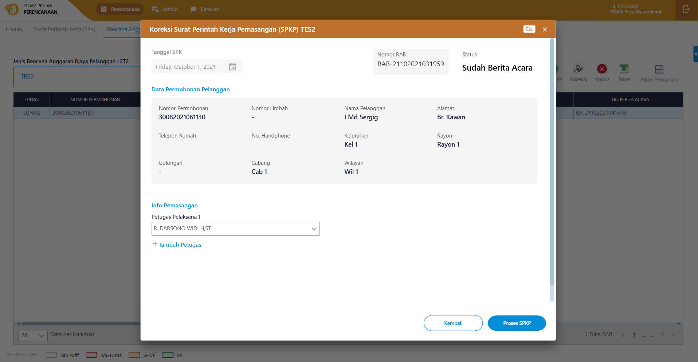
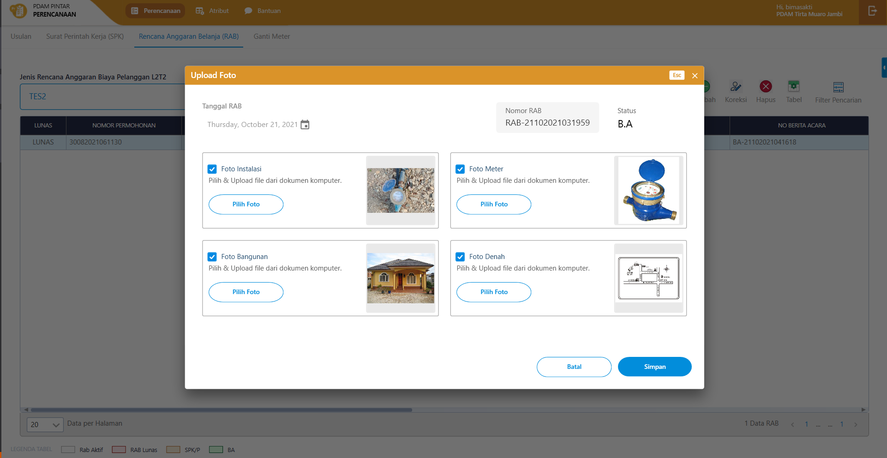

= Flow RAB Pelanggan L2T2

Dokumen ini berisi tentang flow pada menu *RAB Pelanggan L2T2* dari sistem Sipintar.NET.

Berikut adalah _flow_ dari *RAB Pelanggan L2T2*:

== 1. Flow Page RAB Pelanggan L2T2

Berikut adalah _flow_ dari show halaman RAB Pelanggan L2T2. Saat membuka _page_ RAB Pelanggan L2T2, aplikasi akan melakukan serangkaian proses berikut:

1. Mendapatkan data rab pelanggan l2t2 dan data filter pada _page_ tersebut dengan memanggil URL REST API;
2. Pada sisi REST API, akan melakukan rangkaian proses _query_ ke _database_; 
3. REST API mengembalikan hasil _query_ ke Client; 
4. Client menampilkan hasil _query_ oleh REST API. Jika _query_ tidak bermasalah dan datanya tidak nol, maka akan menampilkan tabel. Jika tidak, maka akan _show empty state_.

=== Flow WPF

image::../../images-sipintar/perencanaan/perencanaan/rab/lltt/Flow-WPF-RAB-Pelanggan-L2T2.png[600,400]

=== Flow REST API

image::../../images-sipintar/perencanaan/perencanaan/rab/lltt/Flow-RESTAPI-RAB-Pelanggan-L2T2.png[600,600]
{sp} +
{sp} +
Berikut adalah _screenshot_ _main table_ Permohonan Pelanggan L2T2:

{sp} +
{sp} +

== 2. Flow Input CRUD

Berikut adalah _flow_ untuk _input_ CRUD menu Permohonan Pelanggan L2T2. _Input_ data dilakukan oleh _user_ melalui dialog _form_.

=== Flow REST API

image::../../images-sipintar/perencanaan/perencanaan/rab/lltt/Flow-Input-RESTAPI-RAB-Pelanggan-L2T2.png.png[600,600]
{sp} +
{sp} +

Berikut adalah _screenshot_ input, koreksi, hapus, batal dan detail _dialog form_:

*Input 1*

image::../../images-sipintar/perencanaan/perencanaan/rab/lltt/perencanaan-rab-pelanggan-lltt-2.png[600,400]

*Input 2*

*Input 3*

*Input 4*

*Input 5*

*Input 6*

*Input 7*

*Input 8*

*Detail*

== 3. Endpoint URL REST API

Pada menu ini, URL REST API yang digunakan adalah: 

[cols="10%,25%,65%",frame=all, grid=all]
|===
^.^h| *Method* 
^.^h| *URL* 
^.^h| *Deskripsi*

|GET 
| /api/v1/permohonan-pelanggan-lltt
| Digunakan untuk Get data, wajib menambahkan *IdPdam* dan *IdUserRequest* pada URI param ketika _request_

|POST 
| /api/v1/permohonan-pelanggan-lltt-rab
| Digunakan untuk Tambah data, wajib menambahkan *IdPdam* dan *IdUserRequest* pada body ketika _request_

|PATCH 
| /api/v1/permohonan-pelanggan-lltt-rab
| Digunakan untuk Ubah data, wajib menambahkan *IdPdam* dan *IdUserRequest* serta *IdEntity* pada body ketika request

|DELETE 
| /api/v1/permohonan-pelanggan-lltt-rab
| Digunakan untuk Hapus data, wajib menambahkan *IdPdam* dan *IdUserRequest* serta *IdEntity* pada URI param ketika _request_
|===

=== Code Notes

Fitur ini menggunakan tabel `permohonan-pelanggan-lltt-rab` untuk menyimpan datanya.

=== Other Source

https://drive.google.com/drive/folders/1ICsp9MTgTHOL5EJqbBAkr_NnTp01pzZr?usp=sharing[Diagram Source (editable with email @bsa.id)]
