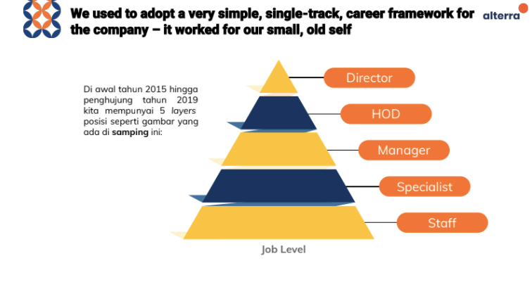
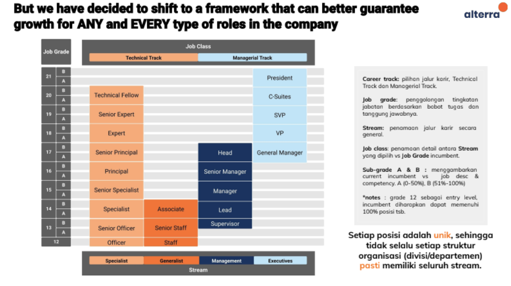

= Alterra Career Framework

== Our New Career Framework

_Career Framework_ adalah kerangka yang memuat semua informasi mengenai penggolongan tingkat posisi yang ada di Alterra. *Apa sih manfaatnya mengetahui _Career Framework_*? Setelah memahami _Career Framework_, kamu bisa mengetahui potensi perkembangan karir di masa yang akan datang sesuai dengan jalur aspirasi kamu. Lalu menjadikannya sebagai bahan diskusi dengan Line Manager.

*Kenapa penting mempunyai _Career Framework_*? Karena semakin besarnya perusahaan dan juga
tuntutan bisnis, jenjang karir untuk karyawan menjadi prioritas utama untuk dikembangkan. Bagaimanapun juga yang menjadi “motor” untuk perusahaan adalah karyawan, maka dari itu perlu adanya kerangka untuk menjadi dasar pengembangan karyawan.

From This

To This

Baca selengkapnya tentang Alterra Career Framework https://drive.google.com/file/d/1XgQSGRJu48vn3PVT2eAXULYTGYelfmWF/view[di sini].

== List of Technical Competency Matrix

Setelah memahami tentang _Career Framework_ di Alterra, tahap berikutnya adalah mempelajari sesuai dengan kebutuhan pada divisi atau departemen masing-masing. 

Apa kamu sudah tahu daftar _technical domain & key behaviour_ yang harus dikuasai? Apa kamu sudah melihat kesenjangan antara kompetensi teknis dengan rating standar yang telah ditetapkan oleh Alterra? 

Jika belum, ini saatnya untuk melihat informasi yang kamu butuhkan dan membantumu tumbuh lebih jauh lagi. Bagi yang sudah, informasi ini bisa kamu gunakan sebagai tempat termudah untuk mengingat dan mempelajarinya kembali.

[cols="33%,33%,33%",frame=all, grid=all]
|===
^.^h|*Technical Competency Matrix*
^.^h|*Rating Standard*
^.^h|*Learning Guide*

|link:../../Meet-Our-Divisions/Technology/Engineering/Software-Engineering-Competency-Matrix/index.adoc[Software Engineering Competency Matrix]
|link:../../Meet-Our-Divisions/Technology/Engineering/Software-Engineering-Rating-Standard/index.adoc[Software Engineering Rating Standard] 
a|- link:../../Meet-Our-Divisions/Technology/Engineering/Software-Engineering-Learning-Program/index.adoc[Software Engineering Learning Program]
- (BSA) drafting

|link:../../Meet-Our-Divisions/Technology/Engineering/Quality-Architect-Competency-Matrix/index.adoc[Quality Architect Competency Matrix]
|link:../../Meet-Our-Divisions/Technology/Engineering/Quality-Architect-Rating-Standard/index.adoc[Quality Architect Rating Standard]
|Quality Architect Learning Program (drafting)

|link:../../Meet-Our-Divisions/Technology/Technology-Operations/Agile-Management-Specialist-Competency-Matrix/index.adoc[Agile Management Specialist Competency Matrix]
|link:../../Meet-Our-Divisions/Technology/Technology-Operations/Agile-Management-Specialist-Rating-Standard/index.adoc[Agile Management Specialist Rating Standard]
|-

|link:../../Meet-Our-Divisions/Technology/Technology-Operations/Technical-Support-Competency-Matrix/index.adoc[Technical Support (ITS) Competency Matrix]
|link:../../Meet-Our-Divisions/Technology/Technology-Operations/Technical-Support-Rating-Standard/index.adoc[Technical Support (ITS) Rating Standard]
|-

|link:../../Meet-Our-Divisions/Technology/Technology-Operations/Knowledge-Management-Competency-Matrix/index.adoc[Knowledge Management Officer Competency Matrix]
|link:../../Meet-Our-Divisions/Technology/Technology-Operations/Knowledge-Management-Rating-Standard/index.adoc[Knowledge Management Officer Rating Standard]
|-
|===

*Note*: daftar di atas akan diperbarui secara berkala. 

== Any Questions?
Ada pertanyaan seputar _Technical Competency Matrix_? Kamu bisa langsung menanyakannya ke Manager atau tulis pertanyaanmu di https://alterra.tribe.so/[Tribe]. 

Kamu juga bisa request untuk publikasi  _Technical Competency Matrix_ divisimu dengan cara _submit ticket_ ke https://alterra-support.freshdesk.com/support/tickets/new[Alterra Support].