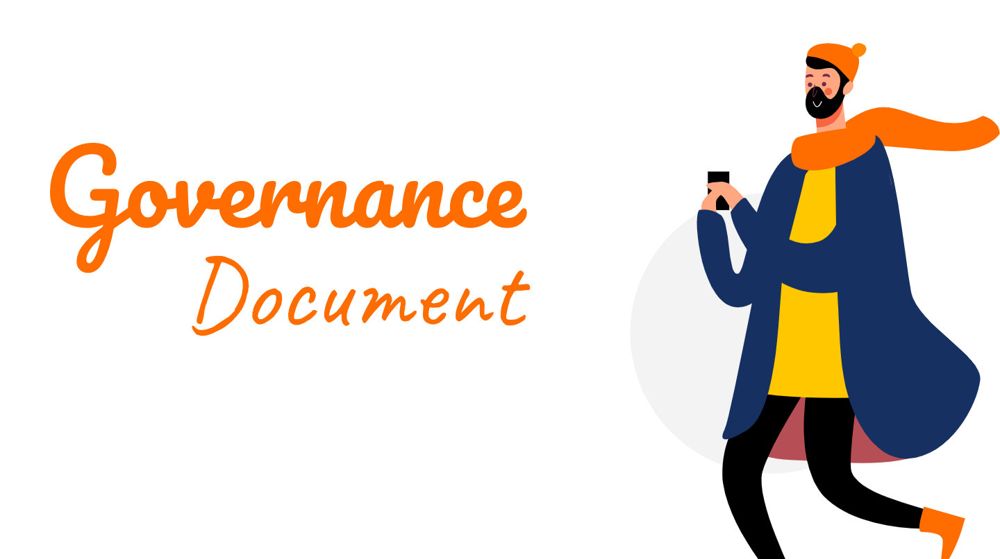

= General Governance Document

Baca prosedur dan kebijakan terbaru di Alterra pada halaman berikut. 
====

[cols="15%,35%,50%",frame=all, grid=all]
|===
^.^h|*Document Owner*
^.^h| *Title* 
^.^h| *Description*

|Procurement|link:https://drive.google.com/file/d/1IpOfaYRaZNjAc1klfq6R1__5wt6xtySq/view[SOP Purchase Requisition]| Prosedur yang mengatur proses pengadaan barang dan/atau jasa
|Procurement|link:https://drive.google.com/file/d/1Fuzy7wCz0PyoD2kcjdGHxVBSIRZ26s-3/view?usp=sharing[SOP Penerimaan Barang v2.0]| Prosedur untuk memastikan proses pembuatan dan pengajuan permintaan barang dan/atau jasa tetap terkendali
|Procurement|link:https://drive.google.com/file/d/1g-_5uJfbi6cpPs8gJd7x6yQM069vrrVS/view[SOP Permintaan Pengadaan Barang (Purchase Requisition)]| Prosedur untuk memastikan proses pembuatan dan permintaan pengajuan barang dan/atau jasa tetap terkendali
|Document Controller|link:https://drive.google.com/file/d/1f1tQMM5CbUjGc7XyOumrgWHIUlEgEaE4/view[SOP Pembuatan Policy dan SOP]| Prosedur untuk menyusun SOP dan _Policy_ sesuai _flow_ dan pembagian ruang lingkup dari awal hingga akhir.
|Document Controller|link:https://drive.google.com/file/d/13R05Y1nlUoSPK2aMIXPgBo0ZQmjjze42/view[SOP Permintaan Akses Governance Document]| Prosedur untuk mengajukan permintaan akses dokumen agar tetap terkontrol
|Risk Management|link:https://drive.google.com/file/d/1lY5u7S5AEryaGY7v5hPu0sdqqBHbjHtn/view[SOP Komunikasi]|Prosedur ini untuk memastikan bahwa semua informasi yang berkaitan dengan Sistem Manajemen Keamanan Informasi (SMKI) disebarkan secara sistematis

|===

====

[cols="15%,35%,50%",frame=all, grid=all]
|===
^.^h|*Document Owner*
^.^h| *Title* 
^.^h| *Description*

|Procurement|link:https://drive.google.com/file/d/1NiVKfaSpKTAITDqSjb4qo8uobz29c508/view[Policy Procurement V2.0]| Pedoman untuk menjaga pengadaan barang atau jasa sesuai kualitas, efisiensi biaya, dan ketepatan waktu pengiriman terbaik
|Risk Management|link:https://drive.google.com/file/d/1NTb_dHZpqNDpicQG-9KenVCGFcEeemXs/view[Policy Company Rules Management]|Pedoman yang digunakan untuk menyusun kerangka peraturan dalam perusahaan
|Risk Management|link:https://drive.google.com/file/d/1wRQdRfWU8NmelEC52swdBAxJeo-vKcTB/view[Policy Clear Desk and Clean Screen]| Pedoman dalam menerapkan standard minimum penggunaan _Clean Desk_
|Risk Management|link:https://drive.google.com/file/d/1rg9JoXhC5GktYDDgDi3U0JGDsIt825_o/view[Policy Governance Document Handling and Management]| Pedoman untuk penulisan dokumen tata kelola oleh tim Document Controller

|===
====

Karena SOP dan _Policy_ dari POPS berkaitan dengan *Employee Onboarding*, kamu bisa melanjutkannya di halaman link:https://docs.alterra.id/home/kb-ho/divisions/meet-our-divisions/ceo-office/people-operations/pops-sop-and-policy/[berikut ini]
====

*Note*: Seluruh daftar di atas akan diperbarui secara berkala.
