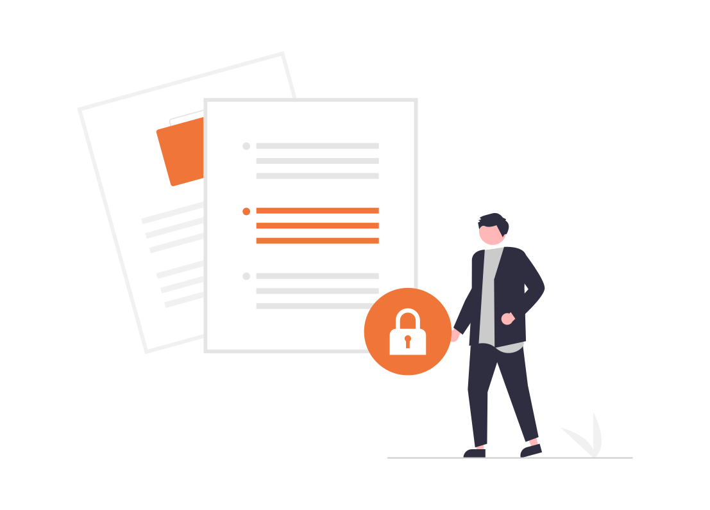

= Information Security

Departemen Information Security memiliki fungsi utama untuk mengamankan informasi yang ada dalam organisasi sebagai bentuk perlindungan atas aset kritis organisasi. Proses perlindungan keamanan informasi yang dilakukan oleh Departemen Information Security mencakup tiga (3) aspek utama, yaitu:

* People - Budaya keamanan informasi, kesadaran keamanan informasi, dan lain sebagainya
* Process - Kebijakan, prosedur, tata cara, dan cara kerja mengamankan informasi yang baik dan sesuai dengan praktik terbaik yang umum digunakan pada industri sejenis
* Technology - Membantu merencanakan dan menerapkan teknologi-teknologi yang bertujuan untuk mengamankan informasi yang ada di organisasi

Untuk mendukung ketiga aspek di atas, Departemen Information Security terbagi menjadi dua bagian, yaitu:

[arabic]
. _Governance_ / Tata Kelola
+
Bagian _governance_ / tata kelola memiliki fungsi utama untuk mengamankan keamanan informasi di organisasi melalui kerangka kerja keamanan informasi yang relevan, seperti:
+
.. Mengembangkan kebijakan dan proses yang terkait dengan keamanan informasi;
.. Mengelola kebijakan dan proses yang mencakup peninjauan dan pemantauan penerapan kerangka kerja keamanan informasi
.. Melakukan riset secara holistik atas kerangka kerja dan teknologi keamanan informasi yang sesuai dan dapat diterapkan
.. Membantu pelaksanaan penerapan kerangka kerja keamanan informasi atau sistem manajemen keamanan informasi di organisasi
.. Membantu pelaksanaan pengelolaan insiden keamanan informasi yang terjadi di organisasi.
. _Operation_
+
Bagian operation memiliki fungsi utama untuk mengamankan keamanan informasi secara teknis dengan praktik terbaik yang tersedia saat ini, seperti:
+
.. Melakukan proses pengujian teknis keamanan pada suatu sistem (meliputi infrastruktur dan aplikasi) untuk mengetahui kerentanan yang ada dan remediasinya; dan
.. Memberikan saran untuk meningkatkan keamanan informasi secara teknis dan berkelanjutan kepada pemangku kepentingan terkait.

Untuk lebih mengenal lebih jauh Departemen Information Security, kamu dapat mengakses _slide_ https://drive.google.com/file/d/1yANvjy0vV_UbjhbZoRbobOfTYnuP3mri/view[berikut].

== Quick Link

* https://drive.google.com/file/d/1qkabNjLltRybqeGs-NHXrax_Ym8e4Nx_/view[Policy Incident Management]
