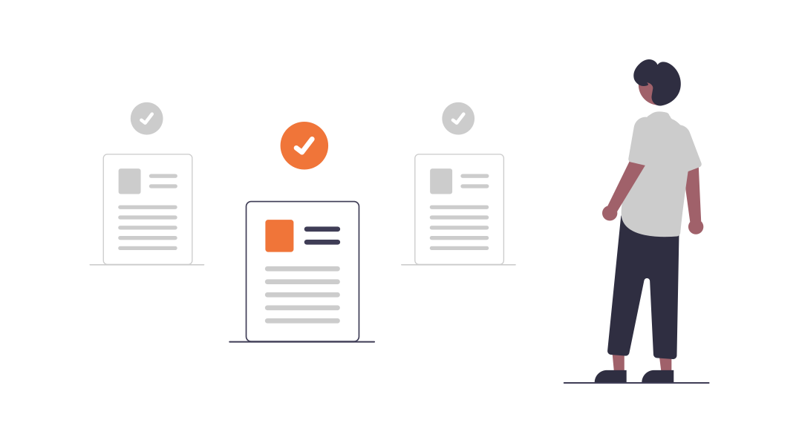

= Document Controller

Document Controller merupakan sebuah tim di bawah naungan IARM yang memiliki tanggung jawab utama dalam melakukan kontrol dan pengelolaan _governance document_. Dokumen yang dimaksud mencakup _charter_, _policy_, SOP, _working instruction_, _form & record_.

Secara umum, fungsi dan tanggung jawab Tim Document Controller secara umum meliputi:

[arabic]
. Melakukan pengelolaan _governance document_, termasuk di antaranya penyimpanan dokumen soft copy atau hard copy, dan semacamnya
. Melakukan kontrol atas _governance document_, termasuk di dalamnya perihal akses dokumen, distribusi dokumen, dan semacamnya
. Melakukan _final review_ dan pemberian nomor dokumen terhadap _governance document_ yang disusun atau dibuat oleh seluruh divisi atau departemen di Alterra Group sebagai bagian dari pengesahan dokumen
. Menyediakan bantuan kepada divisi atau departemen atau tim lain di Alterra Group dalam memberikan saran atau brainstorming terhadap proses penyusunan _governance document_-nya (jika dibutuhkan).
. Mendukung Perusahaan dalam pemenuhan proses lisensi sertifikasi dengan melengkapi kebutuhan _governance document_ masing-masing unit perusahaan.

== Quick Link

* link:./Panduan-Penyusunan-Governance-Document.adoc[Panduan Penyusunan Governance Document]
