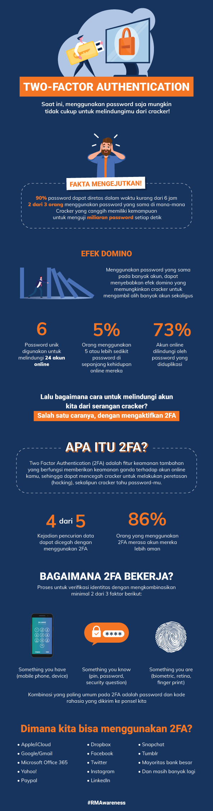

= Apa yang Dimaksud dengan Cracker?

Kemajuan teknologi internet ternyata juga memiliki dampak dan potensi risiko. Terutama website dan layanan internet lain yang memiliki potensi besar diserang oleh para _cracker_.

_Cracker_ (saudara kembar _hacker_) merupakan sebutan untuk orang-orang yang memiliki kemampuan dalam bidang pemrograman dan dapat membuka sistem jaringan komputer tapi dengan tujuan negatif. Misalnya saja demi kejahatan, pencurian data penting untuk menjualnya kepada pihak tertentu, dan semacamnya.

Bagaimana faktanya mengenai serangan _cracker_ ini dan bagaimana pula menanggulanginya agar akun kita tetap aman? Yuk, Simak ulasannya melalui infografik berikut ini!

