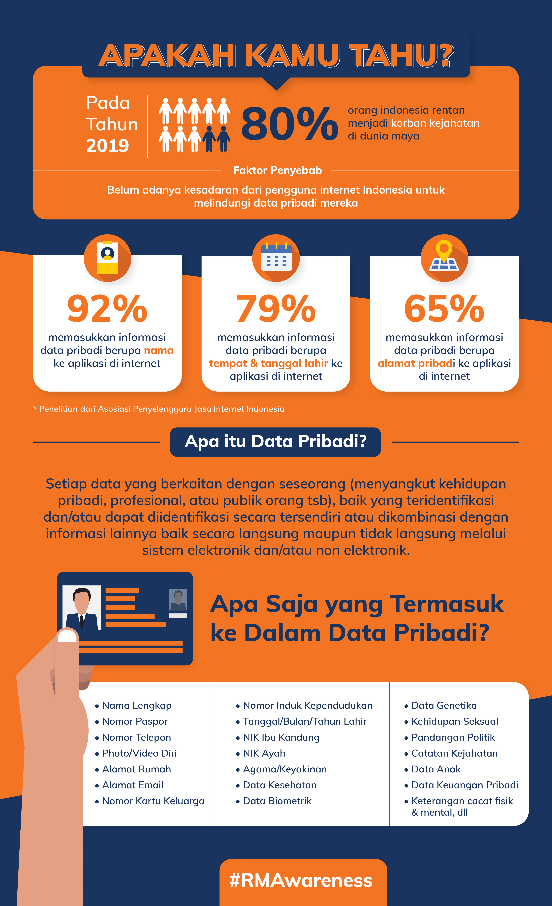
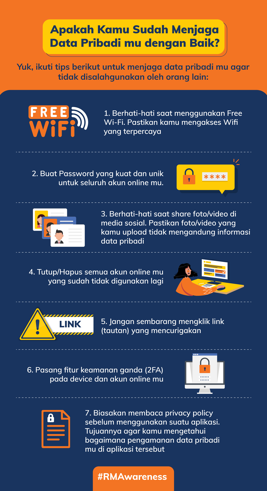

= Cara Hacker Eksploitasi Data Pribadi Seseorang

Pernahkah kamu melakukan pembayaran pajak secara _online_? Atau melakukan pembelian tiket pesawat melalui aplikasi _travel agent_? Atau membuka rekening koran? Atau menggunakan akun media sosial?

Jika jawabanmu adalah “ya” untuk salah satu atau bahkan semua pertanyaan di atas, maka kamu telah membagikan data pribadimu baik secara _online_ maupun _offline_ dengan entitas pribadi seperti bank dan _travel agent_ atau entitas publik seperti direktorat pajak.

Memang berbagi data dapat membawa manfaat dan dibutuhkan untuk melaksanakan tugas sehari-hari, namun dibalik aktivitas berbagi data yang kita lakukan tentu bukan tanpa risiko. Data pribadi mengungkapkan banyak hal tentang dirimu, pikiranmu, dan juga kehidupanmu. Data tersebut dapat dengan mudah dieksploitasi oleh pihak yang tidak berwenang sehingga dapat merugikan kita. Oleh karena itu, kita harus menjaga data pribadi kita dengan baik.

Mari kita simak fakta dan penjelasan mengenai data pribadi berikut ini!

Bagaimana, kamu sudah tau kan tentang Data Pribadi beserta fakta-faktanya?

Ada 1 fakta menarik lagi nih Alterrans, kebanyakan pengguna media sosial seringkali tidak menyadari bahwa #aktivitas yang mereka lakukan di media sosial telah membuka kesempatan bagi hacker untuk mengeksploitasi data pribadinya# lho! Kok bisa ya?

Coba kita simak dulu video https://web.facebook.com/AITI.Brunei/videos/233675567960014/?utm_source=Alterra&utm_campaign=c0ded61590-EMAIL_CAMPAIGN_2020_03_03_06_54_COPY_01&utm_medium=email&utm_term=0_e087ca5e85-c0ded61590-342314953&_rdc=1&_rdr[berikut ini]!

Wah, bagaimana pendapat teman-teman setelah melihat video tadi? Coba bayangkan bagaimana jika hal tersebut terjadi pada kita. Merugikan sekali bukan? Oleh karena itu yuk ikuti tips menjaga data pribadi kita di internet berikut ini!

